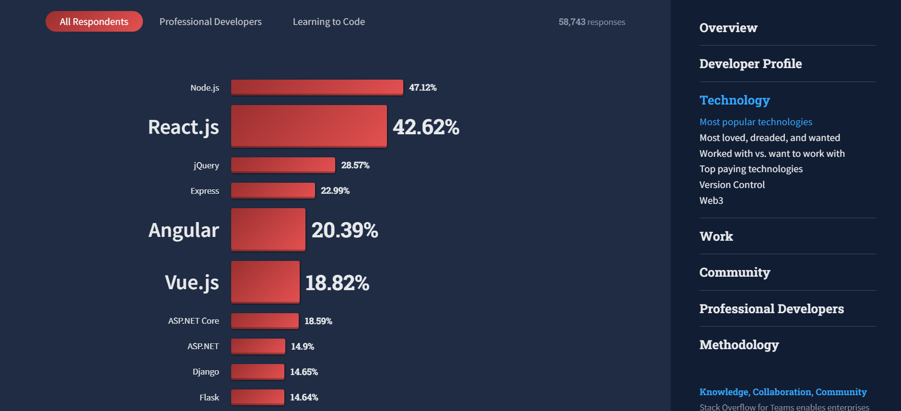
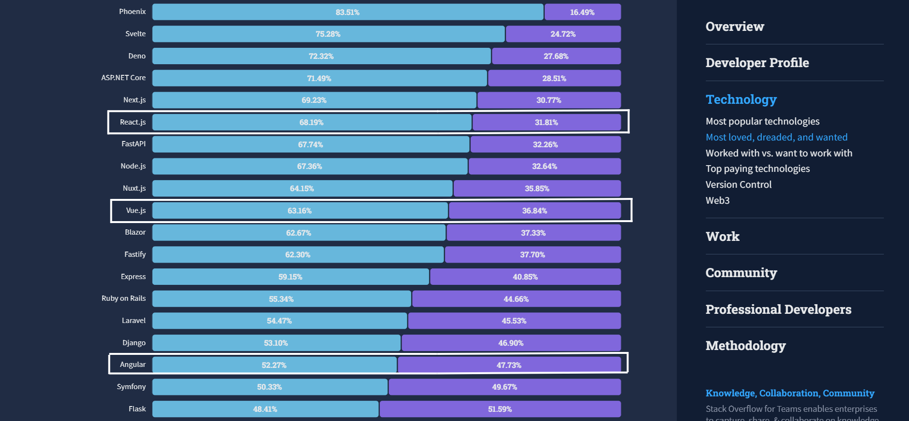
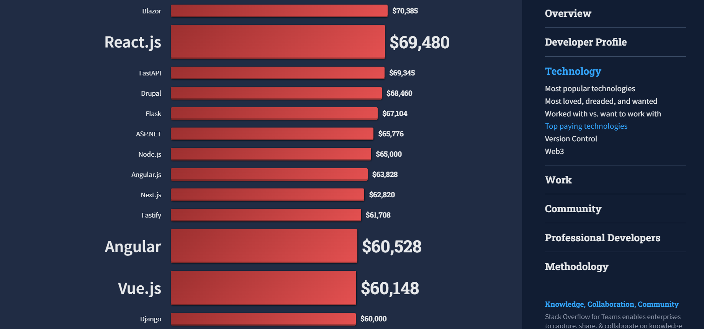
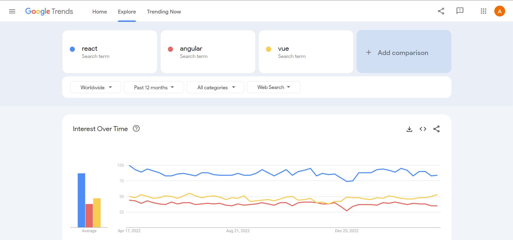

**_TLDR:_** _In this article, we compare React, Angular, and Vue, the 3 most popular JavaScript frameworks, in terms of popularity, maturity, tooling, performance, learning curve, developer satisfaction, job market, interest over time, and mobile app development. React leads in popularity, job market, and mobile app development, Angular in maturity, better built-in tooling and Vue in lower learning curve. All 3 frameworks have strong communities and are highly rated by developers. React may be better for large-scale applications, Angular may be better for large-scale applications that needs a highly opinionated framework, while Vue is ideal for those seeking a simpler framework with a lower learning curve._

In this comprehensive comparison of React, Angular and Vue, three most popular JavaScript frameworks, we delve into their features, tooling, performance, learning curve, developer satisfaction, job market, and more.

Read on to discover which framework best suits your needs, whether you're building a large-scale, high-performance application or seeking a simpler, easy-to-learn option.

## React vs Angular vs Vue: Quick Overview

Before diving into a detailed comparison, let's briefly review what React, Angular, and Vue are:

### React

[React](https://react.dev/) is an open-source JavaScript library developed by Meta (formerly Facebook) for building user interfaces. It is known for its high performance, flexibility, and reusability.

React uses a component-based architecture, allowing developers to create complex UIs by breaking them down into smaller, reusable components. It also employs a virtual DOM, which enables efficient updates and rendering of the UI.

Developed by Meta, it has been around since 2013 and has gained widespread popularity among developers. React's vast and supportive community contributes to its growth and development.

### Angular

[Angular](https://angular.io/) is a popular open-source framework developed and maintained by Google. It is a complete platform for building web applications, providing developers with a powerful set of tools and features such as dependency injection, two-way data binding, and a robust module system.

Angular is known for its scalability, flexibility, and ability to create large-scale applications. It has been around since 2010 (initially as AngularJS) and has undergone multiple major revisions, with the most recent version being Angular 15.

### Vue

[Vue](https://vuejs.org/) is a progressive JavaScript framework for building user interfaces. Created by Evan You in 2014, Vue is designed to be easy to integrate with other projects and libraries, making it a versatile option for developers.

Vue uses a component-based architecture similar to React and offers a virtual DOM, reactive data-binding, and a simple yet powerful API. It has gained popularity due to its simplicity, ease of use, and excellent documentation.

## Detailed Comparison of React, Angular, and Vue

### 1. Popularity

<em>List of most popular web frameworks. Source: <a href="https://survey.stackoverflow.co/2022/#section-most-popular-technologies-web-frameworks-and-technologies">Stack Overflow Developer Survey 2022</a></em>

According to the [Stack Overflow Developer Survey 2022](https://survey.stackoverflow.co/2022/#section-most-popular-technologies-web-frameworks-and-technologies), React is the most popular frontend JavaScript framework with 42.62% votes, whereas Angular and Vue stands with 20.39% and 18.82% votes.

React has over 206,000 stars on [GitHub](https://github.com/facebook/react), Angular has over 87,000 stars on [GitHub](https://github.com/angular/angular), and Vue has over 203,000 stars on [GitHub](https://github.com/vuejs/vue).

While React maintains a significant lead in popularity, both Angular and Vue have strong and active communities.

### 2. Maturity

Angular, being the oldest of the three, has a more mature and well-established ecosystem even though it had gone throgh a major rewrite in 2016. Google's backing and adoption by large
organizations have contributed to its continuous growth and evolution.

React, released in 2013, is also a mature framework with a vast ecosystem and support from Meta. It is widely used by major tech companies like Facebook, Instagram, and Netflix.

Vue, despite being the youngest of the three has gained significant traction in recent years due to its simplicity and ease of use. Many developers and organizations embraced Vue as a viable alternative to React and Angular.

### 3. Tooling

React boasts an extensive ecosystem that includes popular libraries such as [Redux](https://redux.js.org/), [React Router](https://reactrouter.com/en/main), [Next.js](https://nextjs.org/), [TanStack Query](https://tanstack.com/query/latest), [TanStack Router](https://tanstack.com/router/v1), [Zustand](https://zustand-demo.pmnd.rs/) and many others. These libraries make it easier for developers to build complex applications.

Angular provides a comprehensive set of built-in tools and features, including its powerful [Angular CLI](https://angular.io/cli), [RxJS](https://angular.io/guide/rx-library) and [Angular Material](https://material.angular.io/) and more. Additionally, Angular has a wide range of third-party libraries and tools available to developers.

Vue, while not as extensive as React or Angular, has a growing ecosystem with libraries like [Vuex](https://vuex.vuejs.org/) for state management, [Vue Router](https://router.vuejs.org/) for routing, and [Nuxt.js](https://nuxtjs.org/) for server-rendered applications etc.

### 4. Performance

All three frameworks, React, Angular, and Vue, are known for their excellent performance. React and Vue use a virtual DOM for efficient rendering of changes, while Angular employs a real DOM with optimizations like change detection and ahead-of-time (AOT) compilation.

In most cases, the differences in performance among these frameworks are negligible and should not be a deciding factor when choosing one over the other.

### 5. Learning Curve

React has a moderate learning curve, requiring developers to understand concepts such as state, props, and lifecycle methods. While experienced developers may find it relatively easy to pick up, newcomers may face some challenges.

Angular is known for its steeper learning curve due to its extensive set of features, complex syntax, and reliance on TypeScript. Developers new to Angular may need to invest more time and effort to become proficient.

On the other hand, Vue is known for its simplicity and ease of use. Its syntax closely resembles HTML, making it more accessible to developers who are new to web development. As a result, Vue generally has a lower learning curve than React or Angular.

### 6. Developer Satisfaction

According to the [State of JavaScript Survey 2022](https://2022.stateofjs.com/en-US/libraries/#tier_list), React and Vue have high developer satisfaction ratings, with React having an 83% retention ratio and Vue having an 77% retention ratio. Angular has a lower retention ratio of 43%, indicating that developers who have used Angular may be less satisfied with their experience compared to those who have used React or Vue.

<em>List of most loved vs dreaded web frameworks. Source: <a href="https://survey.stackoverflow.co/2022/#section-most-loved-dreaded-and-wanted-web-frameworks-and-technologies">Stack Overflow Developer Survey 2022</a></em>

Even in the list of Most Loved Technologies of [Stack Overflow Developer Survey 2022](https://survey.stackoverflow.co/2022/#section-most-loved-dreaded-and-wanted-web-frameworks-and-technologies), React and Vue were ahead of Angular. On one side, React and Vue are loved by 68.19% and 63.16% developers, Angular, on the other hand, received 52.27% votes from developers.

### 7. Job Market

React and Angular are currently in high demand in the job market, with numerous job listings on various job platforms. Vue, while not as prevalent in the job market as React or Angular, has seen a steady increase in demand.

<em>List of top paying web frameworks. Source: <a href="https://survey.stackoverflow.co/2022/#top-paying-technologies-web-frameworks">Stack Overflow Developer Survey 2022</a></em>

According to the [Stack Overflow Developer Survey 2022](https://survey.stackoverflow.co/2022/#top-paying-technologies-web-frameworks), React developers earn an average of $69,480 per year, Angular developers earn an average of $60,528 per year, and Vue developers earn an average of $60,148 per year.

### 8. Interest Over Time

<em>Google Trends comparison of React, Angular, and Vue from 2018-2023</em>

Google Trends data from the past one year shows that React has consistently maintained a higher level of interest compared to Angular and Vue.

However, both Angular and Vue have also seen a steady interest with Vue having an edge over Angular, indicating that it is gaining traction than Angular within the developer community.

### 9. Mobile App Development

React has a significant advantage when it comes to mobile app development, thanks to React Native. [React Native](https://reactnative.dev/) is a popular framework for building cross-platform mobile applications for iOS and Android using React's component-based architecture. It allows developers to use the same codebase for both platforms, reducing development time and effort.

Angular has its counterpart in [Ionic](https://ionicframework.com/), which is a popular framework for building cross-platform mobile applications using Angular, TypeScript, and the Ionic UI components. Ionic allows developers to build hybrid mobile applications that can run on multiple platforms, including iOS, Android, and the web.

Vue, on the other hand, has NativeScript-Vue, which is a community-driven initiative to build cross-platform mobile applications using Vue and the NativeScript framework. While not as mature or widely adopted as React Native or Ionic, NativeScript-Vue offers a viable solution for building mobile applications with Vue.

## React vs Angular vs Vue: Which one is better for your use case?

React, Angular, and Vue, all have large communities and developers who use them cite their own specific reasons why they like these frameworks. Devs who prefer React often cite these [reasons](https://epicreact.dev/why-i-love-react/) for their preference- explicit state updates, JSX over templates, hooks etc.

On the other hand, devs who prefer Angular cite these [reasons](https://medium.com/@jacobfriesen/why-we-chose-angular-over-react-e633b9d5d155) for their preference - consistent standard components, writing less code, keeping HTML separate from JavaScript etc.

Similarly, Vue developers also have their own preferences. It includes [simplicity](https://dev.to/gautemeekolsen/why-i-prefer-vue-over-react-3jm6), [high performance](https://betterprogramming.pub/when-to-use-vue-over-react-9a4e0f01e064) etc.

In general, if you are building a large-scale application and require a framework with mature, flexible, and well-established ecosystem, then React may be your best choice. On the other hand, if you don't want to spend much time figuring out tools and need a highly opinionated framework that comes with all the tooling built-in, then Angular may be the best choice for you. However, if you need a framework that is easy to learn, simple to use, high performant, and has a huge community around it, then Vue may be your best choice.

Regardless of which framework you choose, you can expect an abundance of tools and libraries at your disposal to help you build complex applications efficiently.

_Happy Coding!_
