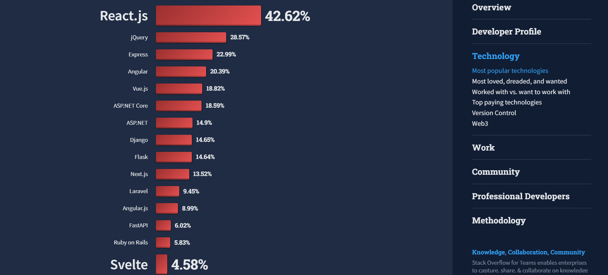
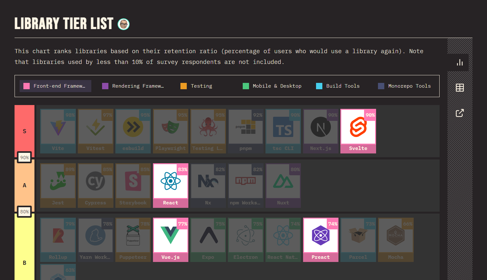
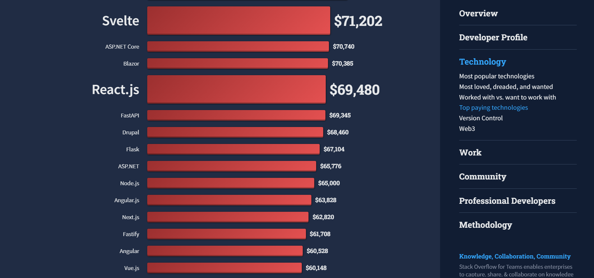
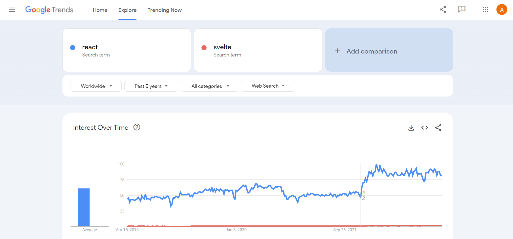
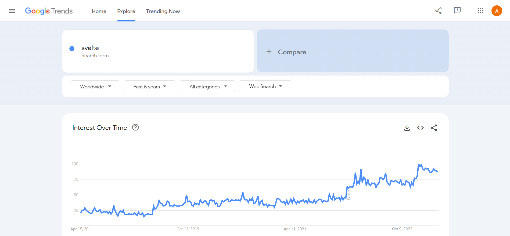

**_TLDR:_** _In this article, we compare React and Svelte, the popular JavaScript frameworks, in terms of popularity, maturity, tooling, performance, learning curve, developer satisfaction, job market, interest over time, and mobile app development. React leads in popularity, job market, and mobile app development, while Svelte has a lower learning curve, high performance, and better developer satisfaction. Both frameworks have strong communities and are highly rated by developers. React may be better for large-scale applications, while Vue is ideal for those seeking a simpler framework with a lower learning curve._

In this comprehensive comparison of React and Svelte, two popular JavaScript frameworks, we delve into their features, tooling, performance, learning curve, developer satisfaction, job market, and more.

Read on to discover which framework best suits your needs, whether you're building a large-scale, high-performance application or seeking a simpler, easy-to-learn option.

## React vs Svelte: Quick overview

Before diving into a detailed comparison, let's briefly review what React and Svelte are:

### React

[React](https://react.dev/) is an open-source JavaScript library developed by Meta (formerly Facebook) for building user interfaces. It is known for its high performance, flexibility, and reusability.

React uses a component-based architecture, allowing developers to create complex UIs by breaking them down into smaller, reusable components. It also employs a virtual DOM, which enables efficient updates and rendering of the UI.

Developed by Meta, it has been around since 2013 and has gained widespread popularity among developers. React's vast and supportive community contributes to its growth and development.

### Svelte

[Svelte](https://svelte.dev/) is a relatively newer JavaScript framework created by Rich Harris and released in 2016. Svelte takes a different approach than traditional frameworks, as it compiles components into highly efficient imperative code at build time, resulting in smaller bundle sizes and faster runtime performance. It also uses a component-based architecture, making it easy for developers to create reusable components and build complex UIs.

It is known for its simplicity, ease of use, and excellent performance. Svelte has a growing community of developers who contribute to its development and maintenance.

### Detailed comparison of React and Svelte

### 1. Popularity

<em>List of most popular web frameworks. Source: <a href="https://survey.stackoverflow.co/2022/#web-frameworks-and-technologies">Stack Overflow Developer Survey 2022</a></em>

React is undoubtedly one of the most popular JavaScript libraries, with a large user base and widespread adoption. According to the [Stack Overflow Developer Survey 2022](https://survey.stackoverflow.co/2022/#section-most-popular-technologies-web-frameworks-and-technologies), React is the most popular frontend JavaScript framework with 42.62% votes.

Svelte, while not as popular as React, has seen significant growth in recent years. It got 4.58% votes in the same survey outperforming popular frameworks like Gatsby and Nuxt.js.

React has over 206,000 stars on [GitHub](https://github.com/facebook/react), while Svelte has over 67,000 [stars](https://github.com/sveltejs/svelte). Although React has a larger user base, Svelte's growing popularity cannot be ignored.

### 2. Maturity

React, released in 2013, is a more mature framework with a well-established ecosystem. It has been adopted by major tech companies like Facebook, Instagram, and Netflix, contributing to its continuous growth and evolution.

Svelte, released in 2016, is still relatively new and evolving. However, its unique approach to compiling components at build time has garnered attention, praise, and love from the developer community. Svelte is also adopted by large companies like GoDaddy, 1Password, The New York Times, etc.

### 3. Tooling

React boasts an extensive ecosystem that includes popular libraries such as [Redux](https://redux.js.org/), [React Router](https://reactrouter.com/en/main), [Next.js](https://nextjs.org/), [TanStack Query](https://tanstack.com/query/latest), [TanStack Router](https://tanstack.com/router/v1), [Zustand](https://zustand-demo.pmnd.rs/) and many others. These libraries make it easier for developers to build complex applications.

Svelte, while not as vast as React's ecosystem, offers tools like [SvelteKit](https://kit.svelte.dev/), [Sapper](https://sapper.svelte.dev/), and [Svelte Store](https://svelte.dev/tutorial/writable-stores) among many others to help developers build scalable applications.

SvelteKit is a framework for building server-rendered applications with Svelte, while Sapper is a lightweight framework for building web applications. Svelte Store is a built-in solution for state management in Svelte applications.

### 4. Performance

Both React and Svelte are known for their excellent performance. React uses a virtual DOM for efficient rendering of changes, while Svelte compiles components into highly optimized imperative code during the build process.

React's virtual DOM allows for fast updates and rendering of the UI. Svelte's unique approach to compiling components at build time results in smaller bundle sizes and faster runtime performance. This makes Svelte particularly well-suited for applications that require high performance and low overhead.

### 5. Learning curve

React has a steeper learning curve than Svelte, requiring developers to understand concepts such as state, props, and lifecycle methods. While experienced developers may find it relatively easy to pick up, newcomers may face some challenges.

On the other hand, Svelte is known for its simplicity and ease of use. It uses a syntax that closely resembles HTML, making it more accessible to developers who are new to web development. As a result, Svelte generally has a lower learning curve than React.

### 6. Developer satisfaction

<em>Retention ratio of popular web frameworks. Source: <a href="https://2022.stateofjs.com/en-US/libraries/#tier_list">State of JavaScript Survey 2022</a></em>

According to the [State of JavaScript Survey 2022](https://2022.stateofjs.com/en-US/libraries/#tier_list), both React and Svelte have high developer satisfaction ratings with Svelte taking an edge over React. React has an 83% retention ratio while Svelte has an impressive 90% retention ratio.

This indicates that developers who have used both frameworks are generally satisfied with their experience and would consider using them again in future projects.

### 7. Job market

<em>List of top paying web frameworks. Source: <a href="https://2022.stateofjs.com/en-US/libraries/#tier_list">Stack Overflow Developer Survey 2022</a></em>

React is currently in high demand in the job market, with numerous job listings on various job platforms. According to the [Stack Overflow Developer Survey 2022](https://survey.stackoverflow.co/2022/#top-paying-technologies-web-frameworks), React developers earn an average of $69,480 per year.

Svelte, being a relatively newer framework, does not have the same level of demand in the job market as React but it has outperformed React in the list of top-paying web frameworks. The same [survey](https://survey.stackoverflow.co/2022/#top-paying-technologies-web-frameworks) reported that Svelte developers earn an average of $71,202 per year.

### 8. Interest over time

<em>Google Trends comparison of React and Svelte from 2018-2023</em>

React is one of the oldest and most popular frontend JavaScript frameworks with an established ecosystem. Therefore, it has derived much higher interest in the search engine.

<em>Google Trends data of Svelte from 2018-2023</em>

Svelte, being a newer framework has a long way to go to match the same interest level as React. However, it has seen a significant increase in interest in recent years, indicating that it is gaining traction within the developer community.

### 9. Mobile App Development

React has a significant advantage when it comes to mobile app development, thanks to _React Native_. [React Native](https://reactnative.dev/) is a popular framework for building cross-platform mobile applications for iOS and Android using React's component-based architecture. It allows developers to use the same codebase for both platforms, reducing development time and effort.

Svelte, on the other hand, does not have a native solution for mobile app development. But it does have a third-party project [_Svelte Native_](https://svelte-native.technology/), however, it's not as mature or widely adopted as React Native. As a result, developers looking to build mobile apps might prefer React over Svelte due to the maturity and popularity of React Native.

## React vs Svelte: Which one is better for your use case?

Both React and Svelte have their vocal proponents. Devs who prefer React often cite these [reasons](https://epicreact.dev/why-i-love-react/) for their preference- explicit state updates, JSX over templates, hooks etc.

On the other hand, devs who prefer Svelte cite these [reasons](https://blog.webjeda.com/why-svelte/) for their preference- HTML like syntax, scoped style, less code, lower learning curve etc.

In general, if you are building a large-scale application and require a mature, well-established ecosystem with better tooling, React may be your best choice. On the other hand, if you need a simple framework with lower learning curve, high performance, and better developer satisfaction, then Svelte may be the best choice for you.

Regardless of which framework you choose, you can expect an abundance of tools and libraries at your disposal to help you build complex applications efficiently.

_Happy Coding!_
