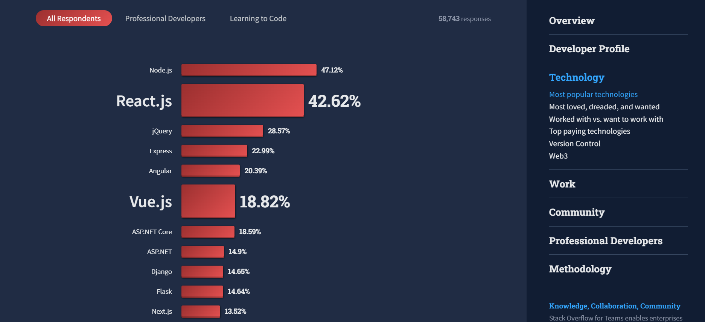
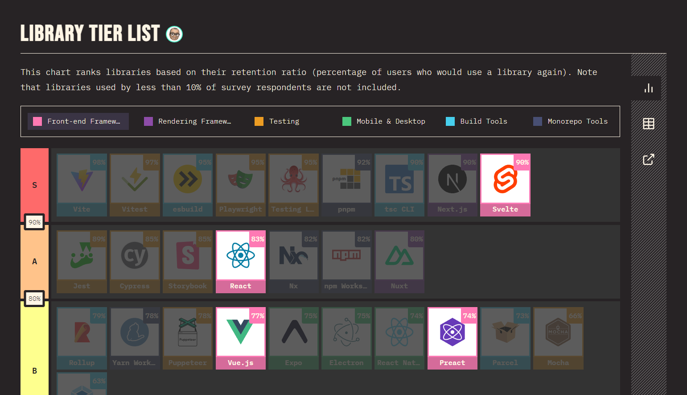
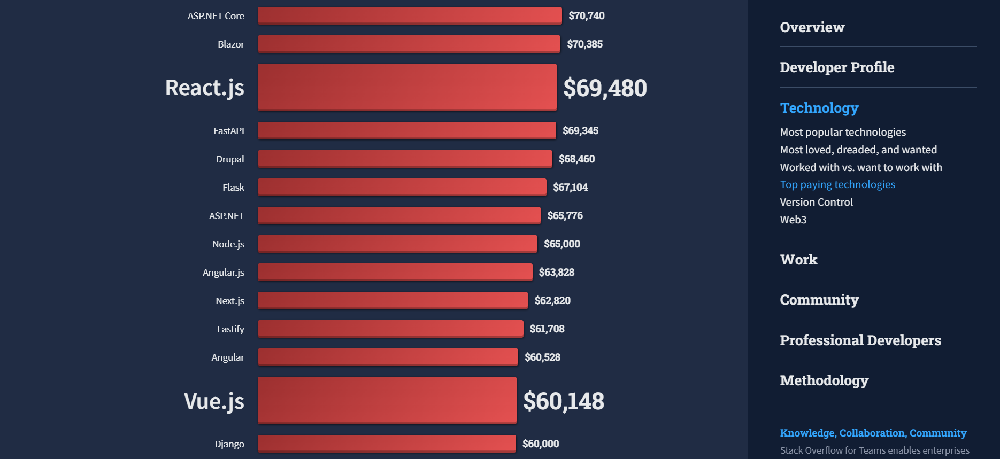
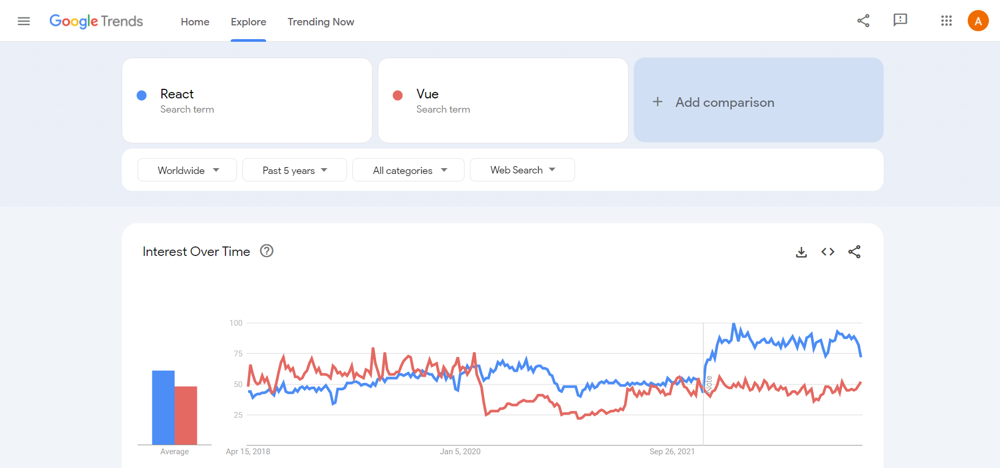

**_TLDR:_** _In this article, we compare React and Vue, the popular JavaScript frameworks, in terms of popularity, maturity, tooling, performance, learning curve, developer satisfaction, job market, interest over time, and mobile app development. React leads in popularity, job market, and mobile app development, while Vue has a lower learning curve. Both frameworks have strong communities and are highly rated by developers. React may be better for large-scale applications, while Vue is ideal for those seeking a simpler framework with a lower learning curve._

In this comprehensive comparison of React and Vue, two popular JavaScript frameworks, we delve into their features, tooling, performance, learning curve, developer satisfaction, job market, and more.

Read on to discover which framework best suits your needs, whether you're building a large-scale, high-performance application or seeking a simpler, easy-to-learn option.

## React vs Vue: Quick overview

Before having an in-depth comparison of both these technologies, let's take a quick look and understand what React and Vue are-

### React

[React](https://react.dev/) is a JavaScript library that was developed by Meta(formerly Facebook) and made public in 2013. React is an open-source JavaScript library used for building user interfaces.

It uses a component-based architecture and virtual DOM (Document Object Model) for efficient rendering of changes. React is highly flexible and can be used for building complex applications with ease.

React is popular among developers because of its robustness and scalability. It provides a rich set of tools and features that make it easier for developers to build high-quality applications.

Additionally, React also has a vast and supportive community that contributes to its growth and development.

### Vue

[Vue](https://vuejs.org/) is a progressive JavaScript framework that was developed by Evan You in 2014. It uses a template-based syntax and a virtual DOM for rendering changes. Vue is known for its simplicity and ease of use, making it a popular choice for developers who are new to web development.

Vue is highly modular and can be easily integrated into existing projects. It provides a set of tools and features that help developers build scalable and high-performance applications. Vue also has a growing community of developers that contribute to its development and maintenance.

## Detailed comparison of React and Vue

### 1. Popularity

<em>List of most popular web frameworks. Source: <a href="https://survey.stackoverflow.co/2022/#web-frameworks-and-technologies">Stack Overflow Developer Survey 2022</a></em>

React and Vue, both are popular frameworks used by developers worldwide. According to the [Stack Overflow Developer Survey 2022](https://survey.stackoverflow.co/2022/#web-frameworks-and-technologies), React is the most popular frontend JavaScript framework and Vue has secured 4th position in popularity among the best frontend JavaScript frameworks.

React is currently(April 2023) the [most popular](https://github.com/facebook/react) JavaScript library on GitHub, with over 206,000 stars and over 1,600 contributors. Vue, on the other hand, has over 203,000 stars on [Vue2 repo](https://github.com/vuejs/vue) with over 350 contributors and over 30,000 stars on [Vue3](https://github.com/vuejs/core) with an approximately similar number of contributors as of April 2023.

While React has a larger user base, Vue has also seen a significant increase in popularity in recent years.

### 2. Maturity

React is considered a more mature front-end framework compared to Vue due to its more established ecosystem. Since its release in 2013, React has had over a decade of development, which has led to a robust community of developers and a plethora of resources and tools available.

React has been widely adopted by big tech companies such as Facebook, Instagram, and Netflix, which has contributed to its continuous growth and evolution.

Vue, although relatively newer compared to React, has still been around since 2014, giving it ample time to develop and mature. Over the years, Vue has established itself as a straightforward and flexible framework that is easy to learn and use. Its popularity has grown significantly due to its unique features, such as reactive components and simple syntax.

This has led to the development of a strong and dedicated community of developers, an expanding ecosystem, and a growing number of resources and tools available. While not yet as widely adopted by big tech companies as React, Vue continues to gain traction and evolve, showcasing its maturity and potential for future growth.

### 3. Tooling

Both React and Vue have a range of tools and libraries available, which makes it easier for developers to build complex applications.

React's extensive ecosystem includes popular libraries such as [Redux](https://redux.js.org/), [React Router](https://reactrouter.com/en/main), [Next.js](https://nextjs.org/), and more. Redux is a predictable state container that helps manage the state of an application, while React Router provides a simple way to navigate between different parts of a web application. Next.js, on the other hand, is a popular framework that helps build server-rendered React applications.

Vue's tooling options include [Vuex](https://vuex.vuejs.org/), [Vue Router](https://router.vuejs.org/), and [Nuxt.js](https://nuxtjs.org/) among many others. Vuex is a state management library for Vue applications, providing a central store for managing data. Vue Router provides routing functionality for Vue applications, allowing developers to easily define and navigate between routes. Nuxt.js is a framework for building server-side rendered Vue.js applications.

### 4. Performance

Both React and Vue can develop high-performance applications and can handle complex applications with ease. React uses a virtual DOM for the efficient rendering of changes, whereas Vue also uses a template-based syntax along with a virtual DOM for rendering changes.

React's virtual DOM allows for fast updates and rendering of the UI, which makes it highly performant. Vue's virtual DOM also allows for efficient updates and rendering of the UI.

However, React's virtual DOM is generally considered to be faster than Vue's virtual DOM.

### 5. Learning curve

React and Vue both have a learning curve, but Vue is generally considered easier to learn. Vue's template-based syntax and simpler API make it easier for developers who are new to web development.

React has a steeper learning curve than Vue, which means that it can take longer for new developers to get up to speed. React also has a relatively complex API, which requires developers to understand concepts such as state, props, and lifecycle methods.

Vue uses templates, which are similar to HTML and can be easier for developers to understand.

### 6. Developer satisfaction

<em>List of popular JavaScript libraries and frameworks with highest retention ratio. Source: <a href="https://2022.stateofjs.com/en-US/libraries/#tier_list">State of JS Survey 2022</a></em>

Both React and Vue are highly popular among developers, and developers tend to be satisfied with their choice of framework. In the [State of JavaScript Survey 2022](https://2022.stateofjs.com/en-US/libraries/#tier_list), both React and Vue have received 83% and 77% retention ratios, respectively.

In the 2022 Stack Overflow Developer Survey, React received 68.19% score and Vue received a 63.16% score in the most loved web frameworks Both of these frameworks are highly rated by developers and have their own cult following.

### 7. Job market

<em>List of top paying web frameworks. Source: <a href="https://survey.stackoverflow.co/2022/#top-paying-technologies-web-frameworks">State of JS Survey 2022</a></em>

Both React and Vue are in high demand in the job market. [Stack Overflow Developer Survey 2022](https://survey.stackoverflow.co/2022/#top-paying-technologies-web-frameworks) reported that React developers are paid $69,480 on average and Vue developers are getting paid $60,148 on average.

They have also secured 9th and 19th place in the list of top-paying web frameworks.

React has over 25,000 [job listings](https://www.indeed.com/jobs?q=react) on Indeed.com. Vue, on the other hand, has got 4,500 [job listings](https://www.indeed.com/jobs?q=vue). While React has a larger job market, Vue has also seen significant growth in recent years and is becoming more popular among employers.

### 8. Interest over time

Both React and Vue have seen significant growth in interest over the years. Both frameworks have a growing community of developers and are likely to continue growing in popularity.

<em>Comparison of React and Vue on Google Trends based on data from 2018-2023</em>

Last 5 years of data on Google Trends data shows a close battle between React and Vue to acquire users' interests. However, in the last 1 year, React has gained an upper edge and has appeared more in searches than Vue.

### 9. Mobile App Development

[React Native](https://reactnative.dev/) is a popular mobile development framework that is based on React. React Native allows developers to build mobile apps for iOS and Android using JavaScript and React.

Vue also had a mobile development framework, [Vue Native](https://vue-native.io/), which was designed to make it easier for developers to build native mobile apps using Vue and it provided a number of benefits over other mobile development frameworks.

Unfortunately, Vue Native had not seen the same level of adoption as React Native and has been deprecated since November 2021 due to the team's limited resources and the fact that the project did not gain enough traction among the community.

So, when it comes to mobile app development, React is the clear winner.

## React vs Vue: Which one is better for your use case?

Both React and Vue have their vocal proponents. Devs who prefer React often cite these reasons for their preference- [Better TypeScript compatibility](https://javascript.plainenglish.io/why-i-finally-chose-react-over-vue-f090cb0e097a), [Smaller API surface](https://sebastiandedeyne.com/why-i-prefer-react-over-vue/), etc.

On the other hand, devs who prefer Vue cite these reasons for their preference- [Simplicity](https://dev.to/gautemeekolsen/why-i-prefer-vue-over-react-3jm6), [Performance](https://betterprogramming.pub/when-to-use-vue-over-react-9a4e0f01e064) etc.

In general, if you are building a large-scale application and need a highly performant framework, React may be your best choice. On the other hand, if you need a simpler framework with a lower learning curve, then Vue may be the best choice for you.

Regardless of which framework you choose, you can expect an abundance of tools and libraries at your disposal to help you build complex applications efficiently.

_Happy Coding!_
