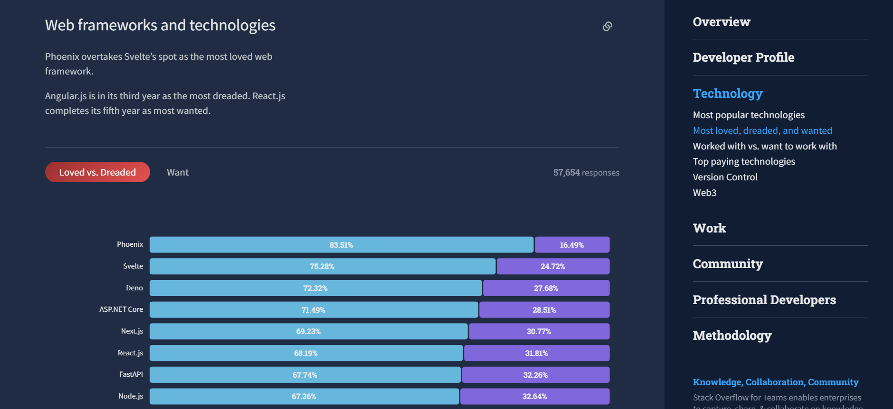
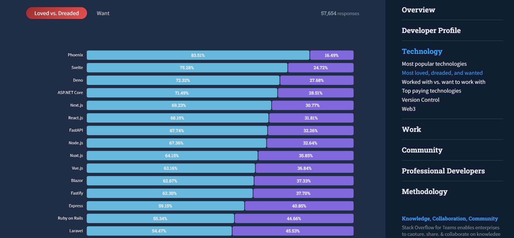
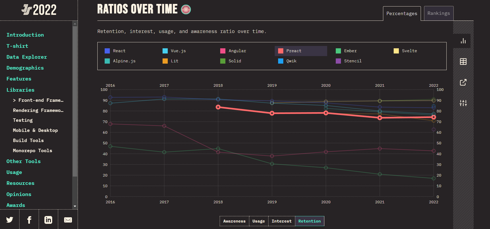
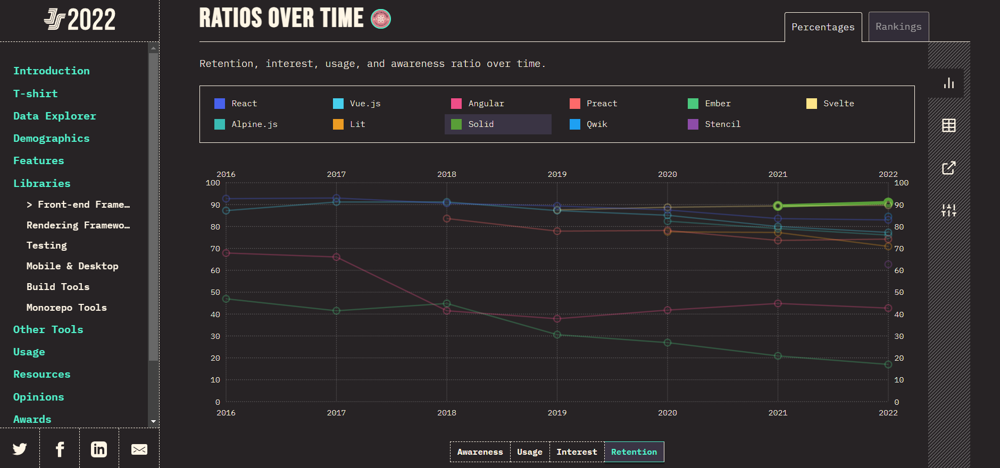

**TLDR**: _This article covers the top JavaScript frameworks as of 2023, considering factors such as popularity, learning curve, developer satisfaction, job market, and interest over time. React and Angular remain the most popular JS frameworks, with mature ecosystems. However, other frameworks, such as Svelte, Vue, Ember.js, Preact, Backbone.js, Alpine, and Solid, have reached a stage of broad adoption. To choose which of these you should use for your next project, consider application size, performance requirements, development timelines, and your team's skillset._

JavaScript frameworks have revolutionized the way developers build web applications by offering pre-built, reusable code structures and tools for efficient development.

As the need for complex and interactive applications grows, choosing the right framework becomes essential for optimizing performance and maintainability.

In this article, we will explore the top JavaScript frameworks, delving into their unique features, strengths, and ideal use-cases. Whether you're a seasoned developer or a newcomer to the world of web development, this comprehensive guide will help you make informed decisions and enhance your skill set in the rapidly evolving landscape of JavaScript frameworks.

## What is a JavaScript framework?

A JavaScript framework is a pre-written code that helps developers build applications more efficiently. It provides a structure, tools, and libraries to streamline the development process and make it easier to build complex applications.

Frameworks take care of a lot of the underlying code that developers would otherwise have to write themselves. This means that developers can focus on building unique features and functionality for their applications, rather than getting bogged down with the nitty-gritty of coding.

### Our ranking criteria

To come up with our list of the top JavaScript frameworks, we considered several factors. Here are the criteria we used to identify the best frameworks:

- **Popularity:** We looked at the number of GitHub stars, NPM trends, StackOverflow Developer Survey, etc. to determine the popularity of each framework.

- **Learning curve**: We considered the ease of learning and how quickly developers can start building applications with each framework.

- **Developer satisfaction**: We looked at the Stack Overflow developer survey and other online resources to find out what frameworks are loved by developers and are easy to use.

- **Job market:** We considered the current job market and the demand for developers skilled in each framework.

- **Interest over time**: We looked at _Google Trends_ and _NPM Trends_ to see how each framework's interest has evolved over time.

## Overview of the best JavaScript frameworks

### 1. React

[React](https://react.dev/) is a frontend JavaScript library created by Meta to build user interfaces and single page applications. It was originally written by Jordan Walke and was first introduced to the world in 2013 at JSConfUS.

React uses a component-based architecture. Components are reusable and encapsulated pieces of code that can be composed to build complex user interfaces. This makes it easier to manage and maintain large codebases and also promotes code reuse.

For optimal performance, it uses Virtual DOM which is a lightweight copy of the actual DOM that React uses to keep track of changes to the UI. This allows React to update the UI efficiently without re-rendering the entire page.

According to the [Stack Overflow Developer Survey 2022](https://survey.stackoverflow.co/2022/#section-most-popular-technologies-web-frameworks-and-technologies), React is the most popular frontend JavaScript framework and is used in large products like Facebook, Netflix, Uber, Airbnb, etc.

Use React if you are building a large-scale application with complex user interfaces, cross platform application, or need a flexible library that allows you to make your own decisions about project structure and architecture.

Here are two great courses for you to start learning React- [Learn React](https://scrimba.com/learn/learnreact) by Scrimba and [The Beginner's Guide to React](https://egghead.io/courses/the-beginner-s-guide-to-react) by Egghead.io

### 2. Angular

[Angular](https://angular.io/) is a TypeScript based framework used for building web applications. Its early version AngularJS was launched by Google in 2010 which they rewrote and relaunched in 2016 as Angular.

Like many other front-end frameworks, Angular uses a component-based architecture to break down user interfaces into smaller, reusable parts. It also provides a powerful two-way data binding system that allows changes to the application's data to automatically update the UI and vice versa. This makes it easy to create complex, interactive user interfaces.

With a focus on building scalable and maintainable applications, Angular has been adopted by companies like Microsoft, Forbes, and PayPal. It is also the 2nd most popular modern frontend JavaScript framework after React.

Use Angular if you are building a large-scale application with complex business logic, or want to follow a strict and opinionated structure for your project and prefer to have all the necessary features and tools provided out of the box.

Here are two great courses for you to start learning Angular- [Angular - The Complete Guide (2023 Edition](https://www.udemy.com/course/the-complete-guide-to-angular-2/) and [The Complete Angular Course: Beginner to Advanced](https://www.udemy.com/course/the-complete-angular-master-class/).

### 3. Svelte

[Svelte](https://svelte.dev/) is a relatively new JavaScript framework that has gained popularity in recent years. The initial version of Svelte was launched by Rich Harris in 2016, who also created Rollup, a popular bundler for JavaScript modules.

It takes a different approach to build web applications compared to traditional frameworks like React and Angular. Rather than focusing on building reusable components, Svelte is designed to be more lightweight and performant. It does this by compiling components at build time, rather than at runtime, which can lead to faster load times and better performance.

Svelte was the 2nd most loved web framework and the most loved JavaScript framework in the Stack Overflow Developer Survey 2022. It is also the highest paying JavaScript framework and is used by large companies like GoDaddy, 1Password, The New York Times, etc.

Use Svelte when your application requires high interactivity and real-time updates and you want to use a framework that provides efficient rendering and optimized performance for your applications.

Here are two great courses for you to start learning Svelte- [Learn Svelte – Full Course for Beginners](https://youtu.be/UGBJHYpHPvA) and [Svelte.js - The Complete Guide](https://www.udemy.com/course/sveltejs-the-complete-guide/).

### 4. Vue

[Vue](https://vuejs.org/) is a progressive JavaScript framework for building user interfaces. It was developed by Evan You and was first released in February 2014. Vue is designed to be easy to adopt and integrate into other projects, and it has gained a lot of popularity among developers.

Vue is often compared to other popular JavaScript frameworks like React and Angular, but it has its own unique features and advantages. It has a minimalistic API and requires less boilerplate code than other frameworks, which makes it easier for developers to learn and use.

Vue is used by top companies like Netflix, Adobe, Gitlab, Behance, etc. It was also voted by 63.16% of developers as their most loved framework in 2022 Stack Overflow Developer Survey.

Use Vue when you want to use a framework that has a gentle learning curve and is easy to pick up for beginners and provides a more flexible and customizable approach to development.

Here are two great resources for you to start learning Vue- [Vue JS Crash Course](https://youtu.be/qZXt1Aom3Cs) by Brad Traversy and courses by [Vue Mastery](https://www.vuemastery.com/courses).

### 5. Ember.js

[Ember.js](https://emberjs.com/) is a JavaScript framework that was first introduced in 2011. It was originally created by Yehuda Katz, who is also known for his contributions to other popular open-source projects like Ruby on Rails and jQuery.

Ember.js is designed to be an all-in-one solution for building web applications, with a strong emphasis on conventions over configurations. It provides a set of best practices and patterns for building scalable and maintainable applications.

Ember is used on many popular websites like Digital Ocean, LinkedIn, Twitch, Apple Music, etc, and has become a popular choice among companies that need to build complex and feature-rich web applications.

Use Ember when you want to build large-scale applications with a strong emphasis on convention over configuration and want to use a framework that provides a complete set of tools for building web applications, such as a router, an object model, and a templating language.

Here are two great resources for you to start learning Ember- [Ember.js Fundamentals](https://www.pluralsight.com/courses/emberjs-fundamentals) by Pluralsight and [Master EmberJS : Learn Ember JS From Scratch](https://www.udemy.com/course/master-emberjs/).

### 6. Preact

[Preact](https://preactjs.com/) is a lightweight JavaScript library for building user interfaces. It is an alternative to React, a popular library for building web applications, but with a smaller bundle size and faster performance.

Preact provides many of the same features and APIs as React, including a component-based architecture, a virtual DOM for efficient updates, and a familiar syntax for defining and rendering components.

In the [State of JavaScript Survey 2022](https://2022.stateofjs.com/en-US/libraries/#tier_list), Preact received a 74% retention ratio. It also had similar stats over the last few years. This indicates that developers are generally satisfied with this framework.

One of the main advantages of Preact is its small size, which is around 4KB when gzipped. This makes it ideal for projects that require a small footprint.

Use Preact when you want to build small to medium-sized applications with a focus on performance and minimal overhead and want to minimize the time it takes for your application to load and execute.

Here are two great resources for you to start learning Preact- [Up and running with Preact](https://egghead.io/courses/up-and-running-with-preact) by Pluralsight and [Learn Preact](https://preactjs.com/tutorial/).

### 7. Backbone.js

[Backbone.js](https://backbonejs.org/) is a lightweight JavaScript framework that provides a structure for building web applications. It was created by Jeremy Ashkenas and was first released in October 2010.

Backbone.js is based on the Model-View-Controller (MVC) architectural pattern, which separates the application into three main components: models, views, and controllers.

It is highly modular and can be easily customized and extended using plugins and extensions. This makes it easy to add new features and functionality to an application, without having to rewrite large parts of the codebase. Backbone.js is also used by popular companies like Uber, Reddit, Pinterest, and LinkedIn on their products.

Use Backbone when you want to build applications that require high interactivity and real-time updates, but you want to avoid the complexity of more comprehensive frameworks and prefer a more flexible and customizable approach to development.

Here are two great resources for you to start learning Backbone- [Backbone Tutorial: Learn Backbonejs from Scratch](https://www.udemy.com/course/backbonejs-tutorial/) and [Backbone.js Fundamentals](https://www.pluralsight.com/courses/backbone-fundamentals).

### 8. Alpine

[Alpine.js](https://alpinejs.dev/) is a relatively new JavaScript framework that was first introduced in 2019 by Caleb Porzio. It's a lightweight and fast framework that's designed to be easy to use and has a low learning curve.

Alpine.js provides a declarative syntax for building UI components and managing application state, without requiring a build step or complicated setup.

Alpine.js is built around the idea of using declarative HTML attributes to create reactive behavior, rather than relying on complex JavaScript code. This makes it easy to add interactivity to your web applications without having to write a lot of custom code.

Use Alpine when you want to use a framework that provides efficient rendering and optimized performance for your applications, but with a smaller footprint than more comprehensive frameworks and a more declarative and easy-to-learn approach to development.

Here are two great resources for you to start learning Alpine- [Learn Alpine JS](https://scrimba.com/learn/alpinejs) and [Alpine JS Vs. 3 For Beginners](https://www.udemy.com/course/alpinejs/).

### 9. Solid

[SolidJS](https://www.solidjs.com/) is a relatively new JavaScript framework that has gained popularity in the last 2 years. It is an open-source, declarative JavaScript library for building user interfaces.

In the [State of JavaScript Survey 2022](https://2022.stateofjs.com/en-US/libraries/front-end-frameworks/), SolidJS received an impressive 90.9% retention ratio. This indicates that developers who use SolidJS really love this framework.

SolidJS uses a declarative syntax, which means that you describe the state of your application and let SolidJS handle the updates. This makes it easier to reason about your code and reduces the likelihood of bugs and errors.

Use Solid when you want to build small to large-sized applications with a focus on performance, scalability, and ease of use.

Here are two great resources for you to start learning Solid- [Learn Alpine JS](https://scrimba.com/learn/alpinejs) and [Alpine JS Vs. 3 For Beginners](https://www.udemy.com/course/alpinejs/).

## Conclusion

As of today (April 2023), React and Angular are the most popular Javascript frameworks for building frontends. However, The other frameworks can also be very useful for certain use cases.

Some frameworks may be better suited for specific projects or development teams, depending on factors such as the project requirements, team size, and technical expertise.

For example, at Kombai, we use Solid because it's lightweight, secure, and provide a consistent structure for organizing code.

Before building your next project, try exploring various options and you may end up with a choice that might not be obvious but better for the future of your project.

_Happy Coding!_
