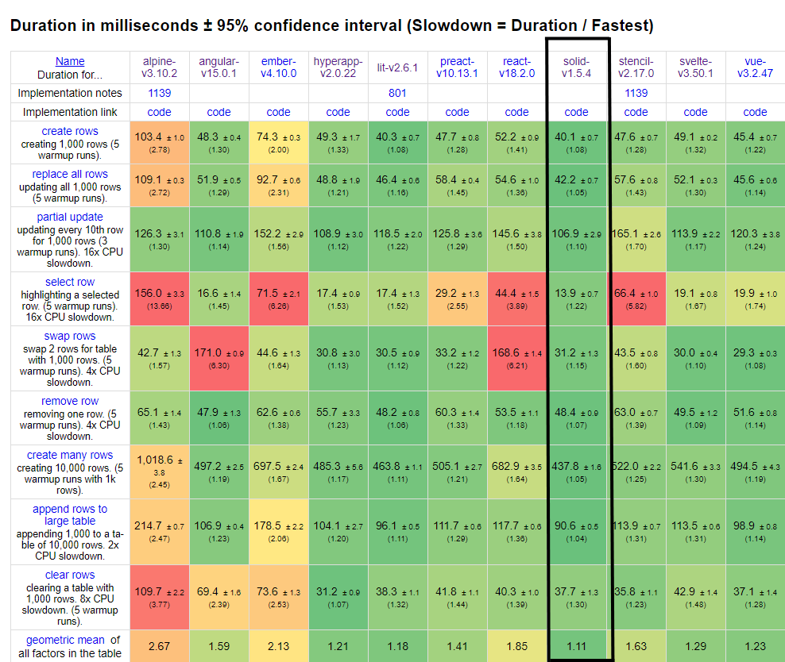
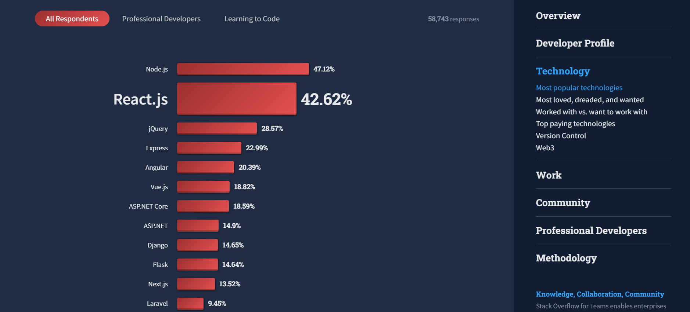
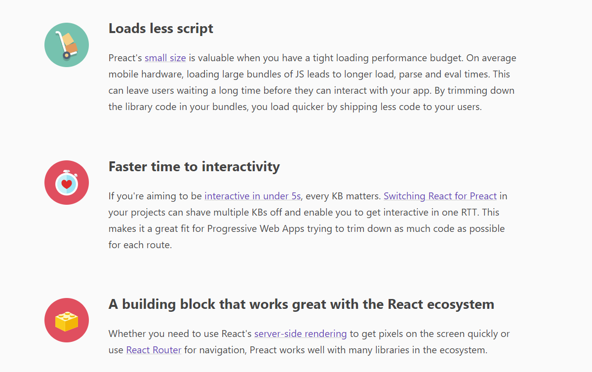
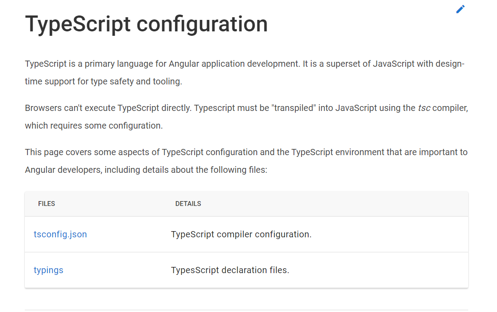
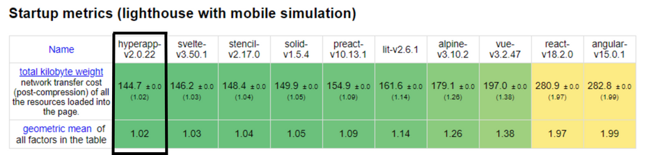

**TLDR:** _In this article, we explore some of the top JavaScript frameworks for performance, tooling, minimal syntax, learning curve, community and ecosystem, Progressive Web Apps, component reusability, scalability, TypeScript support, and lightweight alternatives. Solid.js is excellent for performance, Angular provides robust tooling, Vue.js is great for minimal syntax, and Svelte has a shallow learning curve. React has a strong community and excels in scalability, Preact is perfect for building PWAs, Angular has first-class TypeScript support, and Hyperapp is a lightweight alternative. Choose the one that best suits your project's needs!_

Each JavaScript framework has its strengths and weaknesses, and choosing the right one largely depends on the needs of your project. Some frameworks are optimized for performance, while others provide comprehensive tooling or minimal syntax. Additionally, some frameworks are designed to be scalable, while others provide a shallow learning curve.

In this article, we'll explore some of the top JavaScript frameworks based on use cases. We'll cover a range of use cases, including performance, tooling, minimal syntax, learning curve, community and ecosystem, Progressive Web Apps, component reusability, scalability, TypeScript support, lightweight alternatives and will see which JavaScript framework rules in which category.

## 1. Performance: Solid.js

<em>Solid beats popular frameworks like React, Angular, Vue and others in performance. Source: <a href="https://krausest.github.io/js-framework-benchmark/current.html">JS Framework Benchmark</a></em>

Solid.js is a highly performant JavaScript framework that is designed to provide a reactive and efficient approach to building web applications. The framework provides a range of features and tools that enable developers to optimize their applications for performance.

For example, Solid.js provides a highly efficient state management system that reduces the amount of code needed to manage state in complex applications.

Additionally, the framework provides a range of tools for optimizing code, including a built-in profiling tool that enables developers to identify performance bottlenecks quickly. Overall, Solid.js is an excellent choice for developers who want to build high-performance and scalable web applications.

## 2. Tooling: Angular

Angular is a popular JavaScript framework developed by Google that is known for its robust tooling and ecosystem. The [Angular CLI](https://www.amadousall.com/why-you-should-use-angular-cli/) (Command Line Interface) is a powerful tool that simplifies project setup, testing, and deployment.

The CLI provides a range of tools for generating code, running tests, and deploying applications. Additionally, the Angular framework provides a range of features that enable developers to build scalable and high-performance web applications.

Additionally, Angular provides a range of built-in tools for testing and debugging applications, including a built-in testing framework and a range of debugging tools. Overall, Angular's tooling and ecosystem make it an excellent choice for developers who want a comprehensive set of tools for building web applications.

## 3. Minimal Syntax: Vue.js

Vue.js is known for its [minimal](https://about.gitlab.com/blog/2016/10/20/why-we-chose-vue/) and intuitive syntax, which makes it an excellent choice for developers who want to build web applications quickly and efficiently. The framework's syntax is straightforward and easy to understand, which allows developers to focus on building their application rather than learning a complex framework.

Vue.js provides a powerful templating engine that makes it easy to build complex user interfaces. The templating engine allows developers to define reusable components, which can be used throughout the application. This makes it easier to build scalable and maintainable web applications.

Overall, if minimal syntax and ease of use are your top priorities, then Vue.js is an excellent choice.

## 4. Learning Curve: Svelte

Svelte is a relatively new JavaScript framework that has gained popularity due to its unique approach to building web applications. Unlike traditional frameworks, Svelte compiles applications at build time, which improves performance and reduces the amount of code needed to build web applications.

<blockquote class="twitter-tweet" data-conversation="none" data-theme="dark">
I found React learning curve too steep for onboarding junior devs, I was looking at Vue and then found <a href="https://twitter.com/sveltejs?ref_src=twsrc%5Etfw">@sveltejs</a>, Never looked back, and I even wrote the Svelte tutorial at <a href="https://twitter.com/MozDevNet?ref_src=twsrc%5Etfw">@MozDevNet</a> !!! (really proud of it)<a href="https://t.co/lqi4tDVLA5">https://t.co/lqi4tDVLA5</a> <a href="https://t.co/Syn1o1tw2k">pic.twitter.com/Syn1o1tw2k</a>
&mdash; opensas (@opensas) <a href="https://twitter.com/opensas/status/1464873493770690566?ref_src=twsrc%5Etfw">November 28, 2021</a></blockquote> 

Svelte's approach to building web applications is relatively easy to learn, making it an excellent choice for developers who want a shallow learning curve. Additionally, Svelte provides a range of features, including a reactive data binding system and a simple syntax, which makes it easy to build custom components and applications.

Overall, if you want a shallow learning curve and a unique approach to building web applications, then Svelte is an excellent choice.

## 5. Community and Ecosystem: React

React is one of the most popular JavaScript frameworks, largely due to its large and active community. The React ecosystem provides a vast array of libraries, packages, and tools that help developers build scalable and high-performance web applications.

<em>List of most popular web frameworks. Source: <a href="https://survey.stackoverflow.co/2022/#section-most-popular-technologies-web-frameworks-and-technologies">Stack Overflow Developer Survey 2022</a></em>

Additionally, the popularity of React means that it's relatively easy to find talented developers and contributors who are familiar with the framework. This can make it easier to hire developers or collaborate on open-source projects.

Overall, React's strong community and ecosystem make it an excellent choice for developers who want to build long term projects.

## 6. Progressive Web Apps: Preact

Preact is a lightweight alternative to React that is ideal for building Progressive Web Applications (PWAs). Preact provides a similar feature set to React, with a smaller size and faster load times. This makes Preact an excellent choice for developers who want to build [high-performance PWAs](https://medium.com/dev-channel/treebo-a-react-and-preact-progressive-web-app-performance-case-study-5e4f450d5299) that can be installed on any device.

<em>Preact loads less script and has faster interactivity time. Source: <a href="https://preactjs.com/guide/v10/progressive-web-apps/">Preact</a></em>

Another benefit of Preact is its compatibility with the React ecosystem. Preact provides a similar feature set to React, which makes it easy to transition between the two frameworks.

## 7. Scalability: React

React is a [highly scalable](https://brainhub.eu/library/react-security-scalability) JavaScript framework and provides developers with the flexibility, performance, and resources needed to build large-scale web applications.

React's component-based architecture allows for effective code reuse and modular design, which is critical for building scalable web applications.

In terms of performance, React's virtual DOM implementation enables efficient and fast rendering, making it suitable for building large-scale web applications with high performance requirements. Additionally, React provides a range of tools and features, including a strong and active community, that help optimize performance and enhance scalability.

React has also passed the test of time and have been used on apps like Facebook, Netflix, WhatsApp, Khan Academy and others, therefore, proving that it can be used to build highly scalable applications.

## 8. TypeScript Support: Angular

Angular has first-class support for TypeScript, which is a statically typed superset of JavaScript.

<em>TypeScript is the primary language of Angular and therefore it has first class support for TypeScript. Source: <a href="https://angular.io/guide/typescript-configuration">Angular</a></em>

TypeScript provides a range of tools and features, including type checking and static analysis, that enable developers to write cleaner and more maintainable code. Additionally, TypeScript helps catch errors early, which reduces the time and effort required for testing and debugging.

Angular integrates seamlessly with other TypeScript tools and libraries, making it easier for developers to build modern and efficient web applications with a range of tools and packages.

## 9. Bundle Size: Hyperapp

Hyperapp is a 1KB, lightweight JavaScript framework that emphasizes simplicity and performance. With a small footprint and a functional approach to state management, Hyperapp is an excellent choice for small projects or situations where performance is critical, and bundle size needs to be minimized.

<em>Hyperapp has the tiniest bundle size among all the popular frontend JavaScript frameworks. Source: <a href="https://krausest.github.io/js-framework-benchmark/current.html">Frontend Performance Benchmark</a></em>

Hyperapp has a very small footprint and minimal dependencies, which makes it a great choice for projects where bundle size and performance are critical.

## Conclusion

In the end, there is no one universal JavaScript framework that fits all your needs. Each one has its strengths and weaknesses.

When it comes to building high-performance web applications, Solid.js is an excellent choice. Angular, on the other hand, is known for its robust tooling and ecosystem. With the Angular CLI and a range of built-in tools for testing and debugging applications, Angular provides a comprehensive set of tools for building web applications.

Vue.js, with its minimal syntax and ease of use, is an excellent choice for developers who want to build applications quickly and efficiently. Similarly, React, Svelte, Ember.js, Preact, Hyperapp, and other JavaScript frameworks each have their own unique strengths and are designed for different use cases.

Ultimately, the key is to understand your project requirements and developer preferences. Then, choose the framework that best aligns with your goals and expertise. By staying informed about the latest developments in these frameworks, you can make informed decisions and leverage the best tools for your specific needs.

_Happy Coding!_
