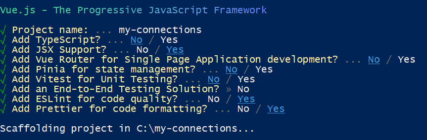
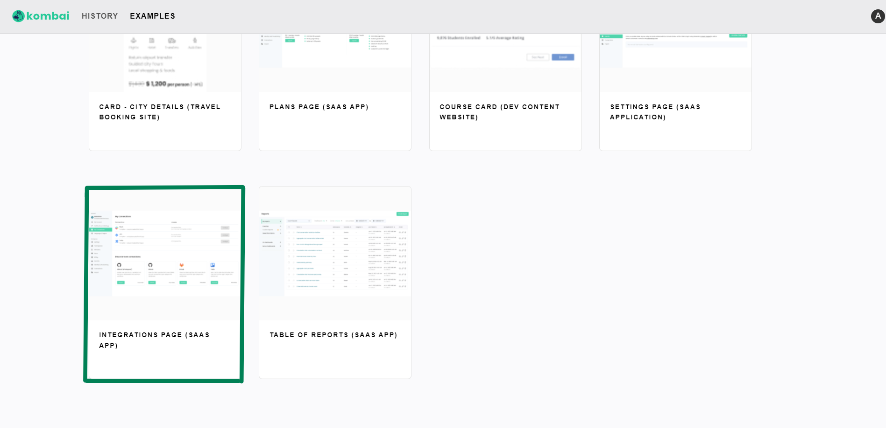
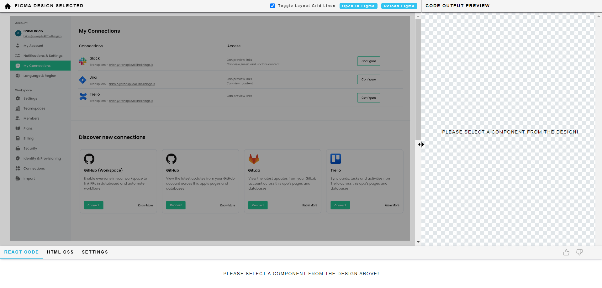
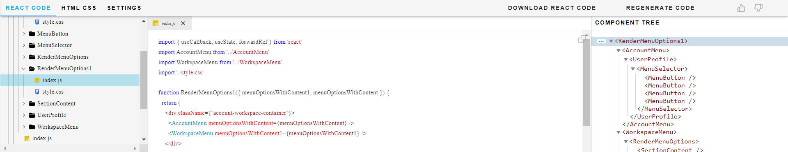
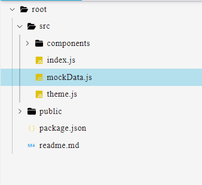
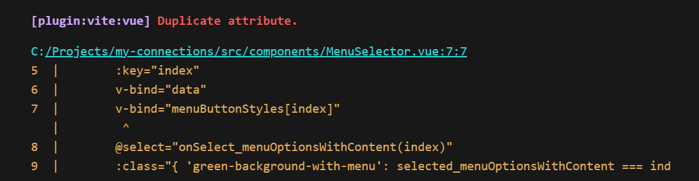

In this article, we are going to learn to create a Vue project with Kombai. As of now, Kombai only allows to generate React and HTML/CSS. But this doesn't mean you can't use it for a Vue project.

Today, we will learn how with the help of GPT4, you can convert all the Kombai created React components into Vue components.

So, without further ado, let's get started.

## Setting up a Vue app

Before starting, let's first spin up a Vue app. To do so, open a terminal at your desired location and run the following command:

`npm create vue@latest`

Now, you will be presented with several prompts with multiple optional features to bring in to your project like TypeScript support, JSX support etc.

For the sake of this article, we are going with the following options:



Once the project is scaffolded, open the directory in VS Code, then run the following commands:

```bash
cd my-connections
npm install
npm run format
npm run dev
```

## How to use Kombai?

- Visit [Kombai](https://dev.kombai.app/) and Sign Up.



- Now, inside the [Examples](https://dev.kombai.app/examples) page, click on **INTEGRATIONS PAGE(SAAS APP)**.



- Now, you will be redirected to the actual Kombai app where you will generate the code from Figma prompts.


- Select the Sidebar of the loaded design on the Kombai website. Now, a new panel will slide up from the bottom that gives you the generated code, file structure, and component tree of the prompt.

- From here, you can either download the entire code directory or can copy the code file by file and paste it to your local code directory.

## Converting Kombai code with GPT4

Kombai gives you the freedom to prompt any specific portion of the design, whether large or small to generate component code.


For this tutorial, we are dividing the whole UI into three major chunks: **Sidebar**, **My Connections**, and **Discover new connections**.

We will prompt these three portions of our design, convert the React components into Vue components and then finally put them together inside `App.vue` to render them on the UI.

But, in this article, we will only see the conversion process of the first component and other important steps, after which you can convert the entire app on your own. Let's start the prompting process:

### Converting the Sidebar

Here's the step by step process to generate and convert the React components to Vue components with the help of Kombai and GPT4.

**Step 1:** Select the Sidebar of the **[Integrations Page](https://dev.kombai.app/page/examples/P1Jl3DfggzOK7TTmTAPcvm/10%3A18)** design on the Kombai website to generate the components.



**Step 2:** Once the code is generated, we will start the conversion process starting from the topmost component in the component tree, i.e., `RenderMenuOptions1`. So, first head over to ChatGPT and paste the following prompt:

_I am migrating a React project to Vue. You have to help me convert each React component to Vue component. I will give you the code for each component one by one._

**Step 3:** In the next prompt, type: _Thank you, here's the code for the first component_ followed by the actual code of the component that Kombai generated. The code for this component resides at `./root/src/components/RenderMenuOptions1/index.js`.

Here's the full code of this component:

```jsx
import { useCallback, useState, forwardRef } from "react";
import AccountMenu from "../AccountMenu";
import WorkspaceMenu from "../WorkspaceMenu";
import "./style.css";

function RenderMenuOptions1({
  menuOptionsWithContent1,
  menuOptionsWithContent,
}) {
  return (
    <div className={`account-workspace-container`}>
      <AccountMenu menuOptionsWithContent={menuOptionsWithContent} />
      <WorkspaceMenu menuOptionsWithContent1={menuOptionsWithContent1} />
    </div>
  );
}

export default RenderMenuOptions1;
```

And here's the Vue code that GPT4 gave us in return:

```html
<template>
  <div class="account-workspace-container">
    <AccountMenu :menu-options-with-content="menuOptionsWithContent" />
    <WorkspaceMenu :menu-options-with-content1="menuOptionsWithContent1" />
  </div>
</template>

<script>
  import AccountMenu from "../AccountMenu";
  import WorkspaceMenu from "../WorkspaceMenu";
  import "./style.css";

  export default {
    name: "RenderMenuOptions1",
    components: {
      AccountMenu,
      WorkspaceMenu,
    },
    props: {
      menuOptionsWithContent1: {
        type: Array, // Assuming this is an array, adjust type if different
        required: true,
      },
      menuOptionsWithContent: {
        type: Array, // Assuming this is an array, adjust type if different
        required: true,
      },
    },
  };
</script>

<style scoped src="./style.css"></style>
```

**Step 4:** Now, create a new file named `RenderMenuOptions1.vue` inside the components folder of your Vue project and paste the entire code.

**Step 5:** At the bottom of the code, inside the `style` element, remove `src="./style.css"` and instead paste the entire CSS code within the element.

However, if your CSS files are really large, you can also choose to keep it in a separate folder. The CSS code of the component is also placed in the same folder from where you copied the JSX code: `./root/src/components/RenderMenuOptions1/style.css`.

Here's how the final component will look like after adding the style:

```html
<template>
  <div class="account-workspace-container">
    <AccountMenu :menu-options-with-content="menuOptionsWithContent" />
    <WorkspaceMenu :menu-options-with-content1="menuOptionsWithContent1" />
  </div>
</template>

<script>
  import AccountMenu from "../AccountMenu";
  import WorkspaceMenu from "../WorkspaceMenu";
  import "./style.css";

  export default {
    name: "RenderMenuOptions1",
    components: {
      AccountMenu,
      WorkspaceMenu,
    },
    props: {
      menuOptionsWithContent1: {
        type: Array, // Assuming this is an array, adjust type if different
        required: true,
      },
      menuOptionsWithContent: {
        type: Array, // Assuming this is an array, adjust type if different
        required: true,
      },
    },
  };
</script>

<style scoped>
  .account-workspace-container {
    box-sizing: border-box;
    display: flex;
    flex-direction: column;
    align-items: stretch;
    justify-content: flex-start;
    min-width: 290px;
    padding-top: 24px;
    padding-bottom: 288px;
    background: #f5f8fa;
    border: 1px solid #f1f2f6;
  }
</style>
```

**Step 6:** Now, repeat the same process for all the components that Kombai generated.

**Step 7:** Once all the components are successfully converted and imported to your local Vue project, create two new files with the name `mockData.js` and `theme.js` inside the `src` folder of your Vue app.



**Step 8:** Now, head over to Kombai and copy the code from `./root/src/mockData.js` and `./root/src/theme.js` and paste it to their respective files in your local Vue app.

### Rendering Parent Component in App.vue

Upto this point, we have successfully imported all the components and data to our app. Now, we have to render the topmost parent component, i.e., `RenderMenuOptions1` in `App.vue`.

Let's see how we are going to do it:

**Step 1:** In the ChatGPT, add the next prompt:

_Thank you. Now help me render the "RenderMenuOptions1.vue" component in "App.vue". Here's how it is getting rendered inside React:_

```jsx
import { createRoot } from "react-dom/client";
import RenderMenuOptions1 from "./components/RenderMenuOptions1";
import { mockData } from "./mockData";
const rootElement = document.getElementById("root");
const root = createRoot(rootElement);
root.render(
  <div
    data-ignore="used for width only"
    style={{ display: "inline-block", width: "290px" }}
  >
    <RenderMenuOptions1 {...mockData} />
  </div>,
);
```

**Code response of ChatGPT**:

```html
<template>
  <div
    data-ignore="used for width only"
    style="display: inline-block; width: 290px;"
  >
    <RenderMenuOptions1 v-bind="mockData" />
  </div>
</template>

<script>
  import RenderMenuOptions1 from "./components/RenderMenuOptions1";
  import { mockData } from "./mockData";

  export default {
    name: "App",
    components: {
      RenderMenuOptions1,
    },
    data() {
      return {
        mockData: mockData,
      };
    },
  };
</script>
```

**Step 2**: Now replace the current `App.vue` code with the above code response of ChatGPT and you are good to go.

### Solving the errors

Here are the solutions of some issues that you might face while starting your dev server:

1. If you are not using separate file for CSS, then remove all the CSS imports in your components.

2. Use the correct relative path when importing your components. Also, make sure you are adding `.vue` while importing the components instead of just referencing their name. E.g. `import AccountMenu from "./AccountMenu.vue";` instead of `import AccountMenu from "../AccountMenu";`

3. You may also get the **Duplicate attribute** error if ChatGPT has used `v-bind` twice for your components, similar to the below image.



Here's an example of how to fix this error:

**Error:**

```js
v-bind="data"
v-bind="menuButtonStyles[index]"
```

**Solution:**

```js
v-bind="{... data, ...menuButtonStyles[index]}"
```

## Conclusion

If you have followed everything correctly, your Sidebar should be live on the UI. Now, repeat the same process for other components as well to build the complete app.

For your reference, here's the [code](https://github.com/ashutosh-mishra4/my-connections) and [deployed site](https://my-connections-navy.vercel.app/) of the complete design. Please take a look if you are stuck somewhere.

Let us know if you have any further question or confusion.

_Happy Coding!_
