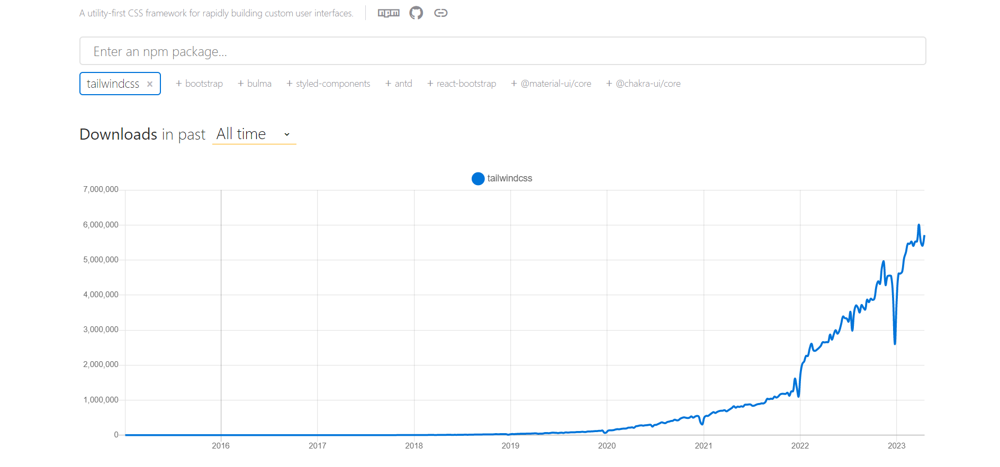

**TLDR**: _In this article, we explored Tailwind CSS, a popular CSS framework known for its utility-first approach, customizable design system, and accessibility-first approach. We discussed its key features, including responsive design, powerful layout tools, and how to use Tailwind's utility classes. We also covered how to customize Tailwind CSS and create custom utility classes. If you're a web developer or designer looking to build responsive and user-friendly websites and applications quickly and efficiently, Tailwind CSS is definitely worth checking out._

Tailwind CSS is a CSS framework that has become increasingly popular among web developers. It provides a set of utility classes that make it easier to create custom designs, and offers a comprehensive set of tools and features that help developers create responsive, accessible, and user-friendly websites and applications quickly and efficiently.



<p style="text-align: center">
<em>All time weekly downloads of TailwindCSS. Source: <a href="https://npmtrends.com/tailwindcss">NPM Trends</a></em></p>

In this article, we will explore the key features of Tailwind CSS, including its customizable design system, responsive design, powerful layout tools, utility-first approach, and accessible classes. We will also cover how to use Tailwind's utility classes, customize Tailwind CSS using the configuration file, and create custom utility classes. By the end of this article, you will have a solid understanding of Tailwind CSS and how it can help you create beautiful and responsive designs in less time.

## What is Tailwind?

[Tailwind CSS](https://tailwindcss.com/) is a popular CSS framework that provides a set of utility classes to make it easier to create custom designs. It was created by [Adam Wathan](https://twitter.com/adamwathan), [Steve Schoger](https://twitter.com/steveschoger), and [David Hemphill](https://twitter.com/davidhemphill), and was released in 2017. Since then, it has gained a lot of popularity due to its ease of use and flexibility.

Tailwind CSS is built on a utility-first approach to CSS, which means that the framework provides a set of small, single-purpose classes that can be combined to create complex styles quickly and easily. This is in contrast to more [traditional CSS frameworks](https://blog.logrocket.com/comparing-bootstrap-vs-tailwind-css-vs-material-ui-mui/) that rely on predefined styles and templates.

<blockquote class="twitter-tweet"><p lang="en" dir="ltr">Properly playing with ChatGPT for the first time to get some help with a new podcast name — really mind-blowing stuff and even more crazy to me that it&#39;s using Tailwind CSS for the UI.<br><br>Constantly humbled by where our stupid little framework has gone in the last 5 years 😳 <a href="https://t.co/etar9xOXSC">pic.twitter.com/etar9xOXSC</a></p>&mdash; Adam Wathan (@adamwathan) <a href="https://twitter.com/adamwathan/status/1623506723280502784?ref_src=twsrc%5Etfw">February 9, 2023</a></blockquote> <script async src="https://platform.twitter.com/widgets.js" charset="utf-8"></script>

Owing to this, large corporations are also constantly using Tailwind to design their projects. Companies like [Shopify](https://tailwindcss.com/showcase/shopify), [Loom](https://tailwindcss.com/showcase/loom), [PlanetScale](https://tailwindcss.com/showcase/planetscale), even [NASA](https://tailwindcss.com/showcase/nasa) and [OpenAI(including ChatGPT)](https://tailwindcss.com/showcase/openai) have their websites designed in Tailwind.

## Features of Tailwind CSS

Tailwind CSS comes with a range of powerful features that can help streamline your CSS workflow. Here are 5 amazing features that tailwind offers-

### 1. Customizable Design System

One of the main features of Tailwind CSS is its customizable design system. This means that you can customize the framework to fit your specific design needs. Tailwind CSS provides a set of pre-defined colors, typography, and spacing utilities, but you can easily customize them to match your design. You can also create your own custom utilities using the configuration file or by creating your own CSS classes.

### 2. Responsive Design

Tailwind CSS is designed to be responsive out of the box. All of the utility classes provided by Tailwind CSS are mobile-first, which means that they are designed to work well on small screens. This makes it easy to create responsive designs that work well on different devices. You can also use the responsive variants of the utility classes to make adjustments for different screen sizes.

### 3. Powerful Layout Tools

Tailwind CSS provides a set of powerful layout tools that make it easy to create complex layouts. You can use the grid system to create responsive grids, and you can use the flexbox and CSS grid utilities to create flexible layouts. These layout tools are easy to use and can save you a lot of time when designing complex layouts.

### 4. Utility-First Approach

Tailwind CSS is based on a utility-first approach, which means that it provides a set of utility classes that you can use to create your UI. This approach is different from traditional CSS frameworks that provide pre-designed components. With Tailwind CSS, you can create your own components using the utility classes provided by the framework. This makes it easier to create custom designs that match your specific needs.

### 5. Accessible classes

Tailwind CSS is also designed with accessibility in mind. All of the utility classes provided by Tailwind CSS are designed to be accessible by default. This means that you can create accessible designs without having to do any extra work. Tailwind CSS also provides utilities for adding accessible text and focus styles to your designs.

## Understanding Tailwind's Utility Classes

Tailwind CSS provides a comprehensive set of utility classes that allow you to easily apply styles to your HTML elements. These utility classes are divided into several categories, including layout and spacing, typography, backgrounds and borders, and colors. Let's take a closer look at each of these categories.

### Layout and Spacing

Tailwind's layout and spacing utility classes make it easy to create consistent and responsive layouts. Some of the most commonly used classes in this category include `w-*` (width), `h-*` (height), `m-*` (margin), `p-*` (padding), and `flex` (flexbox layout).

For example, you can use the `w-1/2` class to set the width of an element to 50%, or the `m-auto` class to center an element horizontally on the page.

### Typography

Typography is a crucial aspect of web design, and Tailwind CSS provides a variety of utility classes to help you style text. You can use the `text-` classes to set font size, font weight, and text alignment. Additionally, the `font-` classes can be used to set the font family and font style.

For example, you can use the `text-2xl` class to set the font size of a text element to 2xl, or the `font-sans` class to set the font family to a _sans-serif_ font.

### Backgrounds and Borders

Tailwind CSS provides a set of background and border utilities that allow you to control the appearance of your UI elements.

The backgrounds and borders utility classes in Tailwind make it easy to style your elements with background colors, gradients, and borders. Some of the most commonly used classes in this category include `bg-*` (background color), `border-*` (border color), `rounded-*` (border radius), and `shadow-*` (box shadow).

For example, you can use the `bg-blue-500` class to set the background color of an element to a blue color, or the `border-2 border-gray-400 rounded-lg` classes to add a border with a gray color and rounded corners.

### Colors

Colors play a significant role in web design, and Tailwind CSS provides a wide range of utility classes to help you work with colors.

In Tailwind, the colors are defined using a palette of colors, with each color having a number of shades ranging from _100_ to _900_. Some of the most commonly used classes in this category include `text-*` (text color), `bg-*` (background color), and `border-*` (border color).

For example, you can use the `text-red-700` class to set the text color of an element to a dark shade of red, or the `bg-yellow-200` class to set the background color of an element to a light shade of yellow.

## Customizing Tailwind CSS

One of the key advantages of Tailwind CSS is its flexibility and customizability. You can use the default settings and utility classes provided by Tailwind CSS, or you can customize them to fit your specific needs.

There are two main ways to customize Tailwind CSS: _using the configuration file_ or _creating custom utility classes_.

### Using the Configuration File

Tailwind CSS provides a configuration file `tailwind.config.js` that you can use to customize various aspects of the framework. The configuration file is a JavaScript file that exports an object with various properties. You can modify these properties to customize Tailwind CSS.

Here are some of the properties you can customize in the configuration file:

- **theme**: This property contains various sub-properties that allow you to customize the colors, fonts, spacing, and other design elements of Tailwind CSS. For example, you can modify the colors property to add your own color palette.

- **variants**: This property contains various sub-properties that allow you to customize the responsive variants of Tailwind CSS. For example, you can modify the variants.backgroundColor property to add your own responsive background color classes.

- **plugins**: This property contains an array of plugins that you can use to extend Tailwind CSS. For example, you can use the typography plugin to add typography-related utility classes.

Here's an example configuration file that modifies the default Tailwind CSS colors:

```javascript
// tailwind.config.js
module.exports = {
  theme: {
    extend: {
      colors: {
        primary: "#3b82f6",
        secondary: "#8b5cf6",
        danger: "#ef4444",
      },
    },
  },
  variants: {},
  plugins: [],
};
```

### Creating Custom Utility Classes

In addition to using the utility classes provided by Tailwind CSS, you can also create your own custom utility classes. This allows you to add your own design elements and functionality to Tailwind CSS.

To create a custom utility class, you can use the `@layer` directive in your CSS code. The `@layer` directive allows you to define your own layer of utility classes that can be used alongside the default layers provided by Tailwind CSS.

Here's an example of how you can create a custom utility class:

```css
@layer utilities {
  .btn-accent {
    background-color: #ff9900;
    color: #fff;
    padding: 0.5rem 1rem;
    border-radius: 0.25rem;
    transition: background-color 0.3s ease;
  }

  .btn-accent:hover {
    background-color: #ff8c00;
  }
}
```

In this example, we've created a custom utility class called `.btn-accent`. This class sets the background color, text color, padding, border radius, and transition properties of the button. We've also defined a hover state for the button.

## Wrapping Up

To summarize, Tailwind CSS is a versatile CSS framework that provides a range of features and tools to streamline your CSS workflow. With its customizable design system, responsive design, layout tools, and other powerful features, Tailwind CSS offers a comprehensive solution for building beautiful and user-friendly websites and applications.

Whether you're a seasoned developer or just starting out, Tailwind CSS is a tool to have in your arsenal. Give it a try and see for yourself how it can simplify your CSS workflow and make your designs more efficient.

_Happy Coding!_
