```toc
# This code block gets replaced with the TOC
```

When creating digital products, two teams play vital roles - designers create the product design, and developers bring it to life. Creating a captivating ui design is an art, but translating that design into code can often be challenging if you fail to establish a successful handoff process from the design team to the developers.

Thankfully, Figma is here to help us. It serves as a unified platform where both teams can align, collaborate, and ensure a smooth transition from pixels to code.

In this blog post, we'll explore Figma's key features, from organizing files to creating reusable components to generating snippets with its unique Code Panel. We'll also take a look at some world-class design systems and useful tools that can aid in streamlining your handoff.

So buckle up and join us as we navigate through the world of Figma and learn what are the key elements of a successful handoff process.

## What is Figma developer handoff?

Imagine you're a designer and you've just finished creating a stellar design on Figma, putting all your creative juices into it. Now, it's time for your design to come alive - to be transformed into a real, working website or app. This is where the developers step in.

The process of passing your design to the developers, that's what we call a Figma Developer Handoff.

But here's the cool part: Figma doesn't just let you hand over image assets of your design. Oh no, it's far more powerful than that. Figma gives developers a detailed roadmap of your design, almost like GPS navigation for your creative work.

Developers get accurate design specs, auto-generated CSS code snippets, and the ability to download the assets they need, all in one place. It's like handing over a comprehensive toolkit along with your designs, making the developer's life a whole lot easier, and ensuring your beautiful designs translate perfectly into the final product.

## Getting started with Figma

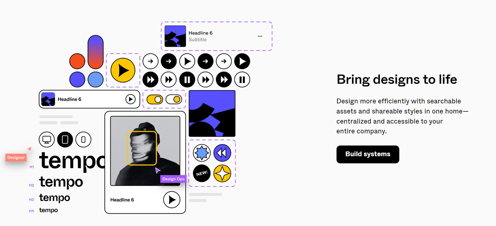

<p style="text-align: center;">
<em>Source: <a href="https://figma.com">Figma</a></em></p>

Figma is a cloud-based collaborative design tool, kind of like Google Docs for designers. Whether you're sketching a fresh idea, or polishing a final design, Figma has got you covered.

One of the best parts about Figma is its real-time collaboration feature. You and your team can work on the same design file simultaneously, and changes are synced live. You can even observe others working on the design through color-coded cursors. It makes teamwork simple and efficient and ensures that every member of the design team is on the same page.

Figma also allows you to comment on a design just like you would comment on a Google doc, you can leave comments directly on the Figma design. It's an excellent way for designers and developers to share design ideas, clarify doubts, and make notes for later. Now let's see how can you start using Figma.

### Sign Up and Get In

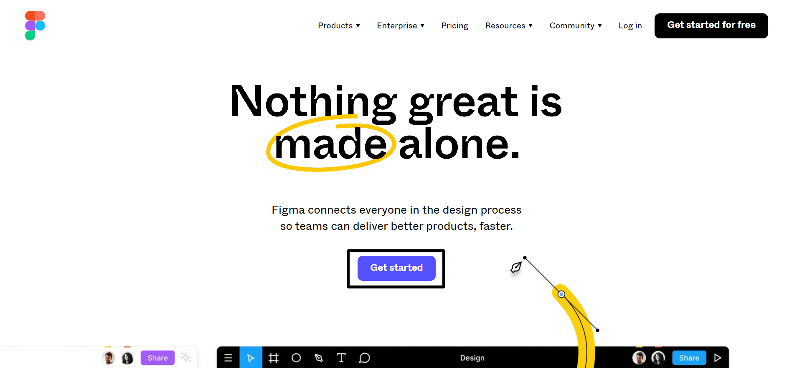

First things first, head to Figma's [website](https://figma.com). Click on **Get Started**, fill in your details, and voila, you're in! You've now entered your personal workspace.

### Your First Project

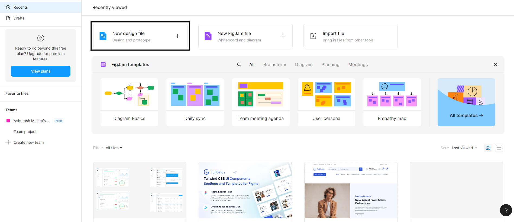

Once you're all set up, it's time to create your first project. Maybe you've already got a design in mind, or perhaps you're keen to explore an existing design before you start your own. Either way, click on the _New design file_ option to create a new project or file.

And that's it! You're now ready to start exploring Figma. Remember, the more you play around with it, the more comfortable you'll get. Don't be afraid to click on different elements and see what happens - who knows what you might discover!

## File organization in Figma

File organization is key to an efficient and smooth design process, especially when collaborating with others. Think of Figma as a digital design studio. Like any physical studio or office, keeping your workspace tidy is crucial for productivity and creativity.

Figma offers a variety of organizational tools and features to help you keep your digital design space clean, structured, and user-friendly. So, let's learn how can you use these tools and features efficiently for the proper organization of your files:

## How to organize files properly

In Figma, the primary unit of organization is a **file**. Each file represents a distinct design project or a component of a project. Inside a file, you can create multiple pages, each hosting a variety of frames or design views. Your frames can contain designs for different device screens, versions of a design, or different components of a project, depending on your work's nature.

Proper organization is vital in maintaining a healthy and productive design environment. Keeping your files, pages, and frames well-structured and logically grouped helps in swiftly locating designs, understanding their context, and seeing how they fit into the project as a whole.

You might choose to organize your design files based on different criteria like projects, teams, or the design's status (e.g., initial drafts, revisions, final versions). This structure largely depends on the nature of your workflow and what makes the most sense for your team. The crucial part is maintaining consistency in your chosen method of organization.

### Use multiple pages to properly organize files

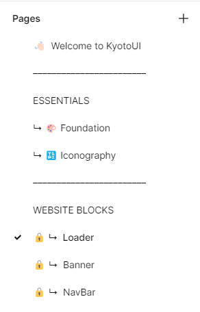

<p style="text-align: center;">
<em>Example of how Kyoto UI team organizes their pages. Source: <a href="https://www.figma.com/community/file/1231537921888637514/KyotoUI---Landing-Page-Builder-Kit-v2-(FREE)">Kyoto UI Figma</a></em></p>

Figma provides the ability to create multiple **Pages** within a single file. This feature helps you categorize and segment your work based on different stages, views, or versions of your design. Each page can contain different frames or screens, acting as sub-categories of the design, thereby enabling a more structured organization of design elements.

For instance, you might have separate pages for wireframes, high-fidelity designs, and user interface (UI) components, all within a single file. This way, you can quickly navigate between different aspects of your design without having to shuffle through numerous files.

For large projects, this level of organization can be a game-changer in maintaining a clean, understandable workspace.

### Use Figma components

Figma Components are reusable design elements that can be utilized in various parts of your design. These can be anything, from buttons and icons to form fields, to complex navigation bars, etc. Components are the foundation of your designs.

The advantage of using components lies in their reusability and consistency. Once a component is created, it can be reused multiple times across your design. Any changes made to the master component will reflect in all instances where the component is used. This feature is a significant time saver and reduces the margin of error in maintaining consistent designs.

Having a library of components at your disposal allows for quicker iterations, helps maintain a unified design language, and speeds up the overall design process.

### Have a proper naming convention

Properly naming your files, pages, frames, and components in Figma is essential to a smooth and efficient workflow. Good naming conventions make your designs more accessible to yourself and others, improve searchability, and aid in understanding the content at a glance.

This practice is particularly crucial in a collaborative environment. If everyone on the team can understand what a file or a component contains just by reading its name, it greatly reduces confusion and improves the speed of navigation.

### Add custom thumbnails

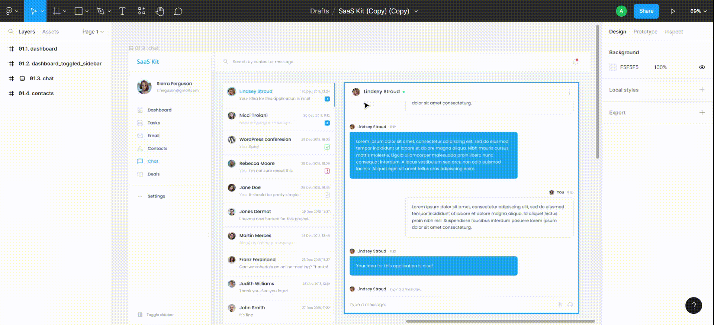

<p style="text-align: center;">
  <em>Example of how to set a thumbnail in Figma</em>
</p>

In Figma, each file, page, or frame can have its own _thumbnail_, providing a small visual preview of the content inside.

These thumbnails aren't just decorations - they can serve a functional purpose in your design process. When you're dealing with numerous Figma files or pages, a quick scan of thumbnails can be a much faster way to find what you're looking for than reading through a list of names. Think of them as the tiny book covers in your digital design library.

### Leave comments wherever necessary

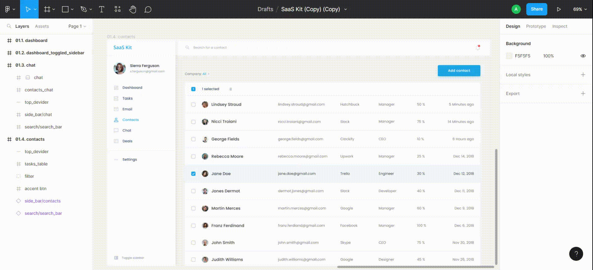

<p style="text-align: center;">
  <em>Example of how to add a comment in Figma</em>
</p>

Figma has a powerful comment tool that allows you to leave contextual notes on specific parts of your design. This ability to annotate directly on your work can dramatically improve clarity and collaboration, especially when working with a team.

Let's say you've designed a button, but you're still not certain about the color. You can leave a note saying, "Not sure about this shade of blue. Thoughts?" Your team can then chime in with their opinions or suggestions, all in one place. It's like having a conversation right on your design!

Comments in Figma also support _@mentions_. So if you need to get the attention of a specific team member, just type **@** followed by their name, and they'll receive a notification.

It's a fantastic way to ensure that your intentions are clear and that all team members, including developers, are kept in the loop during the handoff.

## Creating a Design System

Design systems are essentially the single source of truth for all design components and guidelines within an organization. They help maintain consistency, streamline design processes, and ensure a unified look and feel across all products and platforms.

Creating a design system might seem like a daunting task, but with Figma, the process becomes a whole lot easier. Let's dive into how you can create your own design system in Figma.

### 1. Define your design principles

Before diving into the nitty-gritty of creating a design system, it's important to define your design principles first. These principles act as your north star, guiding your design decisions. They could be things like Simplicity over complexity, Accessibility is key, or Consistency in design and interaction. These principles set the tone for your design system and provide a solid foundation to build upon.

### 2. Establish your color palette

Colors play a vital role in the overall look and feel of your designs. In your design system, define the color palette that aligns with your brand identity. This could include primary, secondary, and accent colors. In Figma, you can create a Color Styles library, where you define and name your colors. Once established, these color styles can be easily applied to any component in your design files.

### 3. Define typography

Similar to colors, typography also has a significant impact on your designs. Decide on the typefaces, font sizes, line heights, and weights you plan to use across your designs. Once defined, these can be saved as Text Styles in Figma for future use.

### 4. Create reusable components

Components are the building blocks of your designs. These could be buttons, form fields, cards, or even complex combinations of these elements. In your design system, you should define these components and make them reusable. This way, whenever a designer needs a button, they can just pull it from the component library instead of creating one from scratch. This not only saves time but also ensures consistency.

### 5. Document everything

The last step in creating your design system in Figma is to document everything. This includes your design principles, color and typography guidelines, component usage, and anything else that is part of your design system. Documentation ensures that everyone knows how to use the design system correctly, reducing confusion and misinterpretation.

## Real-world examples of great Design Systems

Several leading companies have created stellar design systems. Here are a few examples:

**Google's Material Design**

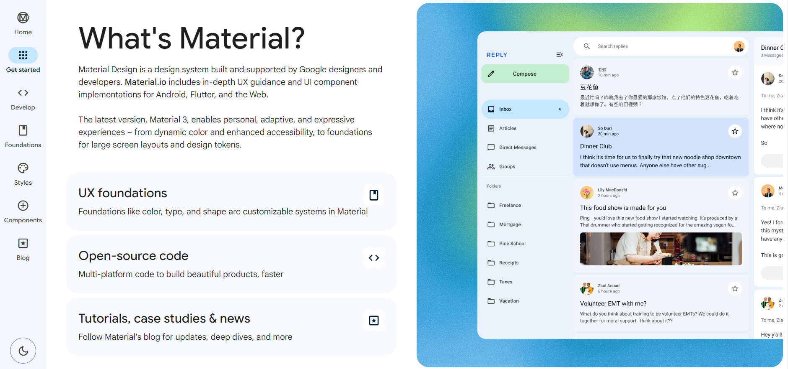

<p style="text-align: center;">
  <em>Source: <a href="https://m3.material.io/get-started">Material Design</a></em>
</p>

Perhaps one of the most famous design systems, Material Design, is a comprehensive guide to Google's design language. It covers everything from color and typography to motion and interaction.

**Apple's Human Interface Guidelines**

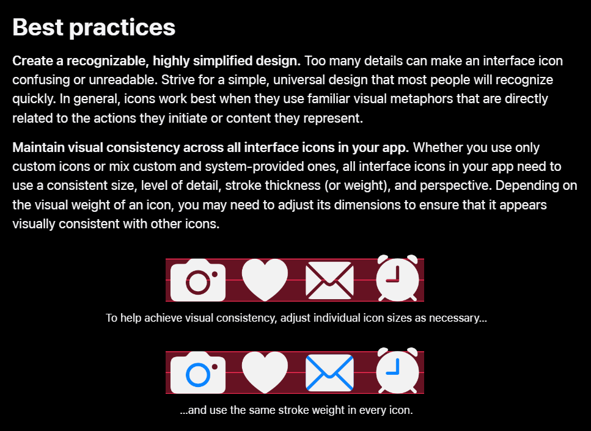

<p style="text-align: center;">
  <em>Best Practices for Icons. Source: <a href="https://developer.apple.com/design/human-interface-guidelines/icons">Apple's Human Interface Guidelines</a></em>
</p>

This design system is a detailed guide to designing for Apple's various platforms. It includes guidelines on visual design, interaction, and usability.

**Atlassian's Design System**

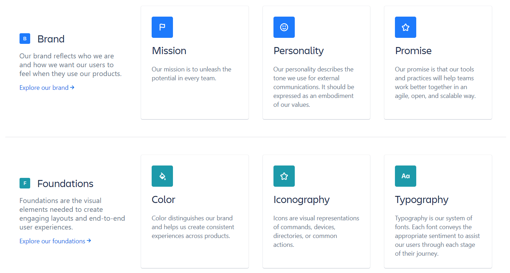

<p style="text-align: center;">
  <em>Source: <a href="https://atlassian.design/">Apple's Human Interface Guidelines</a></em>
</p>

Atlassian's design system includes detailed guidelines on design, content, and components. It also includes resources for getting started and best practices.

**IBM's Carbon Design System**

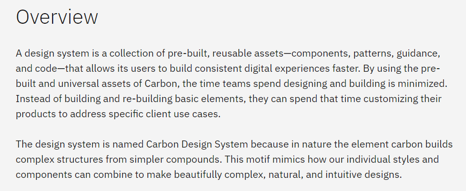

<p style="text-align: center;">
  <em>Source: <a href="https://carbondesignsystem.com/all-about-carbon/what-is-carbon/#overview">Apple's Human Interface Guidelines</a></em>
</p>

The Carbon Design System is a comprehensive guide to designing for IBM's products and experiences. It includes components, patterns, and guidelines for design and content.

Creating a design system in Figma and maintaining it can seem like a lot of work, but the payoff is immense. With a design system, you can ensure consistency, speed up your design process, create a more cohesive user experience, and up your developer handoff process. So why not give it a try?

## How to use the Code panel?


<p style="text-align: center;">
  <em>Example of how to use the Inspect Code Panel in Figma</em>
</p>

The Code Panel is a unique feature of Figma that shines during developer handoffs. This tool automatically generates CSS, iOS, or Android code snippets based on the selected layer or object before developers start coding. For developers, this can be an excellent starting point, aiding in translating design elements into actual code and accelerating the development process.

The Code Panel is a part of the _Inspect_ panel, located on the right-hand side of the Figma interface. It provides code snippets in three main languages - _CSS_, _Swift(iOS)_, and _XML(Android)_. Here's a step-by-step guide on how to use this invaluable tool:

### 1. Selecting Design Elements

To begin, click on the design element you're interested in. This could be anything, ranging from a simple shape to a complex component. Once you've selected the element, Figma automatically generates the relevant code in the inspect panel.

### 2. Navigating the Code Panel

After you select the design element, you'll see the auto-generated code snippets in the panel. At the top, you'll find tabs for CSS, iOS, and Android. Click on these tabs to switch between the languages. The Code Panel will then display the relevant code in the selected language.

### 3. Understanding the Generated Code

The generated code will contain crucial information about the selected design element. For instance, if you've selected a text box, the CSS tab would provide information on the font family, size, weight, color, and more. If you've selected a shape, it would give details about its size, color, border radius, etc.

### 4. Copying and Tweaking the Code

After reviewing the code, all you need to do is to copy and paste it into your preferred coding environment. Remember, the code generated by Figma is meant to serve as a starting point. It's likely that you'll need to modify or tweak it to fit into your project's existing codebase. Use it as a reference or a guide rather than considering it as the final, production-ready code.

Suppose you're designing a button, and now it's time for the developer to implement it. With Figma's Code Panel, you can quickly get CSS code for the button's size, background color, border-radius, box-shadow, and even the font properties for the label. This eliminates guesswork, reduces back-and-forth, and ensures the smoother implementation of the design into code.

## Helpful Figma developer handoff tools

When it comes to the developer handoff process, there are a wealth of resources out there that can amplify your team's efficiency and provide a smoother development process for your engineering team.

The beauty of these tools lies in their ability to interconnect with Figma, establishing a seamless pipeline between design and development teams. Let's dive into some of the essential tools that can help you in ensuring a successful figma developer handoff experience for your developers and design team.

### 1. Zeplin


<p style="text-align: center;">
  <em>Source: <a href="https://zeplin.io/why-zeplin/developers/">Zeplin</a></em>
</p>

[Zeplin](https://zeplin.io/) has rightfully earned its spot as a go-to tool in the world of developer handoff. This powerful platform can be directly integrated with Figma, allowing designers to export their design frames and specs with a single click. Beyond merely being a receptacle for your designs, Zeplin is a comprehensive workspace where developers can access design specifications, assets, colors, and typographical styles, not to mention auto-generated code snippets in a variety of languages.

### 2. TeleportHQ

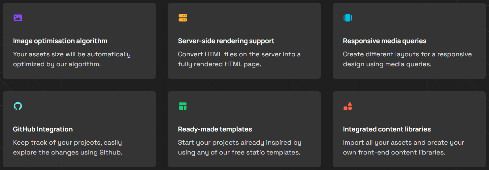

<p style="text-align: center;">
  <em>Source: <a href="https://teleporthq.io/">TeleportHQ</a></em>
</p>

[TeleportHQ](https://teleporthq.io/) is a Figma plugin that deserves a mention for its capacity to export components and design systems. Developers can integrate the exported code directly into their web application codebase and even publish the website right from the tool. It supports code export in React, Vue, Angular, and HTML/CSS, making it a versatile tool in the developer's arsenal.

### 3. Sympli

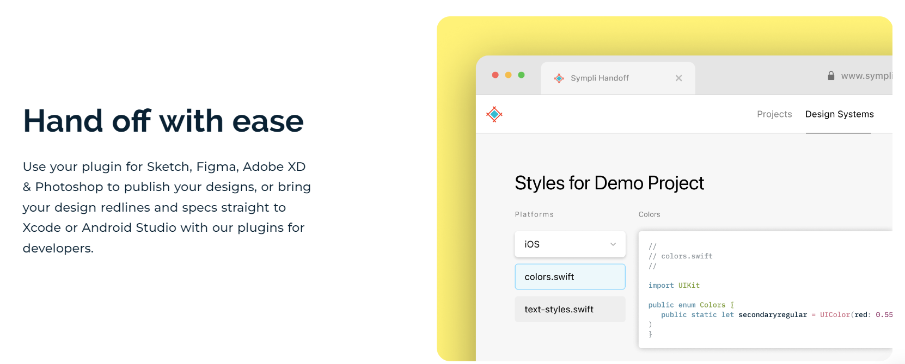

<p style="text-align: center;">
  <em>Source: <a href="https://sympli.io/handoff">Sympli</a></em>
</p>

[Sympli](https://sympli.io/) is a commendable design handoff tool that is compatible with Figma, Adobe XD, and Sketch. It allows for in-depth collaboration between designers and developers using inline comments for review and feedback. Sympli also has a Figma plugin: Sympli Handoff which significantly simplifies complex handoffs processes.

### 4. Zero Height

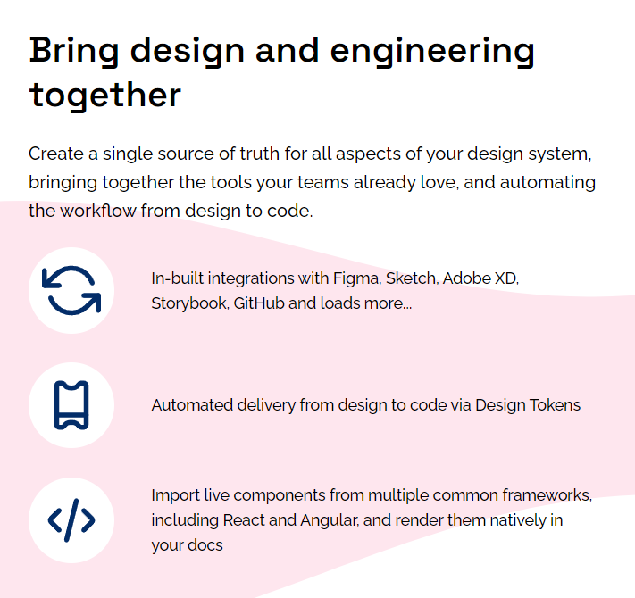

<p style="text-align: center;">
  <em>Source: <a href="https://zeroheight.com/">Zero Height</a></em>
</p>

[Zero Height](https://zeroheight.com/) is another excellent tool that allows you to sync your Figma components and styles, automating the creation of design system and documentation. This streamlines the handoff process, ensuring that developers have access to up-to-date design resources.

### 5. Other Figma Plugins

Figma's rich library of [plugins](https://www.figma.com/community/plugins) adds even more dimensions to the handoff process. Tools such as the _HTML to Figma_ plugin enable you to import existing HTML into Figma, valuable for developers who want to reverse-engineer a design. The _CSS to Figma_ plugin allows for generating a Figma layer directly from CSS code, providing a unique perspective on how design translates to code.

Remember, the journey from design to development is a team endeavor. These tools are there to facilitate the journey, ensuring a smooth handoff process and successful product development.

## Wrapping Up

The journey from the design phase to a fully functional digital product can be complex, but with the right tools and techniques, it can also be an incredibly efficient and seamless process. Figma, with its powerful features and comprehensive developer handoff capabilities, certainly simplifies this journey.

Throughout this guide, we've touched upon various aspects of Figma Developer Handoff, from getting started with Figma, and organizing your files and design systems, to using the Code Panel and other tools that can make your life a lot easier. Each of these steps, when executed effectively, can make the transition from design to development not just smooth but also rewarding.

Remember, at the end of the day, it's all about communication and collaboration. Effective handoff processes eliminate the guesswork, facilitate mutual understanding between design and development teams, and ensure that your creative vision is translated into the final product just as you envisioned it. So go ahead, explore Figma, get your designs ready, and let your creativity easily translate into reality!
