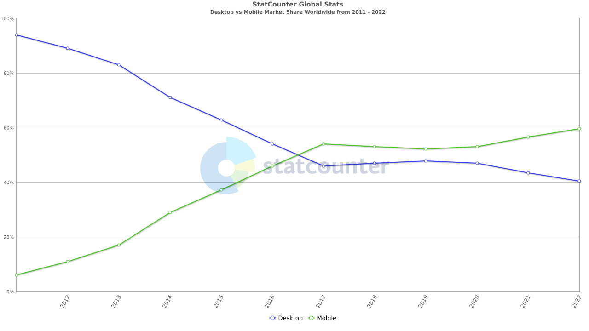
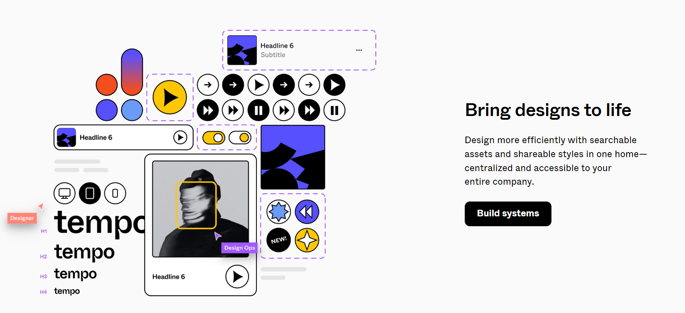

```toc
# This code block gets replaced with the TOC
```

Responsive design has become an essential pillar of modern web development, revolutionizing the way websites and applications adapt to the diverse needs of users.

With the proliferation of mobile devices and the ever-expanding array of screen sizes and resolutions, the demand for seamless cross-device experiences has reached unprecedented levels.

Therefore, in this article, we are going to take a look at responsive design concepts and how to convert your Figma designs into responsive code.

## Introduction to Responsive CSS



<p style="text-align: center;">
<em>Comparison of desktop vs mobile internet users in the last 12 years. Source: <a href="https://gs.statcounter.com/platform-market-share/desktop-mobile/worldwide/#yearly-2011-2022">StatCounter</a></em></p>

According to [StatCounter](https://gs.statcounter.com/platform-market-share/desktop-mobile/worldwide/#yearly-2011-2022), there are currently 51.52% mobile internet users and 48.48% desktop users in May 2023. Not only this, in the last 12 years, desktop internet users have sharply fell from 93.91% to the current state, while mobile internet users have risen from 6.09% in 2011 to 51.52% in 2023.

This change of habit in the internet users to use small screen devices like mobile, tablets etc to browse internet is what made responsive design a necessity in recent times. Businesses that want to survive and grow have to follow this trend.

Now let's discuss some important CSS concepts that you should know and take care of as a developer to build responsive websites from scratch:

### Defining responsive units

Responsive units are fundamental in creating adaptive layouts. These units dynamically scale based on the user's device or viewport size.

Relative units like _percentages (%)_ and viewport-relative units like _viewport width (vw)_ and _viewport height (vh)_ enable us to create fluid and responsive designs.

They allow elements to adjust proportionally to the available space, ensuring consistency and readability across devices.

### Basics of CSS media queries

CSS media queries are essential for implementing responsive design. They enable us to apply different styles based on the characteristics of the user's device, such as screen size, resolution, or orientation.

By using media queries, we can customize the layout, typography, and other design aspects to provide an optimal experience on each device.

Media queries empower us to create adaptive designs that gracefully adapt to various screen sizes and resolutions.

### Grid and Flexbox layouts

Grid and Flexbox are critical tools in responsive design. Together, they provide a powerful framework to create intuitive and consistent layouts across various devices.

A grid system divides the screen into a matrix of rows and columns, enabling us to position elements precisely. This ensures a well-organized and visually pleasing layout that can adapt to different screen sizes.

On the other hand, Flexbox shines when it comes to aligning items within a container. It's excellent for designing components of a webpage, like navigation menus or a group of similar items. Flexbox makes it simple to align, order, and size items in a way that's responsive and adaptable to different screen sizes.

### Typography considerations

Typography plays a vital role in responsive design, as legible and visually appealing text is key to effective communication. When designing for responsiveness, it's crucial to consider _font sizes_, _line heights_, and _line lengths_.

By using relative units and adjusting typography based on the viewport, we can ensure that text remains readable and well-proportioned on various devices. It's important to choose fonts that are optimized for both legibility and aesthetics across different screen sizes.

### Image and graphic optimization

By reducing file sizes and optimizing formats, we can improve performance and ensure quick loading times across all devices. You can also enhance user experience by using appropriate image sizes and implementing techniques such as lazy loading.

By optimizing images and graphics, we can maintain visual quality while minimizing bandwidth usage and ensuring that visuals render smoothly on all devices.

## How to approach the conversion process form Figma to CSS



<p style="text-align: center;">
<em>Source: <a href="https://figma.com">Figma</a></em></p>

When translating Figma layouts to CSS, it is essential to follow a systematic approach to maintain accuracy and consistency. By carefully converting the design elements from Figma to CSS, we can ensure that the final result reflects the intended layout and design aesthetics.

One of the great helpers for the whole conversion process is the **Inspect panel** of Figma. It allows us to generate CSS code for specific part of the design and gives us information about the various element sizes and color codes.

Here's a detailed breakdown of the entire conversion process:

### Setting up the HTML/CSS structure

Getting started with our website involves creating a basic HTML/CSS structure. This is the skeleton of our web page, and it's where everything begins.

We would recommend you to use the Emmet extension in VS Code to set up the basic structure of the HTML file and then link your CSS in the `<head>` of the HTML.

### Converting Figma measurements to CSS units

Accurately converting Figma measurements to appropriate CSS units is crucial for maintaining design integrity.

In Figma, measurements are often provided in _pixels (px)_. While pixels can be directly used in CSS, it is important to consider responsiveness by converting them to relative units, such as _percentages (%)_, _viewport width (vw)_, or _viewport height (vh)_.

This conversion ensures that the design adapts smoothly to different screen sizes and resolutions.

### Mapping Figma styles to CSS properties

To achieve consistency between Figma and CSS, it is necessary to map Figma styles to corresponding CSS properties. This includes _colors_, _typography_, _spacing_, and other visual elements.

By carefully examining the design in Figma and identifying the relevant CSS properties, we can accurately reproduce the intended styles in CSS. It is recommended to define global CSS variables or classes to store common styles, allowing for easy and consistent application throughout the project.

### Prioritizing a mobile-first approach

Implementing a mobile-first approach is a best practice in responsive design. Starting with the mobile layout ensures that the core content and functionality are optimized for smaller screens.

By prioritizing the mobile experience, we ensure that users on mobile devices have a seamless and enjoyable interaction with the website or application.

As we progressively enhance the design for larger devices using media queries, we can maintain a cohesive and responsive experience across all screen sizes.

### Maintaining design consistency across devices

While adapting the design for different devices, it is crucial to maintain design consistency. Elements such as typography, colors, and spacing should remain consistent across various screen sizes.

This consistency ensures that users have a familiar experience regardless of the device they are using.

By adhering to consistent design principles and utilizing responsive CSS techniques, we can create a cohesive and visually appealing experience for users on all devices.

## Conclusion

Now, that the article has come to an end, we hope you have gained lots of insights on responsive CSS and how to approach its implementation when it comes to converting Figma designs into a responsive website.

One of the most powerful ways to solidify your understanding is to apply what you've learned. So, pick a figma design you like and start converting it into a responsive website.

Remember, the goal is not only to create visually appealing website but also to ensure an optimal user experience across all devices. So go forth, apply your knowledge, and start building responsive, and user-friendly web experiences today.
