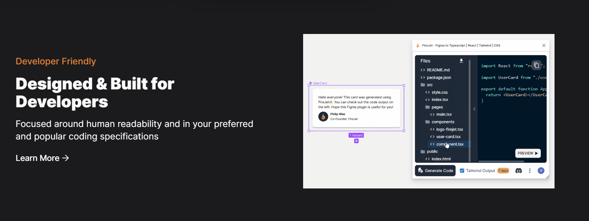

```toc
# This code block gets replaced with the TOC
```

When it comes to user interface design, Figma is one of the most popular tools used by developers and designers worldwide. Its robust features and intuitive interface have made it the go-to tool for many.

In the same vein, Tailwind CSS has grown rapidly in popularity as a utility-first CSS framework that many developers find incredibly efficient and flexible.

But what happens when you want to bridge the gap between these two powerful tools? How do you convert your meticulously designed Figma layout into Tailwind CSS utility classes? In this article, we'll explore these questions in detail.

## How many ways are there to convert Figma to Tailwind?

There are two main ways to convert a Figma design to Tailwind CSS code: manual conversion and the use of automated tools and Figma plugins.

The method of manual conversion is quite hands-on, requiring a developer to take the Figma design files and manually write out the equivalent Tailwind CSS utility classes. While this can be a time-consuming process, it provides excellent control over the final output and serves as an excellent learning exercise for understanding the inner workings of Tailwind CSS.

However, with time being a valuable resource, the appeal of automated conversion tools has also grown. These tools are designed to take Figma designs and generate Tailwind CSS code, saving hours of manual work. They've been developed with varying features, from straightforward conversion processes to generating complete component libraries, to accommodate different user needs and project scales.

There's also the option of using plugins specifically built to augment Figma's functionality with Tailwind CSS utility classes. These plugins display Tailwind classes directly within Figma, helping to bridge the gap between the two tools.

It's important to note that while these tools greatly aid the conversion process, a fundamental understanding of both Figma and Tailwind CSS is necessary to address any issues that may arise and to optimize the generated code. This highlights the need for continued learning and adaptation in this exciting, ever-evolving tech landscape.

## How to convert a Figma design to Tailwind CSS code?

Having explored the existence of numerous methods for conversion, let's delve deeper into the mechanics and structure of how one can transform a Figma design into a set of Tailwind CSS utility classes.

Before you start, it’s crucial to familiarize yourself with both the Figma interface and the fundamental syntax and utilities of the Tailwind CSS framework. Strong foundational knowledge will facilitate the conversion process, whether you are relying on manual methods or leveraging automated tools.

First, begin with your Figma design. Break it down into individual Figma components, and understand the design attributes of each. This step allows you to get a granular view of the design, which will be beneficial when you begin the conversion process.

When converting manually, you would typically start by setting up a Tailwind CSS configuration. Next, you would begin translating the design attributes of each Figma component into Tailwind utility classes. For instance, a simple button in your Figma design may translate the button component into a combination of utility classes handling background color, padding, border-radius, and text styles.

With automated tools, you would usually import your Figma design into the chosen platform. The tool would then parse your design and generate the equivalent Tailwind CSS code. Some tools also offer the ability to fine-tune the generated output, allowing you to adjust the code to fit your needs.

For Figma plugins, the first quarter of the process typically involves selecting the desired element within the Figma file, and the plugin will display the corresponding Tailwind CSS utility classes. This immediate feedback loop saves time and provides a clear link between the Figma design and the Tailwind CSS code.

While the conversion process may seem daunting initially, with practice and experience, it becomes more intuitive. Remember, the final output may need refinement and optimization, as automatic conversion might not always perfectly cater to your specific project requirements.

However, these tools and techniques dramatically streamline the process, turning the concept of a design into working, beautiful web interfaces with relative ease.

## Helpful Tools to Convert Figma to Tailwind

While the manual conversion process has its merits, it's undeniable that it can be time-consuming and complex, especially for larger projects. This is where automated tools come into play, providing a significant boost to productivity and efficiency.

Let's delve into the details of these 2 tools we have found helpful when making the transition from Figma to Tailwind CSS:.

### Firejet



<p style="text-align: center;">
<em>Source: <a href="https://www.firejet.io/plugin">Firejet</a></em></p>

The first tool we'll explore is [Firejet](https://www.firejet.io/plugin). It's a great option for beginners and experienced developers alike who are looking to convert their designs to code. Firejet has a Figma plugin and a desktop app for users to try their product. The platform shines when it comes to converting complex designs, maintaining a high level of accuracy throughout the process.

The only downside is that you have to buy the membership before using the product. Anyway, if you want to try this tool after buying the membership, here's a simple walkthrough:

- Install their Figma plugin from this [link](https://www.figma.com/community/plugin/1087200717679287673/FireJet---Figma-to-Code-%7C-Tailwind-%7C-React-%7C-Vue-%7C-HTML-%7C-TypeScript-%7C-CSS) and sign up.

- Once you are signed up, open a Figma design and Firejet plugin.

- Now, select the element you want to convert into code, select the tech you want your code to convert to, and click on **Generate Code**. You will see all these options in the Firejet plugin window.

## Figma to Code

Next, we have [Figma to Code](<https://www.figma.com/community/plugin/842128343887142055/Figma-to-Code-(HTML%2C-Tailwind%2C-Flutter%2C-SwiftUI)>), a tool prized for its versatility. Supporting several technologies like Flutter, SwiftUI and Tailwind CSS, it is a fitting choice for developers who work across different projects requiring different technologies.

Unlike Firejet, it's a free and open source plugin that is really simple to use. Here's the step by step process to use it:

- Install and open the plugin.
- Select the design you want to convert to code.
- Now **Figma to code** will automatically generate the code for you. Just paste it to your environment.

When it comes to simplifying the conversion process, Figma to Code rocks. However, we have found that when it comes to accurately transforming the designs, the plugin fails to deliver and it doesn't support the latest versions of Tailwind. Still, it can be useful for you as a starting point.

## Conclusion

Both methods: manual conversion and use of tools have their own merits and demerits. It's important to choose the one that aligns with your project requirements and personal preferences.

While tools has their own strengths, they are not fit everywhere. Furthermore, a tool that works perfectly for one project might not be the best fit for another. So, you have to figure out what is the best interest for your project.

Remember that the fundamental understanding of Figma and Tailwind CSS is important irrespective of the way you choose to build the project. It ensures not only the optimal use of these tools but also the ability to tackle any issues that may arise during the conversion.
