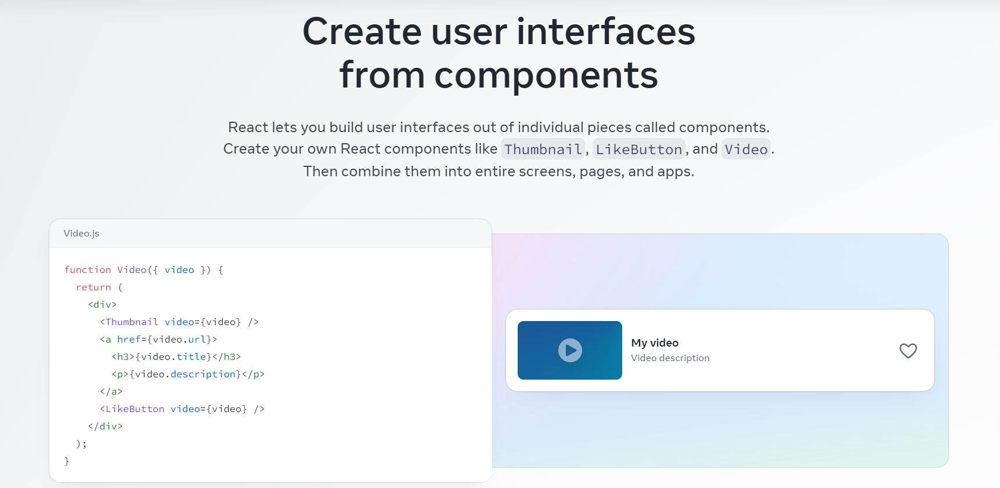

<!-- ---
title: "new figma to react"
date: "2023-07-17"
template: "post"
draft: false
slug: "/posts/figma-to-react-new-article"
category: "figma"
tags:
  - "Figma"
  - "React"
  - ""
description: ""
--- -->

Figma to code plugins and tools are sky high. For years, people have been trying to solve this problem, and every now and then, we see a new tool appearing out of nowhere, claiming that they have solved this problem.

But the problem is not as easy as it looks. Generating code from Figma is actually the easy part; what’s not so easy is generating code that is human-readable and maintainable in the long term.

<blockquote>Any fool can write code that a computer can understand. Good programmers write code that humans can understand.” – Martin Fowler.</blockquote>

In this article…

## Overview of Figma and React

### What is Figma?

<em>Source: <a href="https://figma.com">Figma</a></em>

Figma is a cloud-based UI/UX design application that provides a workspace for teams to collaborate in real time. As a design tool, Figma offers a variety of features that make it an excellent choice for designers. These include vector editing, prototyping, and design components that allow designers to build effectively and efficiently.

Figma’s collaborative nature sets it apart from many other design tools. Multiple team members can work on a design simultaneously, making it a perfect choice for large teams and complex projects. Additionally, as it’s browser-based, you can access your work from anywhere, making it incredibly flexible and portable.

### What is React?

<em>Source: <a href="https://react.dev">Figma</a></em>

React, on the other hand, is a JavaScript library for building user interfaces developed and maintained by Meta. React allows developers to create large web applications that update and render efficiently in response to data changes.
React stands out for its component-based architecture.

This allows developers to break down complex UIs into simpler components, making the code more manageable and the application more scalable. Each component in React has its lifecycle and is responsible for rendering a part of the UI.

As a result, a change in one component doesn’t affect the others, leading to more efficient updates and less buggy code.

## Benchmark of a good Figma to Code tool

### Code Quality

- **Div structure:** This means that all your divs should be properly arranged in the same order as they are appearing in the design. Furthermore, if your ...

- **CSS quality:**

- **Javascript code:** This means that all your data should come from an API or JavaScript object instead of hardcoding everything which requires more manual effort and is prone to more errors.

- **Components and Functionalities:** This means that instead of just putting div everywhere, your code should use relevant HTML elements like `
` for text, `<input>` for form inputs etc.

### Ease of use

- **Manual steps required:** This means how much manual effort is required either in the Figma design itself like naming, auto layout, grouping etc. or manual steps in the tool like tagging etc.

- **Code conversion time:** This means how much time does it require for you to convert the code from design, download it into your IDE, and run it locally.

## Top 4 tools to convert Figma to React code

In this section, we are going to review a few popular Figma to React tools that are available in the market.

We will see their pros and cons and test their effectiveness by converting the following designs to a React app using these tools:

**Note:** Please remember that whatever we have written about these tools is not based on what we have read on the internet but on what we have experienced while using these products when converting our design from Figma to React.

## Anima

[Anima](https://www.animaapp.com/) is a popular design-to-code automation tool. It helps in converting your designs to HTML/CSS, Vue, and React code. Its Figma plugin allows you to export single or multiple frames to code in no time. For styling, it gives you the option to choose between CSS, Styled Components, and Saas.

Anima also has integrations available with apps like AWS Amplify, Vercel, Firebase, Strapi etc.

### Pros

-
-
-

### Cons

- Uses absolution positioning to align the elements.

- Divs are not structured in proper sequence.

- classNames and component names are directly taken from Figma nodes.

### Code Quality

#### 1. Div Structure

Divs in Anima are badly structured and are very different from how development is done in real world. Elements are randomly organized without following the proper sequence in which they are appearing in the UI. At many places, elements are not even wrapped inside other parent div to create a proper division in the UI.

#### CSS Quality

CSS generated by Anima has no real world use case. Unlike, real world development, where flex or grid is used to align elements in the UI, Anima is using _position: absolute_ to fix the position of the elements on the UI. This is not the right way to approach the design to code conversion.

#### JavaScript code (mock data, API)

Another thing which Anima doesn't do right is that they hardcode each values in JSX. Ideally, all your data should come from an API or a JavaScript object.

#### Components and Functionalities

...

### Ease of use

#### Manual steps required

Anima gives you the option to manually add animations, effects, embedding, turning text to input, submit button action etc.

#### Design to code conversion time

...

#### UI/UX

...

## Locofy

Locofy is another popular design to code conversion tool that helps you generate frontend code for mobile and web. It has a separate web platform, as well as Figma and Adobe XD plugins. It allows you to generate HTML/CSS, React, React Native, Next.js, Gatsby, and Vue code in JavaScript or TypeScript.

For the styling part, you can instruct the plugin to use CSS, CSS Modules, Tailwind, and even UI libraries like Material UI, Bootstrap, Chakra UI, etc. Additionally, it allows you to download your code, push it to GitHub, and even deploy it using Netlify, Vercel, or GitHub Pages.

### Pros

-
-
-

### Cons

-
-
-

### Code Quality

#### 1. Div Structure

...

#### CSS Quality

...

#### JavaScript code (mock data, API)

...

#### Components and Functionalities

...

### Ease of use

#### Manual steps required

...

#### Design to code conversion time

...

#### UI/UX

...

## DhiWise

Similar to Locofy, DhiWise allows you to import your Figma designs into their builder. DhiWise is primarily a design to code platform for mobile with options to generate code for Flutter, Android, and iOS, but it allows you to generate React code.

Apart from converting frames to codes, it also allows you to setup navigation, authentication and authorization, and integrate Firebase and Supabase to your app.

### Pros

-
-
-

### Cons

-
-
-

### Code Quality

#### 1. Div Structure

...

#### CSS Quality

...

#### JavaScript code (mock data, API)

...

#### Components and Functionalities

...

### Ease of use

#### Manual steps required

...

#### Design to code conversion time

...

#### UI/UX

...

## TeleportHQ

TeleportHQ is a visual UI builder for static websites. Similar to Locofy and DhiWise, it allows you to push your designs to its builder from Figma, from where you can modify the design and either ship the code or download it locally.

TeleportHQ allows you to export your code to React, Next.js, Gatsby, Vue, Angular, Preact, React Native, and Stencil. Apart from that, it also provides you with free static templates to build websites right from its builder.

### Pros

-
-
-

### Cons

-
-
-

### Code Quality

#### 1. Div Structure

...

#### CSS Quality

...

#### JavaScript code (mock data, API)

...

#### Components and Functionalities

...

### Ease of use

#### Manual steps required

...

#### Design to code conversion time

...

#### UI/UX

...

## Conclusion
