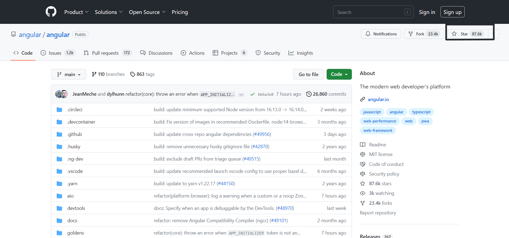

**TLDR**: _In this article, we rank the top JavaScript frameworks based on their GitHub stars, reflecting their popularity in the developer community. React and Vue 2 lead the pack, with Svelte and Angular following behind. Other frameworks such as Ember.js, Backbone.js, Preact, Alpine, Solid, and Hyperapp have also garnered a considerable number of GitHub stars, indicating their adoption and usage by developers. To choose the best framework for your next project, consider factors like application size, performance requirements, development timelines, and your team's skillset._

JavaScript frameworks have made it way easier for developers to build web applications. They offer pre-built, reusable code structures and tools for efficient development. As the need for complex and interactive applications grows, choosing the right framework becomes essential for optimizing performance and maintainability.

In this article, we will rank the top JavaScript frameworks by their GitHub stars, a measure of their popularity among developers. Whether you're a seasoned developer or a newcomer to the world of web development, this comprehensive guide will help you make informed decisions and enhance your skill set in the rapidly evolving landscape of JavaScript frameworks.

## 1. [React](https://github.com/facebook/react) - 206K

<em>Source: <a href="https://github.com/facebook/react">https://github.com/facebook/react</a></em>

React has become the most popular JavaScript framework, garnering the highest number of GitHub stars. Developed by Meta (formerly Facebook), React has revolutionized frontend development and has been widely adopted by developers around the world.

Its component-based architecture and optimized performance have made it the go-to choice for many large-scale applications and user interfaces.

Here are two great courses for you to start learning React- [Learn React](https://scrimba.com/learn/learnreact) by Scrimba and [The Beginner's Guide to React](https://egghead.io/courses/the-beginner-s-guide-to-react) by Egghead.io

## 2. [Vue 2](https://github.com/vuejs/vue) - 203K

<em>Source: <a href="https://github.com/vuejs/vue">https://github.com/vuejs/vue</a></em>

Vue comes in at a close second, with a large number of GitHub stars. This progressive framework is known for its flexibility, ease of integration, and developer-friendly approach.

Vue's popularity can be attributed to its gentle learning curve and ability to handle a wide range of applications with varying complexity.

Here are two great resources for you to start learning Vue- [Vue JS Crash Course](https://youtu.be/qZXt1Aom3Cs) by Brad Traversy and courses by [Vue Mastery](https://www.vuemastery.com/courses).

## 3. [Angular](https://github.com/angular/angular) - 87.K

<em>Source: <a href="https://github.com/angular/angular">https://github.com/angular/angular</a></em>

Angular, a TypeScript-based framework developed by Google, ranks third in terms of GitHub stars. Angular has been adopted by numerous companies for building large-scale applications and offers a powerful two-way data binding system. Its opinionated structure and comprehensive toolset make it a popular choice for complex projects.

Here are two great courses for you to start learning Angular- [Angular - The Complete Guide (2023 Edition](https://www.udemy.com/course/the-complete-guide-to-angular-2/) and [The Complete Angular Course: Beginner to Advanced](https://www.udemy.com/course/the-complete-angular-master-class/).

## 4. [Svelte](https://github.com/sveltejs/svelte) - 67K

<em>Source: <a href="https://github.com/sveltejs/svelte">https://github.com/sveltejs/svelte</a></em>

Svelte, a relatively new JavaScript framework, has quickly gained traction among developers, securing the fourth spot in our ranking. Its unique approach of compiling components at build time, rather than runtime, results in faster load times and better overall performance. Svelte has also been recognized as the most loved JavaScript framework in the Stack Overflow Developer Survey 2022.

Here are two great courses for you to start learning Svelte- [Learn Svelte – Full Course for Beginners](https://youtu.be/UGBJHYpHPvA) and [Svelte.js - The Complete Guide](https://www.udemy.com/course/sveltejs-the-complete-guide/).

## 5. [Preact](https://github.com/preactjs/preact) - 34K

<em>Source: <a href="https://github.com/preactjs/preact">https://github.com/preactjs/preact</a></em>

Preact, a lightweight alternative to React, is ranked fifth based on its GitHub stars. The library offers many of React's features, such as a component-based architecture and a virtual DOM, but with a smaller bundle size and faster performance. Preact's small size and similarity to React have made it a popular choice for performance-focused projects.

Here are two great resources for you to start learning Preact- [Up and running with Preact](https://egghead.io/courses/up-and-running-with-preact) by Pluralsight and [Learn Preact](https://preactjs.com/tutorial/).

## 6. [Backbone.js](https://github.com/jashkenas/backbone) - 28K

<em>Source: <a href="https://github.com/jashkenas/backbone">https://github.com/jashkenas/backbone</a></em>

Backbone.js, a lightweight JavaScript framework introduced in 2010, comes in sixth place in our ranking. Backbone.js provides a modular structure for building web applications and is highly customizable through plugins and extensions. It is used by companies such as Uber, Reddit, Pinterest, and LinkedIn.

Here are two great resources for you to start learning Backbone- [Backbone Tutorial: Learn Backbonejs from Scratch](https://www.udemy.com/course/backbonejs-tutorial/) and [Backbone.js Fundamentals](https://www.pluralsight.com/courses/backbone-fundamentals).

## 7. [Solid](https://github.com/solidjs/solid) - 27K

<em>Source: <a href="https://github.com/solidjs/solid">https://github.com/solidjs/solid</a></em>

Solid is a relatively new declarative JavaScript library that has quickly gained popularity, earning the seventh spot in our ranking. With a focus on performance and scalability, Solid offers a powerful alternative to other frameworks for small to large-sized applications. Solid's impressive 90.9% retention ratio in the State of JavaScript Survey 2022 indicates developers' satisfaction with the framework.

Here are two great resources for you to start learning Solid- [Learn Alpine JS](https://scrimba.com/learn/alpinejs) and [Alpine JS Vs. 3 For Beginners](https://www.udemy.com/course/alpinejs/).

## 8. [Alpine](https://github.com/alpinejs/alpine) - 23K

<em>Source: <a href="https://github.com/alpinejs/alpine">https://github.com/alpinejs/alpine</a></em>

Alpine.js, introduced in 2019, ranks eighth based on GitHub stars. This lightweight and fast framework provides a declarative syntax for building UI components and managing application state. Alpine.js's simplicity and ease of use make it an attractive option for developers seeking a minimalistic approach to frontend development.

Here are two great resources for you to start learning Alpine- [Learn Alpine JS](https://scrimba.com/learn/alpinejs) and [Alpine JS Vs. 3 For Beginners](https://www.udemy.com/course/alpinejs/).

## 9. [Ember.js](https://github.com/emberjs/ember.js) - 22.4K

<em>Source: <a href="https://github.com/emberjs/ember.js">https://github.com/emberjs/ember.js</a></em>

Ember.js, developed in 2011, ranks ninth in our list. This all-in-one solution for building web applications emphasizes conventions over configurations and provides a set of best practices for scalable and maintainable applications. Ember.js is used by popular websites like Digital Ocean, LinkedIn, Twitch, and Apple Music.

Here are two great resources for you to start learning Ember- [Ember.js Fundamentals](https://www.pluralsight.com/courses/emberjs-fundamentals) by Pluralsight and [Master EmberJS : Learn Ember JS From Scratch](https://www.udemy.com/course/master-emberjs/).

## 10. [Hyperapp](https://github.com/jorgebucaran/hyperapp) - 19K

<em>Source: <a href="https://github.com/jorgebucaran/hyperapp">https://github.com/jorgebucaran/hyperapp</a></em>

Hyperapp, a minimalistic JavaScript framework, ranks tenth in our ranking. Hyperapp is known for its simplicity, small size, and minimal dependencies. With a functional programming approach, it allows developers to create web applications using a single, unified architecture.

Its tiny footprint and straightforward syntax make it a popular choice for small-scale projects and developers who prefer a minimalist approach to web development.

Here's the official [tutorial](https://github.com/jorgebucaran/hyperapp/blob/main/docs/tutorial.md) and [reference](https://github.com/jorgebucaran/hyperapp/blob/main/docs/reference.md) for you to start leaning Hyperapp

## Conclusion

The popularity of [React, Vue, and Angular](https://kombai-blog.vercel.app/posts/react-vs-angular-vs-vue) showcases their strength as versatile and powerful tools for building modern web applications. However, the rise of newer frameworks like Svelte, Solid, and Alpine.js reflects a growing interest in simpler, more lightweight alternatives.

The rankings also demonstrate that there is a wide range of good options available for developers, from feature-rich and opinionated frameworks to lightweight and minimalistic libraries, catering to different project sizes and requirements.

_Happy Coding!_
