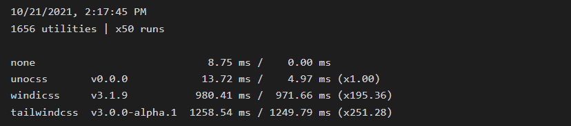

In the ever-evolving world of web development, choosing the right CSS framework can significantly impact the efficiency and aesthetics of your projects. With countless options available, developers are constantly searching for alternatives that cater to their unique needs and preferences.

One such popular choice is Tailwind CSS, a utility-first framework that has garnered a loyal following for its customization capabilities and ease of use. But, no matter how versatile Tailwind CSS is, it's essential to explore other viable options in the market.

In this comprehensive article, we delve into the top Tailwind alternatives that have carved their niche in the web development community. Whether you're a seasoned developer or a newcomer to the field, our expertly curated list will help you make an informed decision when selecting the perfect CSS framework for your next project. So, buckle up and get ready to discover some of the most amazing and user-friendly Tailwind CSS alternatives available today.

## What are the top tailwind alternatives?

While Tailwind CSS has been a game-changer for many developers, it's essential to consider other frameworks that may offer different benefits. The following list showcases the top Tailwind alternatives that have made a name for themselves in the web development community.

### MUI

[MUI](https://mui.com/) is a collection of UI tools and component libraries based on Google's Material Design that aims to help developers create visually appealing and functional user interfaces quickly and efficiently. MUI Core consists of four foundational React UI component libraries that enable developers to ship new features rapidly- [Material UI](https://mui.com/material-ui/getting-started/overview/), [Joy UI](https://mui.com/joy-ui/getting-started/overview/), [Base UI](https://mui.com/base/getting-started/overview/), and [MUI System](https://mui.com/system/getting-started/overview/).

<em>Weekly downloads of Material UI since its release. Source: <a href="https://npmtrends.com/@material-ui/core">NPM Trends</a></em>

**When to use MUI over Tailwind:**

Choose MUI when you require a UI framework that's tailored to work seamlessly with popular front-end frameworks like React, Vue, etc., and adheres to Material Design principles.

### Bootstrap

[Bootstrap](https://getbootstrap.com/) is a classic and one of the most widely-used CSS frameworks available. With its extensive library of components and responsive grid system, Bootstrap simplifies the development process and ensures compatibility across various devices. The framework offers a wealth of customization options and is suitable for projects ranging from small-scale to complex web applications.

<em>Weekly downloads of Bootstrap since its release. Source: <a href="https://npmtrends.com/bootstrap">NPM Trends</a></em>

**When to use Bootstrap over Tailwind:**

Choose Bootstrap when you need a comprehensive and widely-adopted framework with built-in JavaScript plugins, a responsive grid system, and extensive support resources.

### Foundation

[Foundation](https://get.foundation/) is a mobile-first, responsive CSS framework that emphasizes flexibility and customization. With its modular architecture, Foundation allows developers to pick and choose the components they need, leading to leaner and more efficient code. The framework also provides comprehensive documentation and support, making it an excellent alternative for developers who appreciate versatility and control.

<em>Weekly downloads of Foundation since its release. Source: <a href="https://npmtrends.com/foundation-sites">NPM Trends</a></em>

**When to use Foundation over Tailwind:**

Choose Foundation when you need a versatile and customizable framework that focuses on advanced responsive designs, with features such as a flexible grid system, responsive navigation patterns, and rapid prototyping capabilities.

### UnoCSS

[UnoCSS](https://unocss.dev/) is a utility-first CSS framework that shares similarities with Tailwind CSS in terms of functionality and approach. UnoCSS focuses on providing a customizable and performance-oriented solution for developers who prioritize minimalism and flexibility. With its just-in-time (JIT) compilation and plugin-based architecture, UnoCSS ensures that your projects are fast-loading and streamlined.

<em>Performance comparison of UnoCSS with TailwindCSS and WindiCSS. Source: <a href="https://gigahatch.ch/en/blog/unocss-a-tailwind-alternative">Giga Hatch</a></em>

**When to use UnoCSS over Tailwind:**

Consider UnoCSS when you need a performance-oriented, utility-first framework with just-in-time (JIT) compilation, allowing you to generate only the necessary CSS for your project.

<em>Weekly downloads of UnoCSS since its release. Source: <a href="https://npmtrends.com/unocss">NPM Trends</a></em>

### Semantic UI

[Semantic UI](https://semantic-ui.com/) is a user-friendly CSS framework that prioritizes readability and maintainability. Its unique approach to naming conventions allows for easy-to-understand syntax, making it an excellent choice for teams with varying levels of experience. Semantic UI's extensive collection of components and responsive design make it a worthy alternative to Tailwind CSS.

<em>Weekly downloads of Semantic UI since its release. Source: <a href="https://npmtrends.com/semantic-ui">NPM Trends</a></em>

**When to use Semantic UI over Tailwind:**

Use Semantic UI when you value clear syntax and intuitive naming conventions, and want to build projects with enhanced readability and maintainability for larger teams or long-term development.

### Pure CSS

[Pure CSS](https://purecss.io/) is a minimal and lightweight CSS framework that focuses on providing essential styling and a responsive grid system without the bloat. The framework is built with mobile-first design in mind, and its small footprint makes it an excellent choice for developers looking to optimize performance. With its simplicity and modularity, Pure CSS is an ideal alternative for those who prefer a no-frills approach to web development.

<em>Weekly downloads of Pure CSS since its release. Source: <a href="https://npmtrends.com/purecss">NPM Trends</a></em>

**When to use Pure CSS over Tailwind:**

Choose Pure CSS when you need a lightweight and minimal framework with essential styling and a responsive grid system, focusing on performance optimization and simplicity.

### Cirrus

[Cirrus](https://www.cirrus-ui.com/) is a modern and lightweight CSS framework designed for simplicity and ease of use. With its clean syntax and intuitive class names, Cirrus makes it easy for developers to create beautiful and responsive websites. The framework includes a variety of pre-built components and a flexible grid system that can be easily customized, making it a suitable alternative for those who appreciate aesthetics and user-friendly design.

<em>Weekly downloads of Cirrus since its release. Source: <a href="https://www.npmjs.com/package/cirrus-ui">NPM Trends</a></em>

**When to use Cirrus over Tailwind:**

Opt for Cirrus when you want a modern and lightweight framework that emphasizes simplicity and ease of use, while still providing a variety of pre-built components and a flexible grid system.

### Materialize

[Materialize](https://materializecss.com/) is another CSS framework based on Google's Material Design guidelines. With its extensive collection of components, responsive grid system, and focus on usability, Materialize is an excellent option for developers looking for a framework that prioritizes both form and function. The framework also offers support for customization and theming, making it a versatile and appealing choice for a wide range of projects.

<em>Weekly downloads of Materialize since its release. Source: <a href="https://npmtrends.com/materialize-css">NPM Trends</a></em>

**When to use Materialize over Tailwind:**

Use Materialize when you want to build projects that prioritize usability and accessibility, with customization options that follow Material Design guidelines and a CSS-only approach.

### UIKit

[UIKit](https://getuikit.com/) is a lightweight and modular CSS framework that offers a sleek and modern design aesthetic. The framework provides a comprehensive set of components and a responsive grid system, making it easy to create visually appealing websites and web applications. UIKit's emphasis on customization and extensibility makes it a powerful alternative for developers who value both aesthetics and functionality.

<em>Weekly downloads of UIKit since its release. Source: <a href="https://npmtrends.com/uikit">NPM Trends</a></em>

**When to use UIKit over Tailwind:**

Choose UIKit when you need a lightweight framework that emphasizes a modern design aesthetic and modularity, using a combination of HTML, CSS, and JavaScript components for visually appealing and functional web applications.

### Bulma

[Bulma](https://bulma.io/) is a modern and flexible CSS framework built with modularity in mind. With its intuitive syntax and responsive grid system, Bulma makes it easy for developers to create beautiful and adaptable layouts. The framework also offers a wide array of components and customization options, making it a versatile choice for projects of varying complexity and scale.

<em>Weekly downloads of Bulma since its release. Source: <a href="https://npmtrends.com/bulma">NPM Trends</a></em>

**When to use Bulma over Tailwind:**

Choose Bulma when you require a CSS framework that doesn't rely on JavaScript, ensuring compatibility with projects that have minimal client-side scripting requirements.

### Chakra UI

[Chakra UI](https://chakra-ui.com/) is a component library tailored for React developers that prioritize accessibility, modularity, and theming capabilities. With its focus on building accessible and responsive user interfaces, Chakra UI is an excellent alternative for developers who prioritize inclusivity and user experience. The framework offers a wide range of pre-built components and extensive customization options, making it a powerful choice for modern web development.

<em>Weekly downloads of Chakra since its release. Source: <a href="https://npmtrends.com/@chakra-ui/react">NPM Trends</a></em>

**When to use Chakra UI over Tailwind:**

Choose Chakra UI when you're working with React and need a component library that emphasizes accessibility, modularity, and theming capabilities, ensuring that your projects cater to a wide range of users.

## Conclusion

In conclusion, while Tailwind CSS has undoubtedly made a mark in the web development world, it's crucial to explore alternatives that cater to your specific needs and preferences. The frameworks listed above offer unique features and benefits that make them valuable options for various projects.

For instance, if you're working on a React-based project with a strong focus on accessibility and user experience, Chakra UI may be a more suitable choice. If you require a CSS framework that doesn't rely on JavaScript, Bulma could be a better option for projects with minimal client-side scripting requirements. On the other hand, if you need a lightweight and minimal framework for optimizing performance in small-scale projects, Pure CSS might be the perfect fit.

By considering factors such as ease of use, customization, performance, and compatibility with your chosen front-end technologies, you can select the ideal CSS framework for your development endeavors.

_Happy Coding!_
