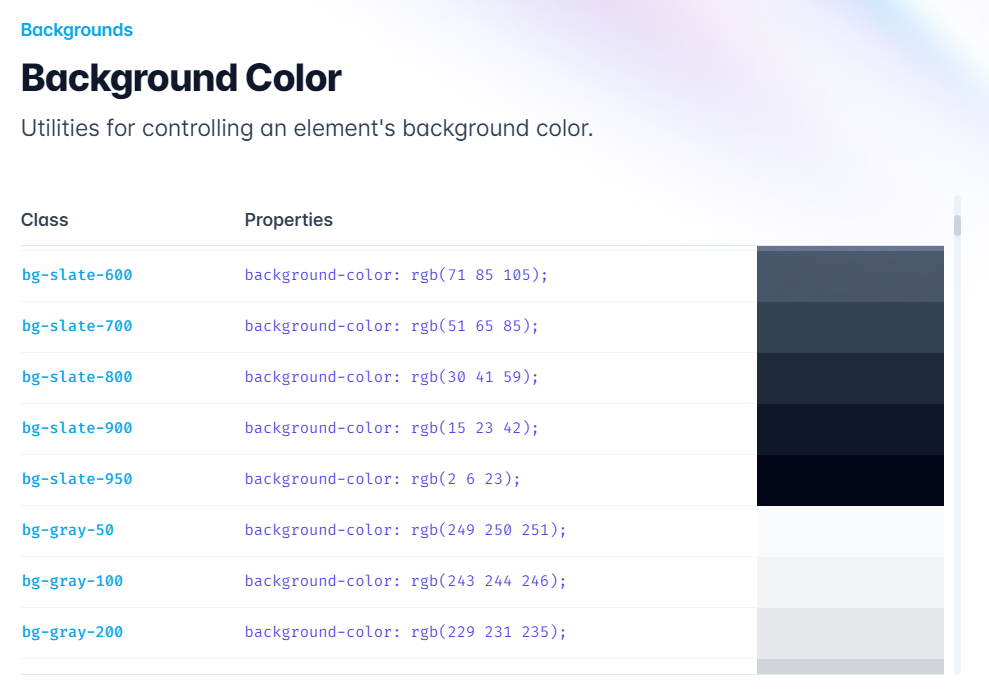
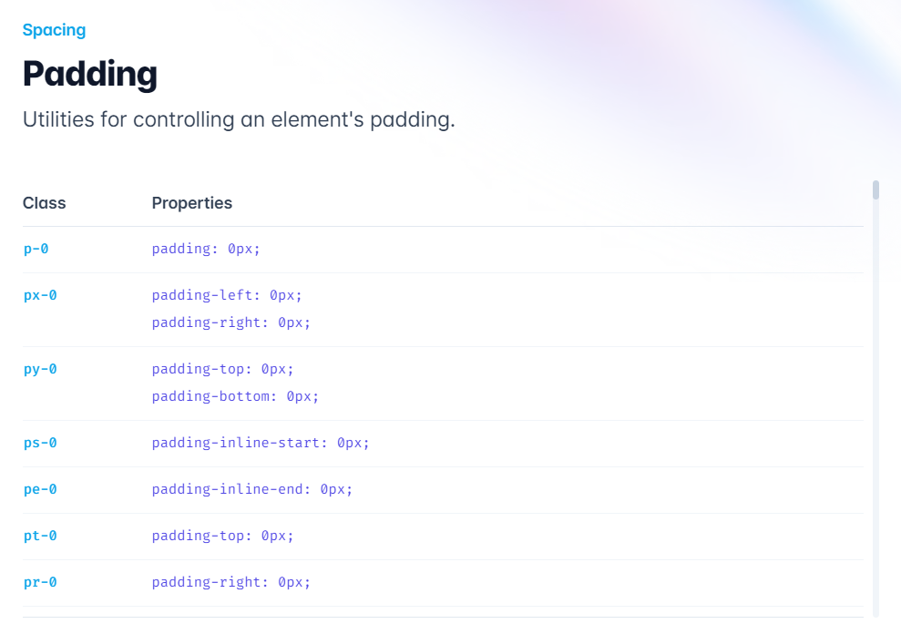
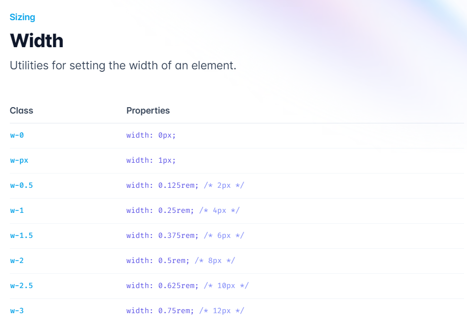
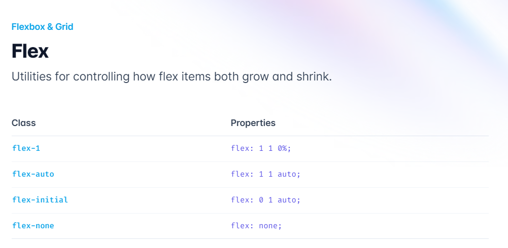
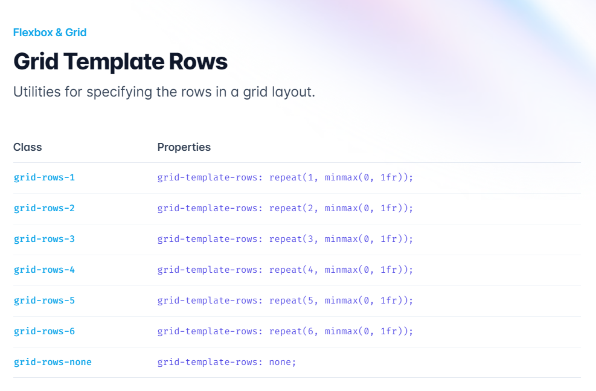
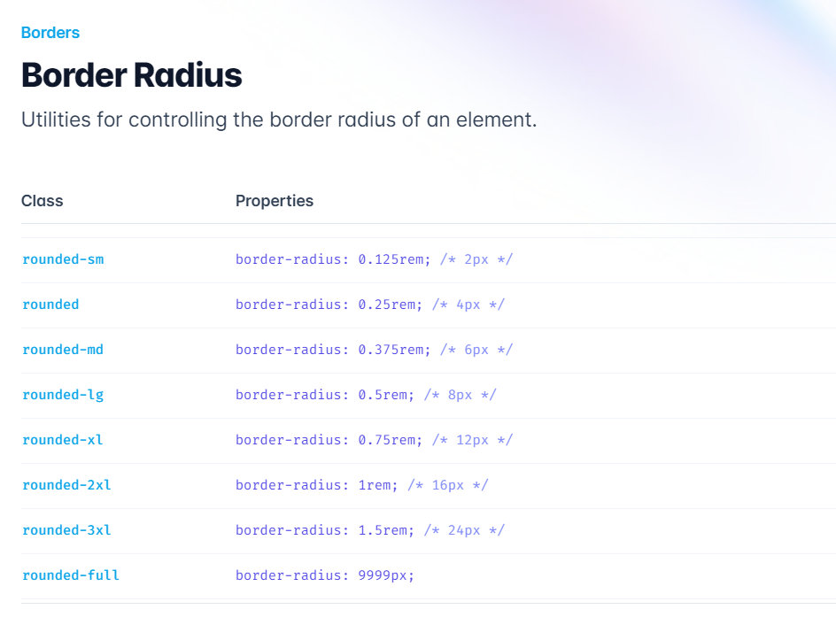
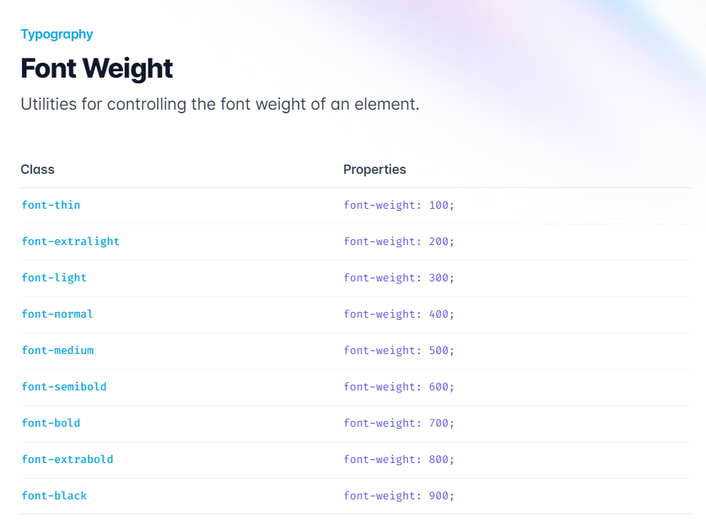

Tailwind CSS has become one of the most popular CSS frameworks, providing developers with an efficient and flexible way to style their web applications. One of the core features of Tailwind CSS is its utility-first approach, which involves using pre-defined CSS classes to apply specific styling to elements. These Tailwind classes can save developers a significant amount of time and effort by streamlining the design process.

<blockquote class="twitter-tweet" data-conversation="none">
I also have a preference for Tailwind CSS, as it offers many advantages for developers including flexibility, speed, and simplified styling through its utility classes.
&mdash; Robert-Stefan (@RobertStefan97) <a href="https://twitter.com/RobertStefan97/status/1653301497864634368?ref_src=twsrc%5Etfw">May 2, 2023</a></blockquote> 

In this article, we will explore the essential Tailwind CSS classes that every developer should know, providing examples to show you how to use them effectively in your projects. We'll cover background, spacing, sizing, flexbox, grid, border, and typography classes in detail, showcasing their versatility and efficiency in creating custom and responsive layouts. So, let’s get started and see what Tailwind classes have for us to uncover.

## A Deep Dive into 30 Essential Tailwind Classes

In this section, we'll cover 30 essential Tailwind classes that every developer should be familiar with. We'll explore each class with examples and explanations to help you understand their functionality and use cases.

For your convenience, we have organized these classes into several categories: background, spacing, sizing, flexbox, grid, border, and typography. This division will help you understand and navigate through the classes more effectively.

## Background

Tailwind CSS offers a wide range of background classes to set color, gradient, image, size, and more. Some key background classes include:

**bg-[color]**: Sets the background color of an element using the pre-defined color palette. For example, `bg-blue-500` sets a medium shade of blue as the background color. You can also use custom colors by extending the configuration.

**bg-[size]**: Sets the background size using keywords like cover, contain, or specific values. For example, `bg-cover` scales the background image to cover the entire element, maintaining the image's aspect ratio. `bg-contain` scales the image to fit within the element, also preserving the aspect ratio.

**bg-[position]**: Specifies the background position using keywords like center, top, bottom, left, right, and their combinations (e.g., top-left). For example, `bg-center` positions the background image in the center of the element.

**bg-[repeat]**: Controls the background repeat behavior using keywords like repeat, no-repeat, repeat-x, repeat-y. For example, `bg-repeat` tiles the background image both horizontally and vertically, while `bg-no-repeat` displays the image only once without repetition.

### Spacing

Tailwind CSS uses a spacing scale based on a base unit of 0.25rem (4 pixels). Here are some important spacing classes:

**p-[size]**: Sets the padding for all sides of an element using the spacing scale or specific values. For example, `p-4` applies 1rem (16px) padding to all sides, while `p-px` applies 1-pixel padding.

**m-[size]**: Sets the margin for all sides of an element using the spacing scale or specific values. For example, `m-4` applies 1rem (16px) margin to all sides, while `m-px` applies 1-pixel margin.

**[direction]-[size]**: Applies padding or margin to a specific side using the spacing scale or specific values. The direction can be top (t), right (r), bottom (b), or left (l). For example, `mt-4` applies 1rem (16px) margin to the top, while `pr-4` applies 1rem (16px) padding to the right side.

### Sizing

Tailwind CSS provides utility classes to control the width and height of elements. Some essential sizing classes are:

**w-[size]**: Sets the width of an element using the spacing scale, fractions (e.g., 1/2, 1/3), or specific values (e.g., full, screen). For example, `w-1/2` sets the width to 50% of the parent element, while `w-full` sets the width to 100%.

**h-[size]**: Sets the height of an element using the spacing scale, fractions, or specific values. For example, `h-1/2` sets the height to 50% of the parent element, while `h-screen` sets the height equal to the viewport height.

**min-w-[size] / max-w-[size]**: Sets the minimum or maximum width of an element using the spacing scale or specific values. For example, `min-w-0` sets the minimum width to 0, while `max-w-3xl` sets the maximum width to a pre-defined breakpoint.

**min-h-[size] / max-h-[size]**: Sets the minimum or maximum height of an element using the spacing scale or specific values. For example, `min-h-0` sets the minimum height to 0, while `max-h-full` sets the maximum height to 100% of the parent element.

### Flexbox

Tailwind CSS also offers utility classes for creating flexible and responsive layouts with ease using the Flexbox model. Some essential flexbox classes are:

**flex**: Activates the flexbox layout for an element, enabling you to align and distribute child elements more effectively.

**flex-[direction]**: Sets the flex direction (e.g., flex-row, flex-col). This determines the primary axis along which child elements are placed. For example, `flex-row` aligns items horizontally, while `flex-col` aligns items vertically.

**justify-[value]**: Aligns flex items along the main axis (e.g., justify-start, justify-center). This controls the distribution of space along the main axis. For example, `justify-start` aligns items at the beginning of the main axis, while `justify-center` aligns items in the center.

**items-[value]**: Aligns flex items along the cross axis (e.g., items-start, items-center). This controls the alignment of items perpendicular to the main axis. For example, `items-start` aligns items at the beginning of the cross axis, while `items-center` aligns items in the center.

### Grid

Tailwind CSS features utility classes to construct intricate and adaptable layouts with the CSS Grid system. Some fundamental grid classes are:

**grid**: Activates the grid layout for an element, allowing you to create complex and responsive layouts using rows and columns.

**grid-cols-[number]**: Defines the number of grid columns (e.g., `grid-cols-3` for a 3-column grid). This divides the grid container into the specified number of columns, each of equal width.

**grid-rows-[number]**: Defines the number of grid rows (e.g., `grid-rows-3` for a 3-row grid). This divides the grid container into the specified number of rows, each of equal height.

**col-span-[number]**: Sets the number of columns an element should span across (e.g., `col-span-2` for an element to span two columns). This controls the width of an individual grid item.

**row-span-[number]**: Sets the number of rows an element should span across (e.g., `row-span-2` for an element to span two rows). This controls the height of an individual grid item.

**gap-[size]**: Sets the spacing between grid items using the spacing scale or specific values. This applies both to rows and columns. For example, `gap-4` applies 1rem (16px) gap between rows and columns, while `gap-px` applies a 1-pixel gap.

### Border

Tailwind CSS offers classes to control border properties such as color, width, radius, and style. Some crucial border classes include:

**border**: Adds a 1px border to all sides of an element using the default border color.

**border-[color]**: Sets the border color using the pre-defined color palette or custom colors. For example, `border-blue-500` sets the border color to a medium shade of blue.

**border-[width]**: Sets the border width using the spacing scale or specific values. For example, `border-2` sets a 2px border width, while `border-t-4` sets a 4px border width only at the top.

**rounded-[size]**: Sets the border-radius using the pre-defined scale or specific values. For example, `rounded-md` applies a medium border-radius, while `rounded-tl-lg` applies a large border-radius only to the top-left corner.

**border-[style]**: Sets the border style using keywords like solid, dashed, or dotted. For example, `border-solid` applies a solid border style, while `border-dashed` applies a dashed border style.

### Typography

Tailwind CSS provides a comprehensive set of typography classes to control font properties, such as size, weight, color, and more. Some key typography classes include:

**font-[family]**: Sets the font family for an element. For example, `font-sans` applies a sans-serif font, while `font-serif` applies a serif font.

**text-[size]**: Sets the font size using the pre-defined scale or specific values. For example, `text-lg` sets a large font size, while `text-xs` sets an extra-small font size.

**font-[weight]**: Sets the font weight using the pre-defined scale or specific values. For example, `font-bold` sets a bold font weight, while `font-thin` sets a thin font weight.

**text-[color]**: Sets the font color using the pre-defined color palette or custom colors. For example, `text-blue-500` sets the font color to a medium shade of blue.

## Conclusion

This article has provided a comprehensive overview of essential Tailwind CSS classes in various categories like background, spacing, sizing, flexbox, grid, border, and typography. With a deeper understanding of these classes, you can create custom and responsive layouts for your projects more efficiently.

As you explore and utilize these classes, you'll appreciate the flexibility and adaptability that Tailwind CSS offers, streamlining your workflow and elevating the quality of your web applications.

We encourage you to experiment with them in your projects, and discover even more possibilities that Tailwind CSS has to offer. With continuous practice and exploration, you'll become proficient in using Tailwind CSS, enabling you to create stunning and responsive web designs with ease.

_Happy Coding!_
