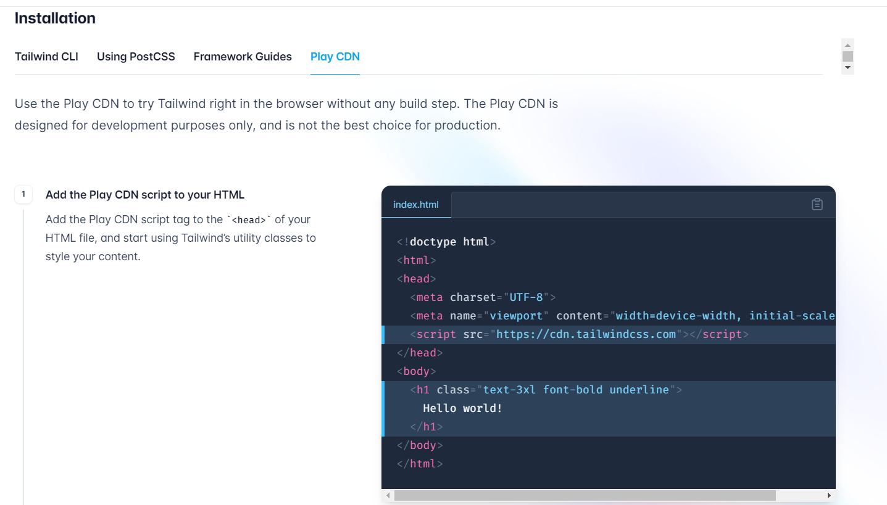

CDN, or Content Delivery Network, has become an important part of web development, enabling developers to optimize content delivery and improve website performance. With Tailwind CSS emerging as one of the most popular CSS frameworks, it's natural to wonder whether it offers a CDN to streamline the integration process.

In this article, we will explore the world of CDN and its relevance to Tailwind CSS, answering some of the most common questions developers have on the subject. We'll start by discussing what is a CDN and whether Tailwind CSS has a CDN available or not. Additionally, we'll explore how to use Tailwind's Play CDN and the benefits it provides.

Finally, we'll discuss whether it's advisable to use Tailwind CSS CDN in production and what factors to consider before making a decision. So, let's dive in and explore what Tailwind CSS CDN has to offer us.

## What is a CDN?

A Content Delivery Network (CDN) is a system of servers distributed across the globe that work together to serve content to users as quickly as possible. By caching and storing content on multiple servers, a CDN reduces the time it takes for users to access that content. This is especially useful for websites with a global audience, as it ensures that users from different locations experience fast loading times and reduced latency.

CDNs are not only beneficial for delivering static files like images, stylesheets, and JavaScript files but can also help in optimizing dynamic content like HTML pages. They work by caching content at the edge servers closest to the end-user, making the content delivery faster and more efficient. CDNs are an essential tool for enhancing user experience and reducing the load on your web server.

Moreover, CDNs offer additional features such as load balancing, DDoS protection, and SSL certificate management. These features can help improve website security and stability, making CDNs a popular choice for modern web development.

## Does Tailwind have CDN?

Yes, Tailwind CSS does have a CDN available, called Tailwind [Play CDN](https://tailwindcss.com/docs/installation/play-cdn). Tailwind Play CDN allows developers to quickly integrate Tailwind CSS into their projects without having to install or configure it locally. The CDN provides an easy way for developers to experiment with Tailwind CSS, especially those who are new to the framework or want to test out new features.

[Adam Wathan](https://twitter.com/adamwathan), the creator of Tailwind CSS, announced in a tweet on Sept 10, 2021 that they are working on a CDN.

<blockquote class="twitter-tweet" data-conversation="none"><p lang="en" dir="ltr">One of the big motivators is that for 3.0, we&#39;re working on a CDN/prototyping story that just runs Tailwind directly in the browser, instead of shipping a static CSS file (much like <a href="https://twitter.com/marcelpociot?ref_src=twsrc%5Etfw">@marcelpociot</a>&#39;s `tailwindcss-jit-cdn` project! ❤️)<br><br>Still fat to trim but not too bad so far. <a href="https://t.co/GTMEzOs9L7">pic.twitter.com/GTMEzOs9L7</a></p>&mdash; Adam Wathan (@adamwathan) <a href="https://twitter.com/adamwathan/status/1436074764217593859?ref_src=twsrc%5Etfw">September 9, 2021</a></blockquote> <script async src="https://platform.twitter.com/widgets.js" charset="utf-8"></script>

## How to use Tailwind’s Play CDN?



Using Tailwind Play CDN is quite simple and straightforward. Follow the below step to integrate it into your project:

Add the following script to the `<head>` section of your HTML file to start using Tailwind’s utility classes to style your content:

```html
<script src="https://cdn.tailwindcss.com"></script>
```

Now you can start using Tailwind CSS classes in your HTML markup. For example, to style a button, you can add the following code:

```html
<button class="bg-blue-500 text-white px-4 py-2 rounded">Click Me</button>
```

As you add more Tailwind CSS classes to your markup, you'll notice the ease with which you can create responsive designs, experiment with different styles, and customize the look and feel of your website. The powerful utility classes offered by Tailwind CSS makes it simple to achieve complex designs without writing custom CSS.

When you're ready to test your changes, simply open your HTML file in a web browser, and you'll see the Tailwind CSS styles applied to your elements. The CDN ensures that the latest version of the framework is always available, so you can focus on designing and building your website.

## Benefits of using Tailwind CSS CDN

There are several benefits to using Tailwind CSS CDN, especially during the development and prototyping phase:

**Quick setup**: No need to install or configure anything locally; just include the CDN link in your HTML file and start using Tailwind CSS classes right away.

**Ease of use**: With the CDN, you can quickly experiment with different styles and layouts without worrying about building and compiling CSS files.

**Latest version**: The CDN ensures that you're always using the latest version of Tailwind CSS, which means you'll have access to the newest features and improvements.

**Reduced server load**: With the use of CDN, the load on your server is reduced, leading to better overall performance.

## Should you use Tailwind CSS CDN in production?

While using Tailwind CSS CDN can be beneficial for quick prototyping and testing, it may not be the best choice for production environments.

<blockquote class="twitter-tweet"><p lang="en" dir="ltr">I&#39;ve been using Livewire and the Tailwind CDN to build a demo app this week and man... not having a build step is kind of amazing. I could get used to that.<br><br>I know using the Tailwind CDN in production is a Bad Idea, but I&#39;m not there yet!</p>&mdash; Aaron Francis (@aarondfrancis) <a href="https://twitter.com/aarondfrancis/status/1586144964286840832?ref_src=twsrc%5Etfw">October 28, 2022</a></blockquote> <script async src="https://platform.twitter.com/widgets.js" charset="utf-8"></script>

In production, it's recommended to use a custom build of Tailwind CSS with only the required classes, which can significantly reduce the file size and improve
performance. Additionally, when building for production, you can configure your project to use features like Just-in-Time (JIT) mode, which generates CSS classes on-demand, further optimizing the output.

## Conclusion

Tailwind CSS CDN is definitely a great tool for quickly integrating Tailwind CSS into your projects, especially during development and prototyping. However, for production environments, it's recommended to use a custom build with only the required classes to optimize performance.

But you can still use it to speed up your development process and to test and experiment with the framework easily. Nevertheless, when it comes to deploying your project to production, make sure to optimize the CSS by creating a custom build, removing unused classes, and using advanced features like JIT mode. By doing so, you can harness the full potential of Tailwind CSS while maintaining optimal performance and delivering an excellent user experience to your visitors.

_Happy Coding!_
