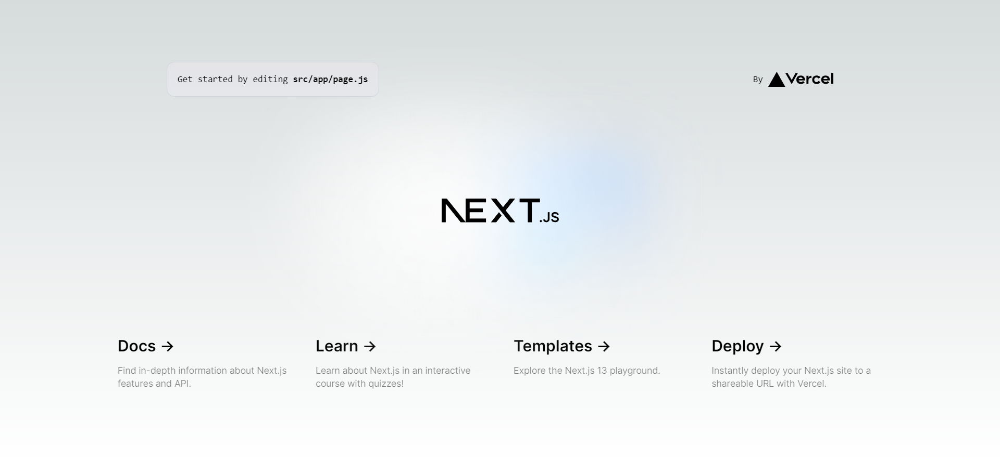
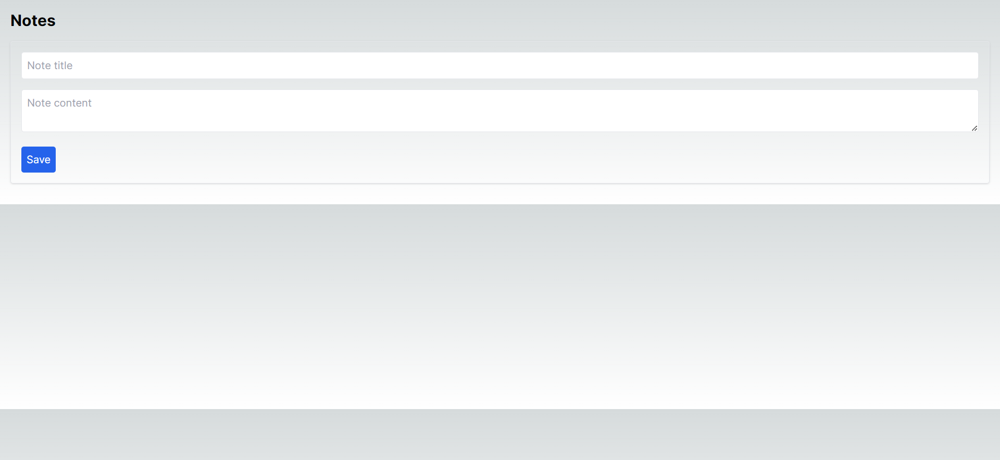

[Next.js](https://nextjs.org/) is a widely popular framework for building server-side rendered (SSR) React applications. With the added benefits of Tailwind CSS, developers can create beautiful and responsive interfaces quickly and efficiently.

But what's even more exciting is that Next.js 13 now comes with Tailwind CSS installed by default which saves you a ton of precious time and helps avoid the hassle of installing and configuring Tailwind on your own.

In this article, we'll cover the fundamentals of creating a Next.js project with Tailwind installed. From there, we will build a Notes application using Next.js and Tailwind CSS, providing a practical example of leveraging these 2 powerful tools to create real applications.

Our goal is to equip you with the knowledge and examples you need to start using Tailwind CSS with Next.js in your projects. Now, without further ado, let’s get started.

## How to install Tailwind CSS and Next.js

To begin, we'll walk through the process of setting up a Next.js project and installing Tailwind CSS. We'll cover each step in detail to ensure a smooth setup.

### Create a new Tailwind + Next.js project

First, we'll create a new Next.js project using the following steps:

1. Ensure that you have Node.js (v16.8 or later) installed on your system. If you don't have Node.js installed, you can download it from the official [Node.js](https://nodejs.org/en) website.

2. Open a terminal or command prompt and run the following command to create a new Next.js app:

```bash
npx create-next-app@latest
```

Once you run the command, you will be asked the following questions during the installation process:

```bash
What is your project named?  new-app
Would you like to add TypeScript with this project?  Y/N
Would you like to use ESLint with this project?  Y/N
Would you like to use Tailwind CSS with this project? Y/N
Would you like to use the `src/ directory` with this project? Y/N
What import alias would you like configured? `@/*`
```

**Note:** Make sure that you type **Y** for Tailwind CSS and `src/ directory`, and **N** for TypeScript(because we are using Javascript for this project). Leave rest of the configuration as it is.

Once everything is set up, type the following commands on your terminal to start the development server:

```bash
cd <your-project-here>
```

```bash
npm run dev
```

Once the dev server is up and running, go to your browser and visit _http://localhost:3000_. If everything is correctly set up, you will see the following page:



<p style="text-align: center">
<em>Default localhost:3000 Next.js server</em></p>

## Creating a Notes app with Next.js and Tailwind

Now that we have our Next.js application set up with Tailwind CSS, let's put these tools to use by creating a simple Notes app.

### Step 1: Creating the Note Component

First, we'll create a new directory **components** inside the `src/ directory`. This directory will be used to create all the components file.

Now, inside the `src/components`, create a new file `Note.js`. This component will be used to display the note's title and content. Add the following code to the file:

```jsx
import React from "react";

const Note = ({ note, onEdit }) => (
  <div className="p-4 border rounded shadow">
    <h2 className="text-xl font-bold">{note.title}</h2>
    <p className="mt-2">{note.content}</p>
    <button className="mt-4 text-blue-600" onClick={() => onEdit(note)}>
      Edit
    </button>
  </div>
);

export default Note;
```

### Step 2: Creating the Notes List Component

Next, we'll create `NotesList` component that will render a list of Note components. Create a new file `NotesList.js` inside `src/components/` and add the following code:

```jsx
import React from "react";
import Note from "./Note";

const NotesList = ({ notes, onEdit }) => (
  <div className="grid grid-cols-2 gap-4">
    {notes.map((note) => (
      <Note key={note.id} note={note} onEdit={onEdit} />
    ))}
  </div>
);

export default NotesList;
```

### Step 3: Creating the Note Form Component

We'll also need a `NoteForm.js` component for adding and updating notes. Create the file for the same inside `src/components/` and add the following code:

```jsx
import { useState } from "react";

const NoteForm = ({ note, onSubmit }) => {
  const [title, setTitle] = useState(note ? note.title : "");
  const [content, setContent] = useState(note ? note.content : "");

  const handleSubmit = (e) => {
    e.preventDefault();
    onSubmit({ title, content });
  };

  return (
    <form className="p-4 border rounded shadow" onSubmit={handleSubmit}>
      <input
        className="w-full p-2 mb-4 border rounded"
        type="text"
        placeholder="Note title"
        value={title}
        onChange={(e) => setTitle(e.target.value)}
      />
      <textarea
        className="w-full p-2 mb-4 border rounded"
        placeholder="Note content"
        value={content}
        onChange={(e) => setContent(e.target.value)}
      />
      <button className="p-2 bg-blue-600 text-white rounded" type="submit">
        Save
      </button>
    </form>
  );
};

export default NoteForm;
```

### Step 4: Putting It All Together

Finally, we'll use these components in our `src/app/page.js` file to create the Notes app. Replace the entire code of the `page.js` file with the following code:

```jsx
"use client";
import { useState } from "react";
import NoteForm from "../components/NoteForm";
import NotesList from "../components/NotesList";

export default function Home() {
  const [notes, setNotes] = useState([]);
  const [editingNote, setEditingNote] = useState(null);

  const handleAddNote = (note) => {
    setNotes([...notes, { ...note, id: Date.now() }]);
  };

  const handleEditNote = (note) => {
    setEditingNote(note);
  };

  const handleUpdateNote = (updatedNote) => {
    setNotes(
      notes.map((note) => (note.id === updatedNote.id ? updatedNote : note)),
    );
    setEditingNote(null);
  };

  return (
    <div className="p-4">
      <h1 className="text-2xl font-bold mb-4">Notes</h1>
      <NoteForm
        note={editingNote}
        onSubmit={(note) =>
          editingNote ? handleUpdateNote(note) : handleAddNote(note)
        }
      />
      <div className="mt-4">
        <NotesList notes={notes} onEdit={handleEditNote} />
      </div>
    </div>
  );
}
```

**Note**: All components inside the `src/app` directory in Next.js 13 are React Server Components by default. To use _Client Component_, you have to add a `"use client"` directive at the top of your component. In our case, we have to specify the _use client_ directive because we are using the **useState** hook of React.

Once you have put everything together, visit `localhost:3000` again and see if your app is running properly or not.



<p style="text-align: center">
<em>Final version of our Tailwind Next.js Notes app</em></p>

Now that your app is ready, play with it, test all the features and see what more you can add on your own!

## Conclusion

In this tutorial, we've explored how to set up a Next.js project with Tailwind CSS integrated. We've also built a simple Notes application, demonstrating how to use Tailwind and Next.js together to create efficient, beautiful, and responsive web applications.

Remember, this tutorial only scratches the surface of what you can achieve with Next.js and Tailwind CSS. Both technologies offer a wealth of features and possibilities that you can explore and experiment with. As you continue to delve deeper, you'll discover just how potent this combination can be.

We hope this guide has been helpful in getting you started with Next.js and Tailwind CSS.

_Happy Coding!_
