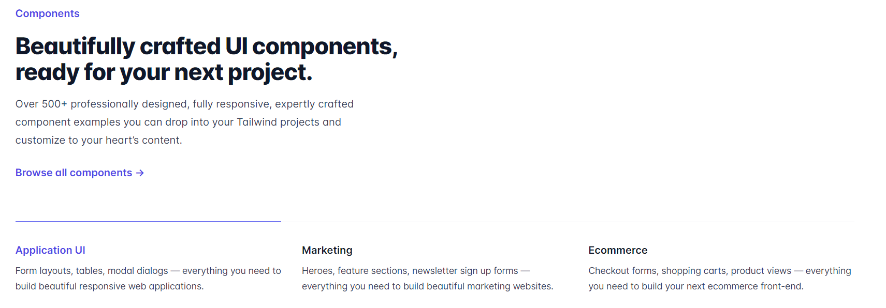

In today's fast-paced web development world, having the right tools and libraries at your disposal is crucial. One such popular combination is the pairing of Tailwind CSS with React. To make the most out of this powerful duo, developers are turning to component libraries that simplify the development process and save time.

In this article, we will explore the top 9 Tailwind React component libraries, provide insights into their features and usage, and discuss how to utilize them effectively. Let's dive in!

### Daisy UI


<p style="text-align: center">
<em>Source: <a href="https://daisyui.com/">Daisy UI</a></em></p>

[Daisy UI](https://daisyui.com/) is an open-source component library for Tailwind CSS that offers a wide range of customizable and accessible components. The library boasts a clean design, extensive documentation, and seamless integration with React.

Daisy UI simplifies the development process by providing a rich set of pre-designed components, such as buttons, forms, modals, and more, that are easy to customize and adapt to your project's needs.

**How to use Daisy UI:**

1. You must have Node.js and Tailwind installed before installing Daisy UI. Additionally, also setup a new React project.

2. Once all these things are done, run the following command at the root of your React project.

```bash
npm i daisyui
```

3. Next, add _daisyui_ to your `tailwind.config.js` file:

```css
module.exports = {
  //...
  plugins: [require("daisyui")];
}
```

4. Finally, copy the code for the component you want to use in your React project. For example, here's the code for a sample [card](https://daisyui.com/components/card/) from DaisyUI:

```jsx
<div className="card w-96 bg-base-100 shadow-xl">
  <figure>
    
  </figure>
  <div className="card-body">
    <h2 className="card-title">Shoes!</h2>
    <p>If a dog chews shoes whose shoes does he choose?</p>
    <div className="card-actions justify-end">
      <button className="btn btn-primary">Buy Now</button>
    </div>
  </div>
</div>
```

### Flowbite


<p style="text-align: center">
<em>Source: <a href="https://flowbite.com/">Flowbite</a></em></p>

[Flowbite](https://flowbite.com/) is a responsive component library for Tailwind CSS and React, designed with simplicity and ease of use in mind. It provides a solid set of components that are perfect for building modern web applications.

Flowbite's components are built with a mobile-first approach, ensuring that your application looks great and works seamlessly on all devices.

The library includes components like alerts, avatars, badges, cards, dropdowns, and many more, making it a versatile choice for any project.

**How to use Flowbite**:

1. Before moving forward, make sure you have Node.js and Tailwind installed and your React project setup. Now, install Flowbite by running the following command:

```bash
npm install flowbite
```

2. Next, require _flowbite_ as a plugin inside the `tailwind.config.js` file:

```css
module.exports = {
  plugins: [ require("flowbite/plugin")];
}
```

3. Now, add the Flowbite source paths to your content data:

```jsx
module.exports = {
  content: [
    // ...
    "node_modules/flowbite-react/**/*.{js,jsx,ts,tsx}",
  ],
};
```

4. Finally, go to [Flowbite React](https://flowbite-react.com/) website and copy the code for the component you want. For example, here's a [card](https://flowbite-react.com/card) from Flowbite React components:

```jsx
<div className="max-w-sm">
  <Card imgSrc="https://flowbite.com/docs/images/blog/image-1.jpg">
    <h5 className="text-2xl font-bold tracking-tight text-gray-900 dark:text-white">
      Noteworthy technology acquisitions 2021
    </h5>
    <p className="font-normal text-gray-700 dark:text-gray-400">
      Here are the biggest enterprise technology acquisitions of 2021 so far, in
      reverse chronological order.
    </p>
  </Card>
</div>
```

### HyperUI


<p style="text-align: center">
<em>Source: <a href="https://www.hyperui.dev/">HyperUI</a></em></p>

[HyperUI](https://www.hyperui.dev/) is a free and open source component library for Tailwind CSS and React. It offers a vast collection of minimally designed and fully responsive components.

With a focus on performance and usability, HyperUI provides a wide array of components, including navigations, forms, tables, and overlays.

**How to use HyperUI**:

1. If you have Tailwind installed on your project, you are good to go with HyperUI, it doesn't need a separate installation.

2. Go to the HyperUI website and copy the code for the component you want to use in your application. For example, here's a code for an _alert_ from the HyperUI website.

```jsx
<div role="alert" className="rounded border-s-4 border-red-500 bg-red-50 p-4">
  <strong className="block font-medium text-red-800">
    Something went wrong{" "}
  </strong>

  <p className="mt-2 text-sm text-red-700">
    Lorem ipsum dolor sit amet consectetur, adipisicing elit. Nemo quasi
    assumenda numquam deserunt consectetur autem nihil quos debitis dolor culpa.
  </p>
</div>
```

### Tailwind UI



<p style="text-align: center">
<em>Source: <a href="https://tailwindui.com/">TailwindUI</a></em></p>

[Tailwind UI](https://tailwindui.com/) is the official component library for Tailwind CSS, designed by the same team behind the popular framework. It offers a comprehensive set of 500+ professionally designed components that are built to be accessible, responsive, and customizable.

Tailwind UI covers a wide range of use cases, from marketing pages and e-commerce to application UI components. With its focus on design consistency, the library ensures that your application will have a cohesive and polished look across all components.

**How to use Tailwind UI**:

1. First, purchase a license and gain access to the Tailwind UI library.

2. Now, setup a React application with Tailwind installed.

3. Then, install _HeadlessUI_ and _Heroicons_ as dependencies on your React project.

```bash
npm install @headlessui/react @heroicons/react
```

4. Finally, explore all [Tailwind UI components](https://tailwindui.com/components) and copy the code for the one that you want to use. Here's an example of an [input group](https://tailwindui.com/components/application-ui/forms/input-groups) from Tailwind UI:

```jsx
<div>
  <label for="price" class="block text-sm font-medium leading-6 text-gray-900">Price</label>
  <div class="relative mt-2 rounded-md shadow-sm">
    <div class="pointer-events-none absolute inset-y-0 left-0 flex items-center pl-3">
      <span class="text-gray-500 sm:text-sm">$</span>
    </div>
    <input type="text" name="price" id="price" class="block w-full rounded-md border-0 py-1.5 pl-7 pr-20 text-gray-900 ring-1 ring-inset ring-gray-300 placeholder:text-gray-400 focus:ring-2 focus:ring-inset focus:ring-indigo-600 sm:text-sm sm:leading-6" placeholder="0.00">
    <div class="absolute inset-y-0 right-0 flex items-center">
      <label for="currency" class="sr-only">Currency</label>
      <select id="currency" name="currency" class="h-full rounded-md border-0 bg-transparent py-0 pl-2 pr-7 text-gray-500 focus:ring-2 focus:ring-inset focus:ring-indigo-600 sm:text-sm">
        <option>USD</option>
        <option>CAD</option>
        <option>EUR</option>
      </select>
    </div>
  </div>
</div>
```

### Material Tailwind


<p style="text-align: center">
<em>Source: <a href="https://www.material-tailwind.com/">Material Tailwind</a></em></p>

[Material Tailwind](https://www.material-tailwind.com/) is a component library that combines the design principles of Google's Material Design with the power and flexibility of Tailwind CSS.

It provides a collection of React components that are both visually appealing and highly functional. Material Tailwind covers essential components such as buttons, cards, navigation, and dialogs, as well as advanced components like data tables and autocomplete inputs.

This library is perfect for developers looking to create modern, Material Design inspired applications with React and Tailwind CSS.

**How to use Material Tailwind**:

1. First, spin up a React project and install Tailwind.

2. Now, install Material Tailwind:

```bash
npm i @material-tailwind/react
```

3. Once you have `@material-tailwind/react` installed, you have to wrap your Tailwind CSS configurations(`tailwind.config.js`) with the **withMT()**, like this:

```css
const withMT = require("@material-tailwind/react/utils/withMT");

module.exports = withMT({
  content: ["./index.html", "./src/**/*.{vue,js,ts,jsx,tsx}"],
  theme: {
    extend: {},
  },
  plugins: [],
});
```

4. Now, wrap you entire application with the _Theme Provider_ of `@material-tailwind/react` in the _src/main_, like this:

```jsx
import React from "react";
import ReactDOM from "react-dom/client";
import App from "./App";
import "./index.css";

import { ThemeProvider } from "@material-tailwind/react";

ReactDOM.createRoot(document.getElementById("root")).render(
  <React.StrictMode>
    <ThemeProvider>
      <App />
    </ThemeProvider>
  </React.StrictMode>,
);
```

5. Finally, import and use the required Material Tailwind components in your React application. Here's an example of a Button component:

```jsx
import { Button } from "@material-tailwind/react";

export default function Example() {
  return <Button>Button</Button>;
}
```

### Headless UI


<p style="text-align: center">
<em>Source: <a href="https://headlessui.com/">Headless UI</a></em></p>

[Headless UI](https://headlessui.com/) is a unique component library by Tailwind Labs that focuses on providing fully accessible, unstyled UI components for Tailwind CSS and React.

This library allows developers to create custom-styled components while ensuring that they remain accessible and follow best practices. Headless UI provides a solid foundation for components like dropdowns, modals, and lists, leaving the styling up to you.

This approach gives you complete control over the appearance of your components while maintaining a high level of accessibility and usability.

**How to use Headless UI**:

1. First, create a new React project and install Tailwind.

2. Install Headless UI:

```bash
npm install @headlessui/react
```

3. Next, import and use the necessary components in your React app, and combine them with your own custom styling to create unique and accessible components for your application. Here's an example of a [Disclosure](https://headlessui.com/react/disclosure) from Headless UI:

```jsx
import { Disclosure } from "@headlessui/react";

function MyDisclosure() {
  return (
    <Disclosure>
      <Disclosure.Button className="py-2">
        Is team pricing available?
      </Disclosure.Button>
      <Disclosure.Panel className="text-gray-500">
        Yes! You can purchase a license that you can share with your entire
        team.
      </Disclosure.Panel>
    </Disclosure>
  );
}
```

### Float UI


<p style="text-align: center">
<em>Source: <a href="https://floatui.com/">Float UI</a></em></p>

[Float UI](https://floatui.com/) is a modern and versatile component library for Tailwind CSS and React. It offers a collection of responsive and easily customizable components that cater to various web application needs.

Float UI's components are designed with a clean and minimal aesthetic, ensuring that your application looks professional and modern.

The library includes a variety of essential components such as buttons, forms, cards, and navigation etc.

**How to use Float UI**:

1. Create a new React app and install Tailwind.

2. Now, explore all the components and copy the code for the one you want to use. Here's an example of a [Pagination component](https://floatui.com/components/paginations) from [Float UI](https://floatui.com/components):

```jsx
import { useState } from "react";

export default () => {
  const [pages, setPages] = useState(["1", "2", "3", , "...", "8", "9", "10"]);
  const [currentPage, setCurrentPage] = useState("1");

  return (
    <div className="max-w-screen-xl mx-auto mt-12 px-4 text-gray-600 md:px-8">
      <div className="flex items-center justify-between text-sm text-gray-600 font-medium">
        <a
          href="javascript:void(0)"
          className="px-4 py-2 border rounded-lg duration-150 hover:bg-gray-50"
        >
          Previous
        </a>
        <div>
          Page {currentPage} of {pages.length}
        </div>
        <a
          href="javascript:void(0)"
          className="px-4 py-2 border rounded-lg duration-150 hover:bg-gray-50"
        >
          Next
        </a>
      </div>
    </div>
  );
};
```

## Conclusion

Each library mentioned in the article has its unique strengths and features, catering to different project requirements and design preferences

Whether you're after a comprehensive set of professionally designed components from Tailwind UI, the accessibility-first approach of Headless UI, or the Material Design principles of Material Tailwind, there's a library to cater to your every need. And with the easy-to-follow installation and usage guidelines provided, integrating these tools into your project couldn't be simpler.

One piece of advice we will give you is to carefully examine your project needs and then explore all these Tailwind React UI libraries to find the one that best matches your project's vision.

_Happy Coding!_
