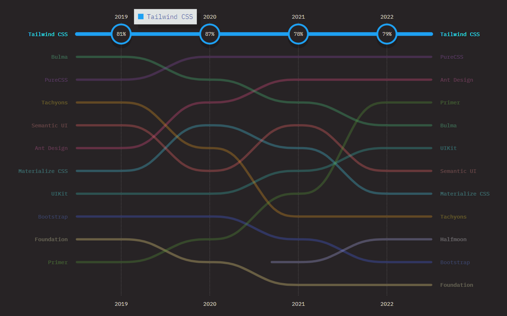
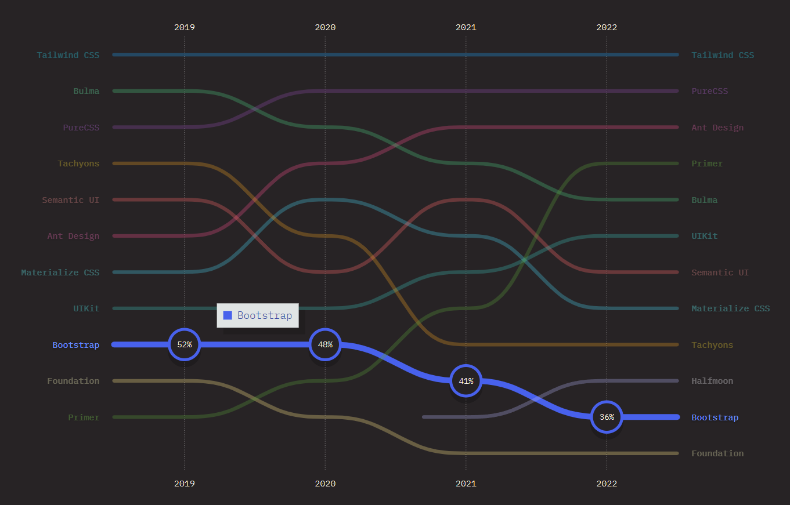

In today's fast-paced world of web development, having a reliable and efficient CSS framework is crucial for delivering visually appealing and responsive websites. Two of the most popular choices in this domain are Tailwind CSS and Bootstrap.

In this comprehensive guide, we will compare Tailwind vs Bootstrap and delve into various benchmarks such as pre-built components, community, performance, and more to help you decide which CSS framework is best suited for your needs.

## Pre-built Components

**Tailwind CSS**:

Tailwind CSS framework offers low-level, reusable utility classes instead of pre-built components. These classes cover many styling needs, including layout, spacing, typography, and colors. With Tailwind, developers can easily create custom designs without writing new CSS.

Although Tailwind does not come with pre-built components, there are several well-designed component libraries, including Tailwind UI and Headless UI by Tailwind Labs. Therefore, if pre-built components are something you are looking for, the Tailwind community has got you covered.

**Bootstrap**:

Bootstrap, on the other hand, is a component-based CSS framework. It offers a wide range of pre-built, responsive components like buttons, forms, modals, and more, which can be easily integrated into your web projects.

This extensive collection of pre-built components saves time and effort, but can lead to websites looking similar due to the use of default Bootstrap styles.

However, the advantage of using pre-built components is that they have been thoroughly tested for cross-browser compatibility and responsiveness, ensuring a consistent user experience across various devices and platforms.

**Winner**: _Equal_

## Community and Support

**Tailwind CSS**:

Tailwind has a rapidly growing community and an increasing number of developers are adopting it as their go-to CSS framework.

<blockquote class="twitter-tweet">
“Move to Tailwind.” — <a href="https://twitter.com/rauchg?ref_src=twsrc%5Etfw">@rauchg</a>  big endorsement on the <a href="https://twitter.com/vercel?ref_src=twsrc%5Etfw">@vercel</a> stage tonight! all the css in js solutions be quaking in they boots <a href="https://t.co/9ZpTaATWdD">pic.twitter.com/9ZpTaATWdD</a>
&mdash; shawn swyx wang (@swyx) <a href="https://twitter.com/swyx/status/1654311379707506689?ref_src=twsrc%5Etfw">May 5, 2023</a></blockquote> 

Although the community is currently smaller than Bootstrap's, it is highly active and supportive, with various resources and plugins, and component libraries available to help you get started and extend the framework's capabilities.

**Bootstrap**:

Bootstrap has been around for a longer time and boasts a massive, well-established community. As a result, it has a wealth of resources, including extensive documentation, tutorials, and third-party libraries. This large community also means that finding support and solutions to common problems is relatively easier.

Moreover, the Bootstrap ecosystem offers a multitude of pre-built themes and templates, which can be a valuable resource for developers looking to jump-start their projects or gain inspiration for their own designs.

**Winner**: _Bootstrap_

## Performance

**Tailwind CSS**:

Tailwind CSS creates only the needed CSS based on the utility classes you use in your project. This results in smaller, better CSS files that are 10KB or less and help your webpage load faster. For the smallest production build, you can also try minifying your CSS with a tool like [cssnano](https://cssnano.co/), and compressing your CSS with [Brotli](https://en.wikipedia.org/wiki/Brotli)(Source: [_Tailwind_](https://tailwindcss.com/docs/optimizing-for-production)).

In general, Tailwind CSS is likely to have better performance than Bootstrap, as it only includes the styles that are actually used.

**Bootstrap**:

Bootstrap, in contrast, comes bundled with a complete set of pre-styled components, which can lead to larger CSS file sizes.

This can potentially impact the load speed and overall performance of a website. However, Bootstrap does allow customization of its Sass variables to enable the exclusion of unnecessary components, which can help reduce file sizes.

It's also worth mentioning that, despite the larger file size, Bootstrap's performance is generally satisfactory for most applications. Nonetheless, it requires careful attention from the developer to ensure unnecessary bloat is minimized for optimal performance.

**Winner**: _Tailwind_

## Customization and Theming

**Tailwind CSS**:

Tailwind offers a high degree of customization, allowing developers to create unique designs by modifying the configuration file.

You can easily define your own color palette, typography, and other design elements, making it simple to create consistent, branded designs across your projects.

This level of customization allows for greater creative freedom and helps you develop a distinct visual identity for your website or application.

**Bootstrap**:

Bootstrap allows for customization through Sass variables and mixins, but the process is less straightforward than Tailwind's approach. Customizing Bootstrap designs can be more challenging, especially if you're not familiar with Sass.

Additionally, the prevalence of default Bootstrap styles can make it harder to achieve a unique look for your website. However, with a good understanding of Sass and careful customization, you can create a bespoke design that breaks away from the typical Bootstrap aesthetic.

**Winner**: _Tailwind_

# Developer Satisfaction

**Tailwind CSS**:

Many developers who have embraced Tailwind's utility-first approach report high levels of satisfaction with the framework. They appreciate the flexibility, customization, and the speed at which they can prototype and build designs.

Once familiar with the utility classes and naming conventions, developers find it easier to create unique and responsive designs without writing extensive custom CSS.

<em>Retention ratio of Tailwind CSS from 2019 to 2022. Source: <a href="https://2022.stateofcss.com/en-US/css-frameworks/#css_frameworks_experience_linechart">State of CSS Survey 2022</a></em>

In the State of CSS survey 2022, Tailwind CSS received 79% [retention ratio](https://2022.stateofcss.com/en-US/css-frameworks/#css_frameworks_experience_linechart) from the developers who have use the framework.

**Bootstrap**:

Bootstrap has been a popular choice among developers for years, thanks to its comprehensive collection of pre-built components and robust grid system.

Developers who prefer a component-based approach often find satisfaction in working with Bootstrap, as it allows them to quickly create functional and responsive designs with minimal effort.

However, some developers may feel constrained by the predefined styles and components, which can limit their ability to create truly unique designs without significant customization.

<em>Retention ratio of Bootstrap from 2019 to 2022. Source: <a href="https://2022.stateofcss.com/en-US/css-frameworks/#css_frameworks_experience_linechart">State of CSS Survey 2022</a></em>

In the State of CSS survey 2022, Bootstrap received only 36% [retention ratio](https://2022.stateofcss.com/en-US/css-frameworks/#css_frameworks_experience_linechart) from the developers who have use the framework. Moreover, the retention ratio of Bootstrap is constantly declining in the last few years, from 52% in 2019 to 36% in 2023.

**Winner**: _Tailwind_

## Integration with JavaScript Frameworks

**Tailwind CSS**:

Tailwind's utility-first approach works seamlessly with modern JavaScript frameworks like React, Vue, and Angular. Developers can directly apply utility classes to components within these frameworks, resulting in clean and maintainable code.

The compatibility with JavaScript frameworks makes Tailwind a popular choice for projects that require dynamic UI elements and interactivity.

**Bootstrap**:

Bootstrap can also be integrated with JavaScript frameworks, but it might require additional configuration and customization. Bootstrap's components rely heavily on jQuery for their interactivity, which can conflict with the principles of modern JavaScript frameworks.

Developers may need to employ third-party libraries like React-Bootstrap or Bootstrap-Vue to adapt Bootstrap components for use within their chosen JavaScript framework. This can add complexity and increase the overall size of the project's dependencies.

**Winner**: _Tailwind_

## Responsiveness

**Tailwind CSS**:

Tailwind CSS provides comprehensive tools to build responsive designs. It includes a wide array of responsive utility classes that make it simple to adjust layouts and components across different screen sizes.

By adding responsive variants to any utility class, developers can easily control the style of an element at various breakpoints.

Tailwind's approach gives developers granular control over how their design behaves at each breakpoint, which can lead to a high level of precision and consistency in responsive designs.

**Bootstrap**:

Bootstrap features a powerful grid system and a set of pre-built responsive classes, allowing developers to easily create layouts that adapt seamlessly to different screen sizes.

Bootstrap's grid system uses 12 columns and supports up to five different breakpoints, providing a flexible foundation for responsive design. Moreover, many of Bootstrap's pre-built components are designed to be responsive out of the box, which can speed up the development process.

However, while Bootstrap's approach can be faster and more convenient, it may offer less granular control compared to Tailwind's utility-first philosophy.

**Winner**: _Equal_

## Conclusion

When comparing Tailwind vs Bootstrap, the best choice depends on your specific needs and preferences. If you value creative freedom, customization, and a utility-first approach, Tailwind CSS is the ideal choice. On the other hand, if you prefer a component-based framework with a wealth of pre-built elements and a more straightforward learning curve, Bootstrap might be the better option.

Ultimately, both frameworks have their merits and can be used to create impressive, responsive websites. It's essential to consider factors such as your project's requirements, your familiarity with each framework, and the desired level of customization when making your decision.

By carefully weighing the pros and cons of Tailwind vs Bootstrap, you can select the CSS framework that best aligns with your development goals and allows you to create visually stunning and user-friendly web projects.

_Happy Coding!_
