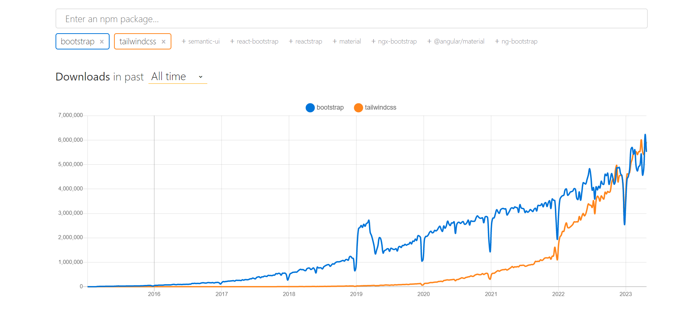
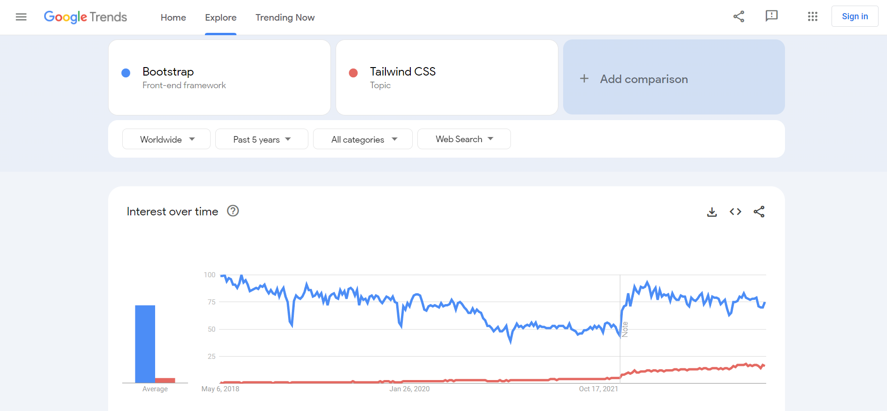

For most developers, making beautiful and responsive websites often means finding the right frontend CSS framework. Undoubtedly, it's possible to style your website using only vanilla CSS. However, with this approach, you have to also deal with slow loading times, overlapping properties, and too many `!important` once your project scales.

CSS frameworks fix this big problem by giving all the needed tools for easier styling and keeping websites up-to-date. Whether it's making the website work on different devices and browsers, or keeping the design consistent, the right framework can help solve these issues and make development smoother.

Continuing on this topic, we'll dive into a comparison between Tailwind CSS and Bootstrap, two leading CSS frameworks widely used today. Our goal is to discuss their distinct features, advantages, and disadvantages, equipping you with the knowledge to make a well-informed choice that caters to your project's unique requirements.

## Tailwind vs Bootstrap: A Comprehensive Comparison

As we proceed with our discussion, we will take a closer look at Tailwind CSS and Bootstrap to understand what sets them apart. Through examining their individual benefits, and limitations, we hope to provide you with a clear perspective to help you choose the best framework for your project. By the end of this article, you'll have a better understanding of which framework is best suited for your next project.

## What is Tailwind?

[Tailwind CSS](https://tailwindcss.com/) is a highly versatile, utility-first CSS framework that empowers developers to build customized, responsive designs with ease. By providing a comprehensive set of predefined classes, Tailwind CSS allows developers to construct unique user interfaces without having to write repetitive and lengthy CSS code. With its built-in breakpoints, creating responsive designs becomes incredibly simple, as developers can add different screen size variations directly to the class names.

For example, consider a simple button styled using Tailwind CSS:

```html
<button
  class="bg-blue-500 hover:bg-blue-700 text-white font-bold py-2 px-4 rounded"
>
  Click me
</button>
```

The Tailwind CSS framework is designed to facilitate rapid development without compromising on design consistency. Its utility-first approach promotes a cohesive design language throughout the project, ensuring that the final product is visually appealing and user-friendly. Moreover, the growing community behind Tailwind CSS offers a wealth of resources, making it easier for developers to find support and inspiration.



<p style="text-align: center">
<em>NPM Downloads comparison of TailwindCSS vs Bootstrap. Source: <a href="https://npmtrends.com/bootstrap-vs-tailwindcss">NPM Trends</a></em></p>

Despite being released years later, Tailwind has given tough competition to Bootstrap and has become 2nd most popular CSS framework on NPM.

### Advantages of using Tailwind

**Utility-first approach**: Tailwind's utility-first approach encourages faster development and promotes a consistent design language.

**Highly customizable**: Tailwind CSS allows for extensive customization, enabling developers to create unique designs that fit their brand.

**No prebuilt components**: Unlike other frameworks, Tailwind doesn't provide prebuilt components, making it a perfect fit for developers who prefer to build their designs from scratch.

**Responsive design made easy**: Tailwind CSS simplifies the process of creating responsive designs with built-in breakpoints.

**Growing community**: With its increasing popularity, Tailwind boasts an active and supportive community.

### Disadvantages of using Tailwind

**Initial setup time**: Tailwind CSS requires a more involved setup process compared to other frameworks, as developers need to configure their build process and customize their configuration file.

**Verbose class names**: The extensive use of utility classes can lead to long and cumbersome HTML class names.

<blockquote class="twitter-tweet"><p lang="en" dir="ltr">I like TailwindCSS but I don’t like how we end up with a long horizontal list of utility classes. Prettier doesn’t format them and we have to constantly scroll horizontally to see them. Also, sometimes the intention of a div is lost and it’s hard to see what’s going on. What are…</p>&mdash; Mosh (@moshhamedani) <a href="https://twitter.com/moshhamedani/status/1650463354631192578?ref_src=twsrc%5Etfw">April 24, 2023</a></blockquote> <script async src="https://platform.twitter.com/widgets.js" charset="utf-8"></script>

**Lack of prebuilt components**: While this can be an advantage for some, the absence of prebuilt components may increase development time for those who rely on them.

## What is Bootstrap?

[Bootstrap](https://getbootstrap.com/) is a popular, open-source CSS framework that streamlines the development of responsive, mobile-first web applications. With an extensive library of prebuilt components and a responsive grid system, Bootstrap enables developers to create visually consistent and appealing interfaces with minimal effort. The framework's primary goal is to simplify the design process and make it more accessible to developers of all skill levels.

For example, consider a simple button styled using Bootstrap:

```html
<button type="button" class="btn btn-primary">Click me</button>
```

Bootstrap's component-based approach saves developers time and energy by providing pre-styled elements like buttons, forms, and navigation bars that can be easily integrated into a project. Additionally, its responsive grid system allows for seamless creation of mobile-first and adaptive designs. With a vast community of users and contributors, Bootstrap offers numerous resources, such as tutorials, examples, and solutions to common issues, making it an attractive choice for many developers.



<p style="text-align: center">
<em>Google Trends comparison of TailwindCSS vs Bootstrap</em></p>

According to Google Trends, Bootstrap has always shown higher audience interest than Tailwind CSS worldwide.

### Advantages of using Bootstrap

**Ease of use**: Bootstrap is easy to set up and use, making it a go-to choice for many developers, especially beginners.

**Prebuilt components**: Bootstrap offers numerous prebuilt components, such as buttons, forms, and modals, which can speed up development.

**Responsive design**: Bootstrap's responsive grid system enables developers to create mobile-first and responsive designs with ease.

**Customizable**: Though not as customizable as Tailwind, Bootstrap still offers options for customization through its Sass variables and mixins.

**Large community**: Bootstrap has a massive community of users, contributors, and resources, making it easier to find solutions to common issues and access a wealth of tutorials and examples.

### Disadvantages of using Bootstrap

**Generic designs**: As a result of the prebuilt components, Bootstrap-based projects can often look similar, resulting in a lack of uniqueness.

**Heavy file size**: Due to its comprehensive set of components and features, Bootstrap's file size can be relatively large, which may affect site performance.

**Limited customization**: While customization options are available, they may not be as extensive as those found in Tailwind CSS.

## Tailwind CSS vs Bootstrap

| Feature             | Tailwind CSS                                              | Bootstrap                                                      |
| ------------------- | --------------------------------------------------------- | -------------------------------------------------------------- |
| Approach            | Utility-first                                             | Component-based                                                |
| Customization       | Highly customizable; extensive configuration options      | Moderate customization; Sass variables and mixins              |
| Prebuilt Components | None; complete freedom to create custom components        | Numerous; pre-styled components for rapid development          |
| Responsiveness      | Built-in breakpoints; easy mobile-first development       | Responsive grid system; mobile-first approach                  |
| Learning Curve      | Steep; requires understanding of utility classes          | Relatively easy; familiar syntax and structure                 |
| Performance         | Lean; optimal file sizes based on usage                   | Heavier; larger file size due to comprehensive set of features |
| Community           | Growing; active and supportive community                  | Large; massive user base and numerous resources                |
| Extensibility       | Plugins available for extending functionality             | JavaScript plugins for added interactivity                     |
| Design Consistency  | Encourages consistent design language throughout projects | Built-in design consistency with pre-styled components         |

## When to choose one over another?

<blockquote class="twitter-tweet"><p lang="en" dir="ltr">Was looking at an old Trello board and found this note I created almost exactly 3 years ago to write an article called &quot;Why I&#39;m Against Utility-First CSS (Tailwind)&quot;. I never did write it, but now I use Tailwind every day. Don&#39;t be too quick to judge. <a href="https://twitter.com/tailwindcss?ref_src=twsrc%5Etfw">@tailwindcss</a> <a href="https://twitter.com/adamwathan?ref_src=twsrc%5Etfw">@adamwathan</a> <a href="https://t.co/Yl5JuRui3x">pic.twitter.com/Yl5JuRui3x</a></p>&mdash; Andrew Jones (@AtlantaJones) <a href="https://twitter.com/AtlantaJones/status/1652342622571184129?ref_src=twsrc%5Etfw">April 29, 2023</a></blockquote> <script async src="https://platform.twitter.com/widgets.js" charset="utf-8"></script>

When deciding between Tailwind CSS and Bootstrap, consider the following factors:

**Design customization**: If you need extensive design customization and prefer building your components from scratch, Tailwind CSS may be the better choice.

**Development speed**: If you want to build your website quickly and are comfortable using prebuilt components, Bootstrap might be the more suitable option.

**Learning curve**: If you are a beginner or prefer a more straightforward approach, Bootstrap's ease of use may be more appealing. However, if you are willing to invest time in learning a utility-first framework, Tailwind CSS could be a powerful tool in your arsenal.

**Performance**: If you are concerned about your website's performance and want to minimize the file size, Tailwind CSS's utility-based approach may provide a leaner solution than Bootstrap.

## Conclusion

Tailwind CSS and Bootstrap are both powerful and widely used CSS frameworks that cater to different preferences and use cases. Tailwind CSS is an excellent choice for developers who prioritize customization and lean file size, while Bootstrap is better suited for those who seek a simple, component-based approach with prebuilt elements.

Ultimately, the choice between Tailwind CSS and Bootstrap depends on your project's unique requirements, your design preferences, and your level of familiarity with each framework. By carefully considering these factors, you can make an informed decision and choose the framework that best meets your needs.
